# Kế hoạch tích hợp và quản lý hóa đơn điện tử MISA meInvoice

> Trạng thái: Bản kế hoạch đề xuất để duyệt  
> Ngày cập nhật: 20/07/2026  
> Phạm vi hệ thống: `apps/fe-wms`, `apps/be-wms`, `packages/shared-types`, Firestore và hạ tầng GCP  
> Route nghiệp vụ đề xuất: `/invoice-management`

## 1. Tóm tắt điều hành

Xây dựng một module quản lý hóa đơn điện tử độc lập tại `/invoice-management`, cho phép người dùng có thẩm quyền:

- tiếp nhận và chuẩn hóa đơn hàng từ HKAPI/JoyWorld;
- kiểm tra dữ liệu người mua, dòng hàng, thuế suất và số tiền;
- xem trước hóa đơn theo dữ liệu sẽ gửi MISA;
- phát hành một hoặc nhiều hóa đơn bằng một thao tác;
- theo dõi tiến độ phát hành theo thời gian thực;
- xem, tải và đối soát hóa đơn đã phát hành;
- xử lý lỗi mà không tạo hóa đơn trùng.

Nút **Phát hành** không gọi MISA trực tiếp từ frontend và không giữ HTTP request cho tới khi cả lô hoàn tất. Backend nhận yêu cầu, khóa các bản nháp hợp lệ trong Firestore transaction, tạo `invoice_issue_job`, sau đó worker xử lý nền. Hóa đơn được phân vào các “lane” theo `meinvoice_account_id + inv_series`; trong cùng một lane phải xử lý tuần tự, còn các lane khác nhau có thể chạy song song.

Kết quả cần đạt là một quy trình có kiểm soát, chống trùng, có phân quyền theo cửa hàng, có phân tách người lập/người duyệt khi số liệu tài chính bị sửa và có audit trail đầy đủ.

## 2. Mục tiêu và chỉ số thành công

### 2.1. Mục tiêu nghiệp vụ

1. Giảm thao tác thủ công khi xuất hóa đơn từ đơn hàng.
2. Ngăn phát hành sai số tiền, sai VAT, sai ký hiệu hoặc sai pháp nhân.
3. Không phát hành trùng khi người dùng bấm nhiều lần, request timeout hoặc worker retry.
4. Cho phép kế toán theo dõi rõ hóa đơn nào chưa xử lý, đang xử lý, đã phát hành hoặc cần can thiệp.
5. Đảm bảo dữ liệu giữa các cửa hàng chỉ được truy cập trong đúng phạm vi được cấp quyền.

### 2.2. Chỉ số nghiệm thu vận hành

| Chỉ số                                                      |                                       Mục tiêu ban đầu |
| ----------------------------------------------------------- | -----------------------------------------------------: |
| Tỷ lệ đơn hợp lệ được tạo draft tự động                     |                          ≥ 99% sau khi mapping ổn định |
| Tỷ lệ phát hành trùng do hệ thống                           |                                                      0 |
| Tỷ lệ hóa đơn phát hành thành công không cần thao tác lại   | ≥ 99% với dữ liệu hợp lệ và MISA hoạt động bình thường |
| Thời gian ghi nhận job sau khi bấm phát hành                |                                         ≤ 2 giây ở p95 |
| Thời gian giao diện nhận thay đổi trạng thái                |                                         ≤ 5 giây ở p95 |
| Bản ghi phát hành có đủ actor, payload hash và kết quả MISA |                                                   100% |
| Truy cập sai phạm vi cửa hàng trong kiểm thử bảo mật        |                                                      0 |

Các mục tiêu trên là SLO nội bộ, cần hiệu chỉnh sau giai đoạn pilot dựa trên lưu lượng thật và SLA của MISA.

## 3. Phạm vi sản phẩm

### 3.1. Phạm vi phiên bản đầu tiên

- Cấu hình nhiều tài khoản/pháp nhân MISA và liên kết theo cửa hàng.
- Đồng bộ đơn hàng hoàn tất từ nguồn hiện có qua một adapter chuẩn hóa.
- Một đơn hàng tạo một hóa đơn.
- Tính toán tiền hàng, chiết khấu, tiền trước thuế, VAT và tổng thanh toán theo từng dòng.
- Kiểm tra dữ liệu trước phát hành và không tự suy đoán VAT.
- Review, chỉnh các đầu vào được phép, duyệt lần hai khi có sửa dữ liệu tài chính.
- Xem trước một hóa đơn.
- Phát hành theo lô bằng background job.
- Theo dõi trạng thái realtime.
- Tra cứu trạng thái bằng `TransactionID` hoặc `RefID`.
- Xem và tải PDF/XML của hóa đơn đã phát hành.
- Retry có kiểm soát và đối soát tự động.
- Audit log, RBAC theo cửa hàng và kiểm thử cách ly dữ liệu.
- Giao diện desktop và mobile; ngôn ngữ Việt/Trung.

### 3.2. Ngoài phạm vi phiên bản đầu tiên

- Gộp nhiều đơn hàng thành một hóa đơn tổng hợp.
- Tự động phát hành hóa đơn điều chỉnh/thay thế cho đơn hoàn/hủy.
- Ký bằng USB/file mềm (`SignType = 1`) tại máy người dùng.
- Hạch toán kế toán hoặc đồng bộ công nợ.
- Gửi email hàng loạt ngoài khả năng gửi email kèm phát hành của MISA.
- Dashboard BI chuyên sâu.
- Cho phép người dùng nhập trực tiếp các trường tổng tiền.

Các mục ngoài phạm vi chỉ được đưa vào backlog sau khi luồng phát hành cơ bản đã vận hành ổn định.

## 4. Hiện trạng và nguyên tắc thiết kế

### 4.1. Hiện trạng liên quan trong repository

- Dữ liệu chi tiết đơn hàng hiện chủ yếu đi qua `apps/be-wms/src/services/joyworldService.ts`.
- Cấu hình OpenAPI theo cửa hàng và mẫu mã hóa AES-256-GCM đã có tại `apps/be-wms/src/services/openApiConfigService.ts`.
- Permission registry dùng chung frontend/backend nằm tại `packages/shared-types/src/permissionRegistry.ts`.
- Hệ thống đã có Firestore realtime, audit log, authorization theo facility và mô hình Cloud Scheduler/Cloud Run.
- Chưa có một domain model hóa đơn độc lập và chưa thấy một hàng đợi nền tổng quát bảo đảm tuần tự theo khóa nghiệp vụ.

### 4.2. Nguyên tắc kiến trúc

1. **Tách nguồn đơn hàng khỏi domain hóa đơn:** module hóa đơn chỉ phụ thuộc vào `OrderSourceAdapter`, không phụ thuộc trực tiếp vào JoyWorld legacy hoặc một phiên bản HKAPI cụ thể.
2. **Backend là nguồn thẩm quyền:** frontend không giữ credential, không tính tổng cuối cùng và không gọi MISA trực tiếp.
3. **Idempotency từ đầu đến cuối:** cùng một đơn, loại hóa đơn và phiên bản nghiệp vụ phải tái sử dụng cùng `RefID`.
4. **Không đánh đồng “request thành công” với “hóa đơn thành công”:** phải kiểm tra kết quả từng hóa đơn trong `publishInvoiceResult`.
5. **Tuần tự theo ký hiệu:** mọi request sử dụng cùng tài khoản MISA và `InvSeries` đi qua một lane tuần tự.
6. **Dữ liệu tài chính bất biến sau khi xếp hàng:** draft đã `QUEUED` không được sửa; thay đổi cần tạo revision mới hoặc hủy job trước khi worker bắt đầu.
7. **Reconciliation là bắt buộc:** trạng thái nội bộ phải được xác minh lại với MISA bằng API trạng thái; không chỉ tin kết quả request ban đầu.
8. **Không tự đoán dữ liệu thuế:** thiếu quy tắc VAT hoặc không rõ giá đã gồm VAT thì chặn phát hành.

## 5. Contract MISA dùng làm baseline

Baseline kỹ thuật này dựa trên tài liệu OpenAPI đầu ra của MISA được công bố ngày 18/11/2025. Trước khi code production phải xác nhận lại contract bằng sandbox và Postman collection do MISA cung cấp.

### 5.1. Endpoint đã xác minh từ tài liệu công khai

| Chức năng                | Endpoint MISA                 | Ghi chú triển khai                                                           |
| ------------------------ | ----------------------------- | ---------------------------------------------------------------------------- |
| Lấy token                | `POST /invoice/token`         | Header `ClientID`/`ClientSecret`; body gồm `taxcode`, `username`, `password` |
| Lấy mẫu/ký hiệu          | `GET /invoice/templates`      | Cần truyền `invoiceWithCode` và `ticket`; lưu `InvSeries`, `IsSendSummary`   |
| Xem trước                | `POST /invoice/unpublishview` | Một hóa đơn/lần; link khoảng 5 phút                                          |
| Phát hành AllInOne       | `POST /invoice/publishing`    | Body gồm `SignType` và danh sách `InvoiceData`                               |
| Xem hóa đơn đã phát hành | `POST /invoice/publishview`   | Body là danh sách `TransactionID`; link khoảng 5 phút                        |
| Tải hóa đơn              | `POST /invoice/Download`      | Body là danh sách `TransactionID`; `downloadDataType` là `Pdf` hoặc `Xml`    |
| Lấy trạng thái           | `POST /invoice/status`        | `inputType = 1` theo `TransactionID`; `2` theo mã tra cứu/số hóa đơn         |
| Danh sách hóa đơn        | `POST /invoice/paging`        | Lọc `FromDate`, `ToDate`, phân trang bằng `Skip`, `Take`                     |
| Chuyển đổi giấy          | `POST /invoice/voucher-paper` | Ngoài phạm vi phiên bản đầu                                                  |

Base URL:

- Gateway chính thức: `https://developer.misa.vn/apis/itg/meinvoice`
- Mọi API nghiệp vụ gửi `ClientID` và `Authorization: Bearer <token>`; token gửi thêm `ClientSecret`.

### 5.2. Giới hạn và quy tắc an toàn

- Cache token theo claim `exp` nếu token là JWT; nếu không có `exp`, dùng TTL bảo thủ và refresh khi API báo token hết hạn.
- MISA yêu cầu xử lý request tuần tự theo từng `InvSeries`.
- Hệ thống đặt ngưỡng nội bộ tối đa 30 hóa đơn/request.
- Mỗi hóa đơn phải có ít hơn 200 dòng hàng; ngưỡng này thay thế con số 400 trong bản nháp ban đầu.
- Việc hiển thị và làm tròn số phải khớp `OptionUserDefined`; round từng thành phần trước khi cộng tổng.
- `RefID` là khóa kiểm tra trùng và phải được lưu để tra cứu về sau.
- `success = true` ở envelope chưa đủ kết luận; mỗi item trong `publishInvoiceResult` phải có `ErrorCode` rỗng mới được coi là phát hành thành công.
- `DuplicateInvoiceRefID` phải chuyển sang tra trạng thái và cập nhật hóa đơn đã tồn tại, không phát hành bản mới.
- `InvoiceDuplicated` và `InvoiceNumberNotCotinuous` có thể retry, nhưng hệ thống chỉ retry có giới hạn, có backoff và luôn tra trạng thái trước lần phát hành lại để giảm rủi ro trùng.

### 5.3. Contract đối chiếu

Portal MISA Developer hiện công bố `POST /invoice/paging`. Luồng reconciliation sẽ:

- tải toàn bộ trang trong ngày bằng `Skip`/`Take`;
- đối chiếu `TransactionID`, `RefID`, ký hiệu, số và ngày hóa đơn với internal ledger;
- đánh dấu đơn nguồn chưa có hóa đơn tương ứng;
- tiếp tục dùng `/invoice/status` để xác minh trạng thái từng hóa đơn và xử lý kết quả chưa xác định.

Khoảng poll 3–5 giây và số lần poll không được xem là ràng buộc chính thức nếu chưa có xác nhận từ MISA. Đây là cấu hình vận hành nội bộ và phải thay đổi được không cần deploy.

## 6. Luồng nghiệp vụ đích

```mermaid
flowchart LR
    A["HKAPI / JoyWorld"] --> B["OrderSourceAdapter"]
    B --> C["Normalized source order"]
    C --> D["Invoice preparation + calculation"]
    D --> E{"Preflight hợp lệ?"}
    E -->|"Không"| F["Needs configuration / review"]
    E -->|"Có"| G["Ready for review"]
    G --> H{"Có sửa dữ liệu tài chính?"}
    H -->|"Có"| I["Needs second review"]
    H -->|"Không"| J["Ready to issue"]
    I --> J
    J --> K["Create issue job"]
    K --> L["Queue lane: account + series"]
    L --> M["Publish to MISA"]
    M --> N["Status verification"]
    N -->|"Issued"| O["Issued ledger"]
    N -->|"Retryable"| P["Bounded retry"]
    N -->|"Unknown / rejected"| Q["Manual reconciliation"]
    O --> R["Scheduled reconciliation"]
```



### 6.1. Trạng thái tài liệu hóa đơn

| Trạng thái                | Ý nghĩa                          | Trạng thái tiếp theo hợp lệ                                                  |
| ------------------------- | -------------------------------- | ---------------------------------------------------------------------------- |
| `SOURCE_SYNCED`           | Đã snapshot đơn hàng nguồn       | `NEEDS_TAX_CONFIGURATION`, `NEEDS_REVIEW`                                    |
| `NEEDS_TAX_CONFIGURATION` | Thiếu hoặc mâu thuẫn VAT/giá     | `NEEDS_REVIEW` sau khi cấu hình lại                                          |
| `NEEDS_REVIEW`            | Draft đã tính, chờ kiểm tra      | `NEEDS_SECOND_REVIEW`, `READY_TO_ISSUE`                                      |
| `NEEDS_SECOND_REVIEW`     | Có sửa dữ liệu tài chính         | `READY_TO_ISSUE`, `REJECTED`                                                 |
| `READY_TO_ISSUE`          | Đã vượt preflight và duyệt       | `QUEUED`                                                                     |
| `QUEUED`                  | Đã khóa vào job                  | `SUBMITTING`, `CANCELLED` nếu worker chưa bắt đầu                            |
| `SUBMITTING`              | Worker đang gọi MISA             | `PENDING_CONFIRMATION`, `ISSUED`, `RETRYABLE_ERROR`, `MANUAL_RECONCILIATION` |
| `PENDING_CONFIRMATION`    | MISA đã nhận nhưng chưa kết luận | `ISSUED`, `RETRYABLE_ERROR`, `MANUAL_RECONCILIATION`                         |
| `ISSUED`                  | Đã xác minh phát hành thành công | `POST_ISSUE_REVIEW` nếu đơn nguồn hoàn/hủy                                   |
| `RETRYABLE_ERROR`         | Lỗi tạm thời có thể retry        | `QUEUED`, `MANUAL_RECONCILIATION`                                            |
| `MANUAL_RECONCILIATION`   | Cần con người xử lý              | `ISSUED`, `READY_TO_ISSUE`, `CLOSED`                                         |
| `POST_ISSUE_REVIEW`       | Đơn thay đổi sau phát hành       | `CLOSED`; điều chỉnh/thay thế thuộc phase sau                                |

Không được chuyển trực tiếp từ `NEEDS_REVIEW` sang `ISSUED`, hoặc từ trạng thái lỗi sang `QUEUED` mà không chạy lại preflight và kiểm tra trạng thái MISA.

## 7. Kiến trúc giải pháp

### 7.1. Các thành phần chính

1. **OrderSourceAdapter**
   - lấy đơn hàng từ nguồn hiện có;
   - ánh xạ về `NormalizedOrder`;
   - lưu snapshot bất biến và `source_payload_hash`;
   - hỗ trợ backfill theo khoảng thời gian.

2. **InvoicePreparationService**
   - mapping SKU/category sang mã hàng, đơn vị và VAT;
   - tính lại toàn bộ số tiền;
   - tạo `TaxRateInfo` và payload MISA;
   - trả lỗi/cảnh báo preflight có cấu trúc.

3. **MeInvoiceClient**
   - quản lý token cache theo account;
   - gọi templates, preview, publish, status, view, download;
   - chuẩn hóa envelope và error code MISA;
   - có timeout, correlation ID, metric và redaction.

4. **InvoiceOrchestrator**
   - tạo job, chia batch và lane;
   - lease/lock lane theo account + series;
   - kiểm soát idempotency, retry và reconciliation;
   - ghi trạng thái từng item ngay sau mỗi phản hồi.

5. **InvoiceQueryService**
   - cung cấp danh sách chờ phát hành, đã phát hành và lỗi;
   - luôn áp dụng warehouse scope ở backend;
   - phân trang bằng cursor, không tải toàn bộ collection.

6. **Invoice Realtime Projection**
   - frontend subscribe các job/item nằm trong phạm vi đã chọn;
   - dùng query scoped, không subscribe collection toàn cục;
   - REST vẫn là nguồn tải danh sách/phân trang chính, realtime chỉ cập nhật delta/progress.

### 7.2. Hàng đợi đề xuất

Khuyến nghị dùng **Cloud Tasks để đánh thức worker + Firestore làm state machine và distributed lease**:

- một task chỉ chứa `job_id`/`job_item_id`, không chứa credential;
- worker transactionally giành lease cho lane `account_id + inv_series`;
- chỉ một worker được `SUBMITTING` trong một lane;
- nếu lane đang bị giữ, task được reschedule với jitter;
- lease có `owner`, `acquired_at`, `expires_at`, `heartbeat_at` để tự phục hồi khi worker chết;
- cùng một item có `attempt`, `next_attempt_at`, `last_error` và `max_attempts`;
- Cloud Scheduler kích hoạt sweep job định kỳ để phục hồi task bị mất và chạy reconciliation.

Nếu không được phép dùng Cloud Tasks, phương án thay thế là Firestore lease-based worker được Cloud Scheduler gọi ngắn hạn. Không dùng một vòng lặp sống lâu trong instance Cloud Run và không dựa vào bộ nhớ tiến trình.

## 8. Mô hình dữ liệu

| Collection                         | Vai trò                                                                             |
| ---------------------------------- | ----------------------------------------------------------------------------------- |
| `meinvoice_accounts`               | Tài khoản/pháp nhân MISA; secret được mã hóa                                        |
| `meinvoice_store_configs`          | Binding cửa hàng → account, mẫu, series, SignType, seller shop và quy tắc thuế      |
| `meinvoice_tokens`                 | Token mã hóa/cached server-side, expiry và refresh metadata; không cho frontend đọc |
| `invoice_source_orders`            | Projection chuẩn hóa của đơn nguồn để tra cứu/đối chiếu                             |
| `invoice_source_order_payloads`    | Raw danh sách + hàng hóa + chi tiết đơn; server-only; có revisions theo hash        |
| `invoice_order_sync_runs`          | Lịch sử mỗi lần đồng bộ toàn ngày cho issue hoặc reconciliation                     |
| `invoice_documents`                | Draft, revision, payload đã duyệt và dữ liệu hóa đơn đã phát hành                   |
| `invoice_issue_jobs`               | Một thao tác phát hành của người dùng                                               |
| `invoice_issue_jobs/{jobId}/items` | Kết quả từng hóa đơn trong job                                                      |
| `invoice_queue_lanes`              | Lease tuần tự theo account + series                                                 |
| `invoice_sync_cursors`             | Watermark backfill/reconciliation nếu có nguồn phân trang                           |
| `audit_logs`                       | Lịch sử thay đổi và thao tác nhạy cảm                                               |

### 8.1. Trường xuyên suốt bắt buộc

- Phạm vi: `warehouse_id`, `legal_entity_id`, `meinvoice_account_id`.
- Nguồn: `source_system`, `source_order_id`, `source_payload_hash`, `source_action_time`, `source_sync_time`.
- Phiên bản: `revision`, `calculation_version`, `mapping_version`, `prepared_payload_hash`.
- Người thực hiện: `created_by`, `edited_by`, `reviewed_by`, `issued_by`, `reconciled_by`.
- MISA: `ref_id`, `transaction_id`, `inv_series`, `inv_no`, `inv_date`, `misa_status`, `send_tax_status`, `error_code`.
- Điều phối: `job_id`, `lane_key`, `attempt`, `next_attempt_at`, `locked_at`.
- Chung: `created_at`, `updated_at`, `is_deleted`.

Lưu snapshot payload thực sự đã gửi MISA và response đã redaction. Không lưu token, mật khẩu hoặc secret vào `invoice_documents`, job item hay audit log.

### 8.2. Sinh `RefID`

Sinh UUID v5 quyết định từ:

```text
namespace_version + legal_entity_id + warehouse_id + source_order_id + invoice_kind
```

Quy tắc:

- retry cùng nghiệp vụ luôn dùng lại `RefID`;
- hóa đơn điều chỉnh/thay thế trong tương lai dùng `invoice_kind` và reference riêng;
- thay đổi payload không được tự sinh `RefID` mới để né lỗi trùng;
- tạo unique index logic bằng document ID hoặc registry transaction để ngăn hai job cùng giữ một `RefID`.

## 9. Tính toán và validation

### 9.1. Công thức cơ bản

```text
AmountOC           = round(Quantity × UnitPrice)
DiscountAmountOC   = round(AmountOC × DiscountRate)
AmountWithoutVATOC = round(AmountOC − DiscountAmountOC)
VATAmountOC        = round(AmountWithoutVATOC × VATRate)
TotalAmountOC      = sum(AmountWithoutVATOC) + sum(VATAmountOC)
```

Số chữ số thập phân và cách round phải lấy từ cấu hình tương ứng với `OptionUserDefined`. Calculation engine phải dùng decimal arithmetic, không dùng phép tính `number` nhị phân cho giá trị tiền tệ.

### 9.2. Preflight bắt buộc

Một draft chỉ được `READY_TO_ISSUE` khi:

- cửa hàng thuộc scope của actor;
- account và store binding đang bật;
- test token gần nhất thành công hoặc token hợp lệ;
- template/series đang sử dụng và phù hợp loại hóa đơn;
- `SignType`, `invoiceWithCode`, `IsInvoiceCalculatingMachine` nhất quán;
- ngày hóa đơn hợp lệ và không vi phạm thứ tự ngày trong cùng series;
- có ít nhất một dòng hàng, ít hơn 200 dòng;
- item code/name/unit và mapping VAT hợp lệ;
- thông tin người mua thỏa quy tắc đã chốt;
- tổng từng dòng, `TaxRateInfo` và tổng master khớp tuyệt đối theo rounding policy;
- `source_payload_hash` và `expected_revision` chưa thay đổi;
- `RefID` chưa thuộc một invoice khác hoặc đã được reconcile đúng invoice hiện tại;
- không có issue job đang hoạt động cho cùng invoice document.

Nếu nguồn chỉ cung cấp `sysMoney`, `discountMoney`, `realMoney` nhưng không xác định được thuế suất hoặc giá đã gồm VAT, chuyển `NEEDS_TAX_CONFIGURATION` và chặn preview/publish.

## 10. RBAC, SOD và bảo mật

### 10.1. Permission đề xuất

- `invoices.read`
- `invoices.prepare`
- `invoices.review`
- `invoices.issue`
- `invoices.retry`
- `invoices.download`
- `invoices.reconcile`
- `invoices.config`

Thêm nhóm `invoices` vào permission registry với nhãn Việt/Trung. Route middleware chỉ là lớp chặn đầu tiên; service/controller phải gọi `authorization.assert(permission, warehouseId)` cho từng tài nguyên thực tế.

### 10.2. Segregation of duties

- Draft chỉ được import từ service account và không bị sửa số liệu: người có quyền phù hợp có thể review rồi issue.
- Nếu người dùng sửa thuế suất, số lượng, đơn giá, chiết khấu, dòng hàng hoặc dữ liệu ảnh hưởng số tiền: chuyển `NEEDS_SECOND_REVIEW`.
- `edited_by` không được bằng `reviewed_by` hoặc `issued_by` đối với revision đó.
- Hành động issue/retry hàng loạt cần re-authentication hoặc step-up authentication nếu nền tảng hiện tại hỗ trợ; nếu chưa có, ghi thành dependency bắt buộc trước production rollout.

### 10.3. Credential và network

- Mã hóa credential bằng AES-256-GCM theo pattern hiện có, nhưng dùng encryption context/key version riêng cho meInvoice.
- Không trả secret/token về frontend; API chỉ trả `has_secret`, mask và thời điểm test gần nhất.
- Chỉ cho phép hai base URL MISA đã cấu hình trong allowlist; không nhận URL tùy ý từ client.
- Có kế hoạch xoay vòng encryption key và credential; audit việc thay đổi cấu hình nhưng redaction toàn bộ secret.
- Log request/response phải che `Authorization`, password, token, buyer bank account và dữ liệu cá nhân không cần thiết.

## 11. API nội bộ

```text
GET    /api/invoices/orders
GET    /api/invoices/orders/:id
PUT    /api/invoices/drafts/:id
POST   /api/invoices/drafts/:id/review
POST   /api/invoices/drafts/:id/preview
POST   /api/invoices/issues
GET    /api/invoices/jobs/:id
POST   /api/invoices/jobs/:id/cancel
POST   /api/invoices/jobs/:id/retry
GET    /api/invoices
GET    /api/invoices/:id
POST   /api/invoices/:id/view-link
GET    /api/invoices/:id/download
GET    /api/invoices/reconciliation-cases
POST   /api/invoices/reconciliation-cases/:id/resolve
POST   /internal/invoices/reconcile
POST   /internal/invoices/queue/sweep
GET    /api/meinvoice/accounts
POST   /api/meinvoice/accounts
PUT    /api/meinvoice/accounts/:id
POST   /api/meinvoice/accounts/:id/test
PUT    /api/meinvoice/store-configs/:warehouseId
POST   /api/meinvoice/store-configs/:warehouseId/validate
```

### 11.1. Contract quan trọng của `POST /api/invoices/issues`

Request gồm:

- `client_request_id` để idempotency ở cấp thao tác người dùng;
- danh sách `{ invoice_document_id, expected_revision }`;
- xác nhận tổng số hóa đơn, tổng trước thuế, VAT và tổng thanh toán mà người dùng vừa xem.

Response trả `202 Accepted` với `job_id`, số item accepted/rejected và lỗi preflight theo từng item. Cùng `client_request_id` và cùng payload phải trả lại job cũ; cùng key nhưng payload khác phải trả conflict.

Internal endpoints chỉ nhận request từ Cloud Tasks/Cloud Scheduler bằng IAM hoặc OIDC; không chỉ dựa vào một secret header nếu hạ tầng hỗ trợ xác thực danh tính dịch vụ.

## 12. Thiết kế giao diện `/invoice-management`

Một route chính, trạng thái tab và filter nằm trên query string để bookmark/chia sẻ. Dữ liệu nhiều cửa hàng chỉ bao gồm các cửa hàng actor được phép truy cập.

### 12.1. Thanh tổng quan

Hiển thị số lượng và tổng tiền của tập dữ liệu đang lọc:

- cần cấu hình/kiểm tra;
- sẵn sàng phát hành;
- đang xử lý;
- đã phát hành;
- lỗi/cần đối soát;
- tổng chưa thuế, tổng VAT, tổng thanh toán.

### 12.2. Tab “Chờ phát hành”

Bộ lọc:

- cửa hàng, khoảng ngày thanh toán/hoàn tất;
- trạng thái draft và trạng thái đơn nguồn;
- có/không MST người mua;
- thuế suất, phương thức thanh toán;
- mã đơn, số điện thoại, email, MST;
- có sai lệch hoặc cảnh báo.

Bảng desktop gồm checkbox, cửa hàng, mã đơn, thời gian thanh toán, người mua, tiền hàng, chiết khấu, trước thuế, VAT, tổng thanh toán, trạng thái và thao tác. Mobile dùng card, không ép bảng desktop thành responsive table.

Drawer chi tiết gồm:

- dữ liệu nguồn và thời điểm snapshot;
- thông tin người mua;
- dòng hàng và VAT từng dòng;
- `TaxRateInfo`;
- so sánh nguồn, giá trị tính lại và payload MISA;
- lỗi/cảnh báo;
- preview;
- revision history, người sửa và người duyệt.

Sticky action bar hiển thị số hóa đơn đã chọn và tổng tiền; nút issue bị disable nếu có item chưa hợp lệ, revision thay đổi hoặc người dùng thiếu quyền.

### 12.3. Tab “Đã phát hành”

Nguồn chính trong MVP là `invoice_documents` đã được xác minh bằng `/invoice/status`. Hiển thị cửa hàng, mã đơn, `RefID`, `TransactionID`, ký hiệu/số/ngày hóa đơn, buyer/MST, tổng tiền, trạng thái gửi CQT, loại gốc/thay thế/điều chỉnh, trạng thái khớp, xem và tải PDF/XML.

Nếu MISA xác nhận API danh sách/phân trang riêng, bổ sung badge “đã đối chiếu từ danh sách MISA” và cursor đồng bộ nhưng không thay đổi contract giao diện.

### 12.4. Tab “Lỗi & đối soát”

Phân nhóm:

- thiếu dữ liệu nguồn;
- thiếu cấu hình VAT/template/series;
- sai công thức hoặc rounding;
- trùng `RefID`;
- MISA đang xử lý hoặc không xác định;
- MISA từ chối;
- invoice nội bộ không tìm thấy trên MISA;
- invoice trên MISA chưa ghép được với đơn nguồn, nếu có API danh sách;
- đơn hoàn/hủy sau phát hành.

Không có nút “đồng bộ toàn bộ”. Reconciliation chạy nền; người dùng chỉ có thao tác retry item đủ điều kiện, tra lại trạng thái hoặc giải quyết case thủ công với lý do bắt buộc.

## 13. Retry, timeout và reconciliation

### 13.1. Phân loại lỗi

| Nhóm                     | Ví dụ                                                    | Xử lý                                                          |
| ------------------------ | -------------------------------------------------------- | -------------------------------------------------------------- |
| Validation cố định       | thiếu buyer, VAT, template, `InvalidTaxCode`             | Không retry; trả về review/config                              |
| Duplicate/unknown result | timeout, `DuplicateInvoiceRefID`, mất kết nối sau submit | Tra `/invoice/status` bằng RefID trước mọi publish lại         |
| Sequence tạm thời        | `InvoiceNumberNotCotinuous`, `InvoiceDuplicated`         | Giữ lane lock, status check, retry có backoff                  |
| Auth                     | token hết hạn/không hợp lệ                               | Refresh một lần có single-flight; nếu vẫn lỗi thì dừng account |
| MISA 429/5xx/network     | lỗi tạm thời                                             | Exponential backoff + jitter, circuit breaker theo account     |
| Business rejection       | template/tờ khai/license không hợp lệ                    | Không retry tự động; tạo reconciliation case                   |

### 13.2. Retry policy ban đầu

- Tối đa 5 attempt tự động cho lỗi tạm thời.
- Backoff cấu hình được, ví dụ 3s, 10s, 30s, 2m, 10m với jitter.
- Trước attempt publish thứ hai trở đi luôn tra status bằng `RefID`.
- Sau max attempt, chuyển `MANUAL_RECONCILIATION`; không loop vô hạn dù thông điệp tài liệu MISA đề cập phát hành lại tới khi thành công.
- Circuit breaker mở theo account khi tỷ lệ lỗi vượt ngưỡng để không làm lỗi lan sang tất cả cửa hàng dùng chung account.

### 13.3. Reconciliation định kỳ

- Sweep mỗi 1–5 phút cho `PENDING_CONFIRMATION`, lease hết hạn và task đến hạn.
- Recheck chậm hơn cho case chưa xác định: 15 phút, 1 giờ và 24 giờ.
- Báo động nếu item ở `SUBMITTING` quá lease hoặc `PENDING_CONFIRMATION` quá SLA.
- Daily control report theo cửa hàng: đơn đủ điều kiện nhưng chưa có invoice; invoice đã issue nhưng thiếu `TransactionID`/số hóa đơn; case mở quá 24 giờ.

## 14. Observability và vận hành

### 14.1. Structured logs

Mỗi log có `correlation_id`, `job_id`, `job_item_id`, `invoice_document_id`, `warehouse_id`, `account_id`, `lane_key`, `ref_id`, `attempt`, latency và error classification. Không log payload nhạy cảm nguyên bản.

### 14.2. Metrics và cảnh báo

- số draft theo trạng thái;
- issue jobs/items queued, processing, success, failed;
- latency từng endpoint MISA và tỷ lệ timeout;
- retry count theo error code;
- lane backlog/oldest age;
- reconciliation case age;
- token refresh failure;
- số invoice bị chặn vì mismatch số tiền;
- số lần từ chối authorization theo warehouse.

Cảnh báo tối thiểu: backlog vượt ngưỡng, không phát hành thành công trong một khoảng thời gian khi có queue, auth lỗi toàn account, duplicate tăng bất thường, reconciliation case quá 24 giờ.

### 14.3. Runbook

Chuẩn bị runbook cho: MISA outage, token lỗi, template đổi năm, lane kẹt, duplicate, chênh tổng tiền, license hết, credential rotation, rollback rollout và xử lý đơn hoàn/hủy sau issue.

## 15. Kế hoạch kiểm thử

### 15.1. Unit test

- adapter mapping bằng fixture thật đã ẩn dữ liệu cá nhân;
- decimal calculation và rounding boundary;
- `TaxRateInfo` với 0%, 5%, 8%, 10%, không chịu thuế và nhiều mức thuế;
- deterministic `RefID`;
- state transition, retry classifier và redaction;
- validation SOD và expected revision.

### 15.2. Integration/contract test

- token cache/refresh single-flight;
- templates, preview, publish, status, view, download trên sandbox;
- response envelope thành công nhưng item lỗi;
- timeout trước/sau khi MISA đã nhận request;
- giới hạn 30 invoice/request, 199 và 200 dòng;
- nhiều cửa hàng dùng chung account/series;
- hai series xử lý song song;
- Firestore transaction, lease expiry và task delivery lặp.

### 15.3. Security test

- đọc/sửa/issue/download chéo cửa hàng;
- query thiếu warehouse scope;
- actor sửa rồi tự duyệt;
- secret/token xuất hiện trong API, log hoặc audit;
- SSRF qua base URL;
- gọi internal endpoint không có IAM/OIDC hợp lệ;
- replay `client_request_id` với payload khác.

### 15.4. End-to-end/UAT

- happy path một hóa đơn và lô nhiều hóa đơn;
- buyer có/không MST theo rule đã chốt;
- sửa VAT cần duyệt lần hai;
- double-click và reload giữa lúc job chạy;
- MISA lỗi tạm thời rồi phục hồi;
- hóa đơn đã phát hành nhưng response client bị mất;
- xem/tải PDF/XML;
- đơn hoàn/hủy sau phát hành;
- mobile, desktop và i18n Việt/Trung.

## 16. Lộ trình triển khai

### Giai đoạn 0 — Discovery và chốt contract (3–5 ngày)

**Công việc**

- Thu thập payload thật cho đơn hoàn tất, giảm giá, khuyến mại, hoàn/hủy và nhiều VAT.
- Lập field mapping từ nguồn → domain → MISA.
- Xác nhận sandbox, app ID, account, template, series, SignType và loại hóa đơn.
- Chạy thử thủ công token, preview, publish, status và download.
- Hỏi MISA về API danh sách/phân trang, rate limit, SLA và semantics lỗi.
- Chốt tám quyết định nghiệp vụ ở mục 19.

**Đầu ra**

- Contract test collection chạy được trên sandbox.
- Bộ fixture đã ẩn PII.
- Data mapping và rounding examples được kế toán ký duyệt.
- Architecture Decision Record cho queue, `RefID`, invoice date và SignType.

**Cổng nghiệm thu**

Không sang giai đoạn phát triển publish nếu chưa xác định VAT, invoice date, series ownership và buyer default rule.

### Giai đoạn 1 — Domain, cấu hình và nền tảng bảo mật (4–6 ngày)

**Tiến độ 20/07/2026:** đã hoàn thành shared types/state machine, permission registry, account/store binding, mã hóa credential, Firestore rules/indexes/audit và `MeInvoiceClient` cho token/templates. Contract token/templates đã chạy thành công với cấu hình môi trường hiện tại. Chi tiết tại `docs/integrations/meinvoice/phase-1-foundation.md`.

**Công việc**

- Shared types/enums/state machine.
- Permission registry Việt/Trung.
- Account, store binding, encryption và config validation.
- Firestore collections, rules, indexes, audit mappings.
- `MeInvoiceClient` cho token/templates cùng test sandbox.
- Thiết lập Cloud Tasks/worker identity hoặc quyết định phương án fallback.

**Cổng nghiệm thu**

Credential không lộ qua API/log; account test thành công; rules/RBAC test pass; domain transition test pass.

### Giai đoạn 2 — Adapter, calculation và preflight (5–8 ngày)

**Tiến độ 20/07/2026:** phần code và kiểm thử tự động đã hoàn thành; chờ kế toán cấu hình mapping SKU/đơn vị/VAT/phương thức thanh toán và xác nhận fixture trong UAT. Chi tiết tại `docs/integrations/meinvoice/phase-2-adapter-calculation-preflight.md`.

**Công việc**

- `OrderSourceAdapter` và incremental sync/backfill.
- Mỗi lần người dùng sync để issue hoặc reconciliation phải tải toàn bộ đơn của ngày đã chọn.
- Lưu projection, raw payload đầy đủ và revision theo payload hash; chạy lại không đổi là idempotent.
- Ngày trước go-live được phép sync/đối chiếu nhưng không được đưa vào luồng issue.
- Mapping SKU/category, VAT, unit, payment method.
- Decimal calculation engine, `TaxRateInfo`, rounding.
- Preflight và calculation comparison.

**Cổng nghiệm thu**

Toàn bộ fixture được kế toán xác nhận; thiếu VAT bị chặn; chạy lại cùng input cho cùng output/hash.

### Giai đoạn 3 — Giao diện review và preview (5–7 ngày)

**Tiến độ 20/07/2026:** phần code đã hoàn thành: route `/invoice-management`, bộ lọc nhiều cửa hàng/ngày/mục đích/trạng thái/tìm kiếm có lưu trên URL, desktop table/mobile cards, draft revision bất biến, edit/recalculate, review/second review với SOD, rebase khi source thay đổi và preview MISA qua backend. Còn UAT bằng mapping, đơn thật và hai tài khoản tách biệt để hoàn thành cổng nghiệm thu. Chi tiết tại `docs/integrations/meinvoice/phase-3-review-preview.md`.

**Công việc**

- Route, summary, tabs và query-string filters.
- Desktop table/mobile cards, drawer chi tiết.
- Edit/review/second review.
- MISA preview và hiển thị expiry.
- Loading/empty/error states, i18n và chống double-click.

**Cổng nghiệm thu**

UAT có thể tìm, kiểm tra, sửa, duyệt và preview hóa đơn; scope nhiều cửa hàng hoạt động đúng.

### Giai đoạn 4 — Issue job và phát hành (6–9 ngày)

**Tiến độ 20/07/2026:** phần code đã hoàn thành: idempotent job, RefID registry, payload snapshot backend-only, Cloud Tasks/Scheduler fallback, distributed lane lease, publish/status contract, per-item error handling, retry/circuit breaker/sweep và UI theo dõi tiến độ. Phát hành thật vẫn mặc định khóa bằng `MEINVOICE_ISSUE_ENABLED=false`; còn UAT sandbox, cấu hình hạ tầng và xác nhận `go_live_at` trước cổng nghiệm thu production. Không dùng đơn ngày 19/07/2026 để test publish vì toàn bộ đơn ngày đó đã được xuất hóa đơn. Chi tiết tại `docs/integrations/meinvoice/phase-4-issue-jobs.md`.

**Công việc**

- Idempotent issue API và Firestore transaction.
- Cloud Tasks dispatch, lane lease, chunking.
- Publish + per-item response handling.
- Status verification, realtime progress.
- Retry classifier, circuit breaker và sweep recovery.

**Cổng nghiệm thu**

Test double-click, timeout sau submit, task trùng, worker chết và hai cửa hàng dùng chung series đều không tạo invoice trùng.

### Giai đoạn 5 — Sổ cái, download và reconciliation (4–7 ngày)

**Công việc**

- Tab đã phát hành và lỗi/đối soát.
- View/download PDF/XML.
- Scheduled status reconciliation.
- Daily control report và backfill.
- Tích hợp API danh sách MISA nếu contract được xác nhận.

**Cổng nghiệm thu**

Mọi item issue có kết luận hoặc case đối soát; download đúng scope; báo cáo phát hiện được mismatch mẫu.

### Giai đoạn 6 — Hardening và rollout (4–6 ngày)

**Công việc**

- Load/concurrency/security/Firestore rules tests.
- Dashboard, alerts và runbook.
- Shadow mode chỉ chuẩn bị/tính toán.
- Pilot một cửa hàng và một series.
- Mở dần theo feature flag/store allowlist.

**Cổng nghiệm thu**

Pilot đạt SLO, không có lỗi severity cao, kế toán ký biên bản đối chiếu và có phương án rollback đã diễn tập.

### 16.1. Ước lượng tổng thể

Ước lượng sau khi giai đoạn 0 đã chốt: **28–43 engineering days**. Con số này cao hơn bản nháp 24–33 ngày vì bổ sung durable queue/lease, contract test, security test, observability, runbook và cổng rollout.

Với hai kỹ sư có thể làm song song frontend/backend cùng hỗ trợ part-time của QA/kế toán, thời gian lịch dự kiến khoảng **5–7 tuần**, chưa tính thời gian chờ MISA, chờ nghiệp vụ và hạ tầng. Với một kỹ sư, dự kiến **7–10 tuần**.

## 17. Chiến lược rollout và rollback

1. Deploy schema/rules/indexes tương thích ngược.
2. Bật config và sync ở `shadow_mode`: tạo snapshot/draft nhưng không preview/publish.
3. Đối chiếu calculation với kế toán trên dữ liệu 3–7 ngày.
4. Bật preview cho nhóm UAT.
5. Pilot issue cho một cửa hàng, một account và một series với giới hạn lô nhỏ.
6. Mở dần theo store allowlist; theo dõi 24–48 giờ trước mỗi đợt.
7. Sau khi ổn định mới tăng batch lên ngưỡng 30.

Rollback bằng feature flag ngăn tạo job mới; không rollback trạng thái của invoice đã gửi MISA. Job đang `SUBMITTING/PENDING_CONFIRMATION` tiếp tục chạy status reconciliation cho tới khi có kết luận. Không xóa dữ liệu issue khi rollback phiên bản ứng dụng.

## 18. Rủi ro và biện pháp giảm thiểu

| Rủi ro                                                         | Mức        | Biện pháp                                                            |
| -------------------------------------------------------------- | ---------- | -------------------------------------------------------------------- |
| Không rõ giá đã gồm VAT                                        | Rất cao    | Chặn code publish cho tới khi kế toán ký mapping và example          |
| API danh sách `/paging` không tồn tại trong contract công khai | Cao        | MVP dùng internal ledger + status; xác nhận API riêng với MISA       |
| Timeout tạo kết quả không xác định                             | Rất cao    | Deterministic RefID, status-before-retry, reconciliation             |
| Hai cửa hàng dùng chung series phát hành đồng thời             | Rất cao    | Lane lease theo account + series, task delivery idempotent           |
| MISA thay template/series theo năm                             | Cao        | Validate theo InvDate, scheduled template check, alert trước năm mới |
| Token/credential bị lộ                                         | Rất cao    | Encryption, redaction, server-only, key rotation và security tests   |
| Firestore query/rules làm lộ dữ liệu chéo store                | Rất cao    | Backend scope assert, scoped query, emulator/access-matrix tests     |
| Người sửa tự duyệt                                             | Cao        | Revision-level SOD và audit actor                                    |
| Calculation lệch do floating point                             | Cao        | Decimal library, golden fixtures và round theo OptionUserDefined     |
| Retry vô hạn khi MISA lỗi                                      | Cao        | Bounded retry, circuit breaker và manual reconciliation              |
| Cloud Tasks không được phê duyệt                               | Trung bình | Firestore lease + Scheduler fallback đã thiết kế trước               |
| Đơn hoàn/hủy sau issue                                         | Cao        | `POST_ISSUE_REVIEW`; phase sau mới tự động điều chỉnh/thay thế       |

## 19. Quyết định bắt buộc trước khi bắt đầu phát hành

|   # | Quyết định                                                               | Chủ trì đề xuất       | Hạn chốt              |
| --: | ------------------------------------------------------------------------ | --------------------- | --------------------- |
|   1 | Một đơn = một hóa đơn                                                    | Product + Kế toán     | Đã chốt               |
|   2 | Giá nguồn đã gồm VAT; thành tiền trước thuế = `realMoney - taxMoney`     | Kế toán + Owner HKAPI | Đã chốt               |
|   3 | Các cửa hàng dùng chung account/series                                   | Kế toán + Vận hành    | Đã chốt               |
|   4 | SignType là option cấu hình cho kế toán (`2` hoặc `5`)                   | Kế toán + MISA        | Đã chốt cách cấu hình |
|   5 | `InvDate` lấy theo thời điểm thanh toán thành công                       | Kế toán/Pháp chế      | Đã chốt               |
|   6 | Adjustment/replacement không thuộc phiên bản này                         | Product + Kế toán     | Đã chốt               |
|   7 | Issue từ go-live; timestamp được đặt khi chức năng hoàn thành/kích hoạt  | Vận hành              | Đã chốt cách vận hành |
|   8 | Buyer mặc định là khách lẻ, địa chỉ được phép trống, MST trống           | Kế toán/Pháp chế      | Đã chốt               |
|   9 | MISA có cung cấp API danh sách/phân trang cho integration account không? | Tech lead + MISA      | Giai đoạn 0           |
|  10 | Có dùng Cloud Tasks và step-up authentication không?                     | Tech lead + Security  | Trước giai đoạn 1     |

## 20. Tiêu chí hoàn thành toàn dự án

Dự án chỉ được coi là hoàn thành khi:

- các quyết định nghiệp vụ bắt buộc có owner và biên bản chốt;
- contract test sandbox cho token, templates, preview, publish, status và download chạy ổn định;
- calculation fixtures được kế toán ký duyệt;
- không tạo trùng trong các test double-click, retry, timeout, task trùng và worker crash;
- mọi API đọc/ghi/download đều kiểm tra warehouse scope;
- SOD, audit, Firestore rules và access matrix tests pass;
- không có secret/token trong response, log hoặc audit;
- dashboard, alert và runbook đã bàn giao;
- shadow mode và pilot hoàn tất, dữ liệu đối chiếu khớp;
- có feature flag dừng phát hành mới và rollback runbook;
- tài liệu vận hành, hướng dẫn người dùng và danh sách known limitations được phê duyệt.

## 21. Tài liệu tham chiếu

- [MISA — Tài liệu Open API tích hợp hóa đơn điện tử meInvoice đầu ra](https://www.misa.vn/154989/tai-lieu-open-api-tich-hop-hoa-don-dien-tu-misa-meinvoice-dau-ra/)
- [MISA — Mã lỗi thường gặp](https://doc.meinvoice.vn/api/Document/ErrorCode.html)
- `apps/be-wms/src/services/joyworldService.ts`
- `apps/be-wms/src/services/openApiConfigService.ts`
- `packages/shared-types/src/permissionRegistry.ts`
- `firestore.rules`
- `firestore.indexes.json`

---

### Khuyến nghị phê duyệt

Phê duyệt kiến trúc background job, adapter đơn hàng, deterministic `RefID`, queue tuần tự theo account + series và reconciliation bằng status API. Chỉ cho phép bắt đầu phần phát hành sau khi giai đoạn 0 chốt VAT, invoice date, buyer rule, SignType, ownership của series và contract API danh sách với MISA.
