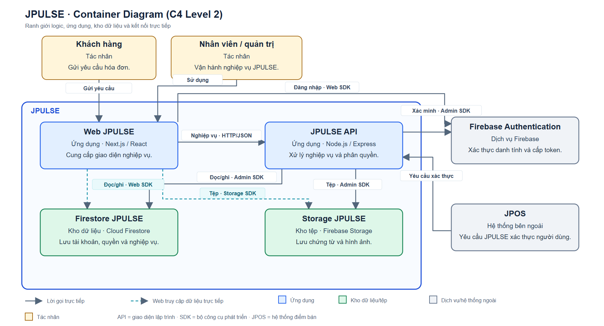
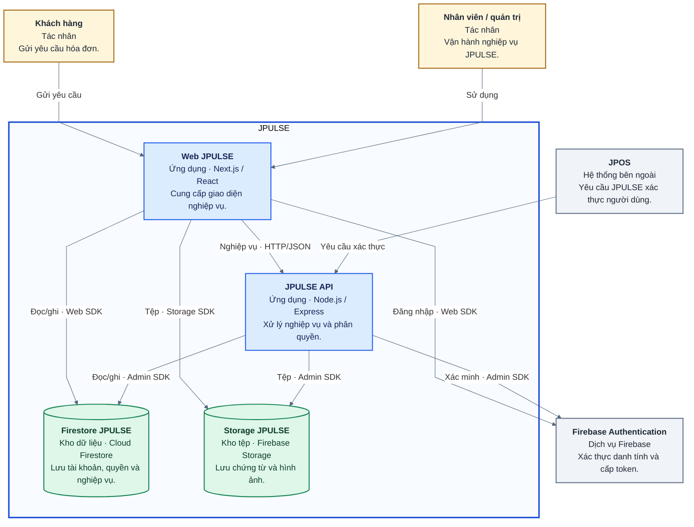
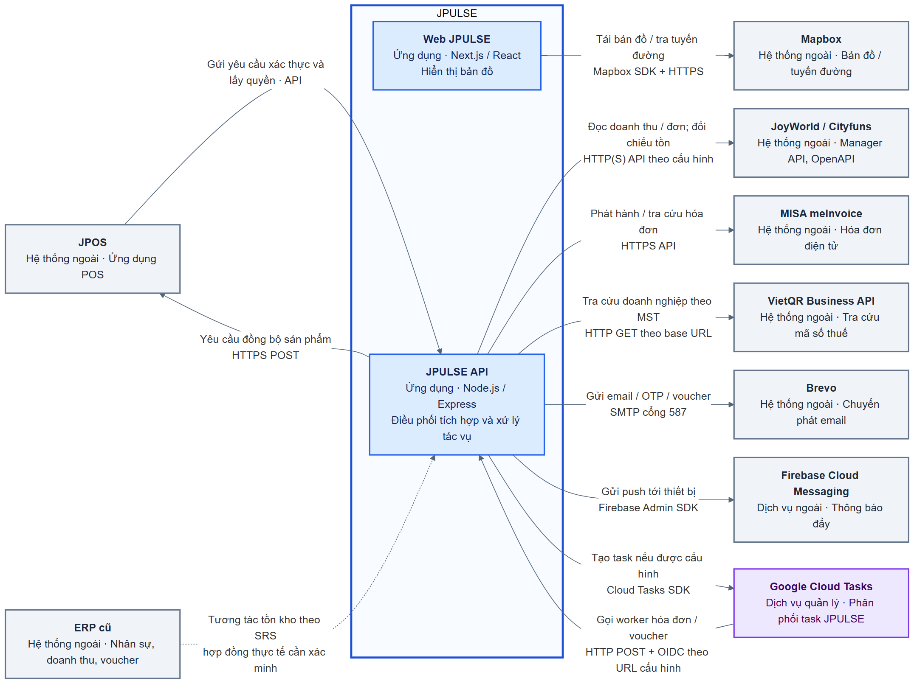
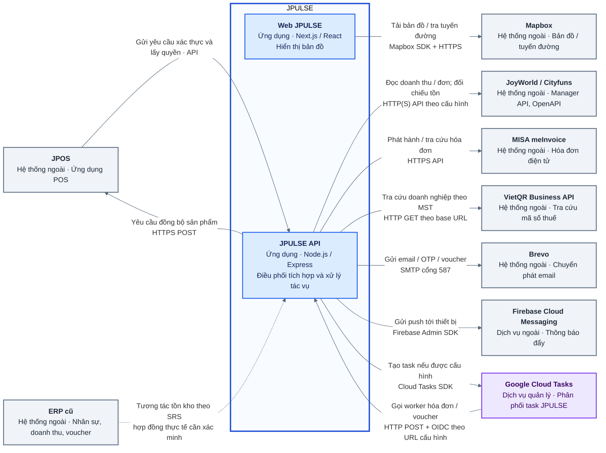

# Container Diagram của JPULSE

Tài liệu mô tả **JPULSE ở mức C4 Level 2** dựa trên [`SRS-JPULSE.docx`](../../SRS-JPULSE.docx), hình ngữ cảnh trong SRS, sơ đồ Container trước đó và mã nguồn hiện có. Mũi tên chỉ bên **khởi tạo** lời gọi; phản hồi đi trên cùng kết nối.

## Nhận xét về sơ đồ cũ

1. Đã gộp ERP cũ với JoyWorld/Cityfuns dù SRS phân biệt các hệ thống này. ERP cũ quản lý nhân sự, xem doanh thu và voucher theo xác nhận của chủ hệ thống; chưa chứng minh được luồng đồng bộ các nghiệp vụ đó với JPULSE.
2. Khối Firebase Authentication được mô tả mơ hồ là “quản lý tài khoản”. Firebase xác thực credential và token; **JPULSE API + Firestore** là nguồn tài khoản nghiệp vụ, trạng thái, vai trò, quyền và phạm vi cơ sở.
3. Bố cục cũ dồn khối và để nhiều đường vòng/giao nhau; nhãn dài che đường nối, một số chi tiết triển khai nằm ngay trên hình. Bản mới cố định hai hàng container, rút ngắn nhãn và chuyển chi tiết sang bảng. Các bước theo thời gian thuộc Sequence Diagram.
4. Thiếu VietQR; hai đường truy cập Firestore/Storage chưa rõ; một số giao thức/cờ triển khai bị khẳng định quá mức.

## Chú giải và ranh giới

**Đường bao xanh** là hệ thống JPULSE. Web và API là ứng dụng JPULSE; Firestore và Storage là kho dữ liệu/tệp *thuộc kiến trúc logic JPULSE* nhưng được Google vận hành. Firebase Authentication là dịch vụ xác thực do Google vận hành ở ngoài ranh giới ứng dụng. Cloud Tasks trong hình tích hợp là dịch vụ hàng đợi do Google vận hành; JPULSE cấu hình queue, tạo task và lưu trạng thái job nghiệp vụ ở Firestore.

Hộp **xanh dương** là ứng dụng; **trụ xanh lá** là kho dữ liệu/tệp; **xám** là hệ thống/dịch vụ độc lập; **vàng** là người dùng; **tím** là hàng đợi quản lý. Trong hình chính, **nét xanh lục lam đứt** phân biệt Web truy cập kho dữ liệu trực tiếp; các mũi tên khác là lời gọi trực tiếp. Trong hình tích hợp, **nét đứt xám** là quan hệ SRS đề cập nhưng hợp đồng triển khai chưa xác minh. API = giao diện lập trình ứng dụng; RBAC = phân quyền theo vai trò; POS = điểm bán hàng; ERP = hệ thống hoạch định nguồn lực doanh nghiệp; SDK = bộ công cụ phát triển; FCM = Firebase Cloud Messaging; MST = mã số thuế; OIDC = OpenID Connect; OTP = mật khẩu dùng một lần.

## Sơ đồ Container chính

**Ranh giới trên hình:** Firestore và Storage là tài nguyên dữ liệu của JPULSE về mặt logic, dù Google vận hành dịch vụ Firebase. Firebase Authentication là dịch vụ xác thực độc lập ở ngoài đường bao; dữ liệu vai trò và quyền nghiệp vụ nằm trong Firestore JPULSE.

| Đường trên hình | Dữ liệu/nghiệp vụ và kiểm soát truy cập |
| --- | --- |
| Web → Firebase Authentication | Người dùng đăng nhập qua Web SDK và nhận ID token; Firebase Authentication xác thực danh tính, không là nguồn vai trò/quyền JPULSE. |
| Web → JPULSE API → Firestore/Storage | Lệnh tạo/sửa dữ liệu nghiệp vụ, tài khoản, quyền và xử lý tệp đi qua API. API kiểm tra ID token/phiên, quyền và phạm vi; Admin SDK truy cập kho dữ liệu. |
| Web → Firestore trực tiếp | Web SDK đọc realtime theo phạm vi; ghi giới hạn gồm trạng thái thông báo và tín hiệu truyền tệp LAN. Firebase Authentication và Firestore Security Rules kiểm soát quyền truy cập client. |
| Web → Storage trực tiếp | Một số luồng tải tệp dùng Storage SDK; các luồng khác dùng signed URL/post policy do API cấp. Quy tắc Storage/bucket policy của production cần xác minh. |
| JPOS → JPULSE API | JPOS gửi yêu cầu xác thực người dùng; endpoint, cơ chế phiên và quyền cụ thể cần xác minh. Không suy ra JPOS gọi Firebase Authentication hoặc Firestore trực tiếp từ thông tin đã xác nhận. |

Ảnh để chèn Word: [PNG](./jpulse-container-main.png) · [SVG](./jpulse-container-main.svg). Nguồn chỉnh sửa: [Mermaid](./jpulse-container-main.mmd). SVG/PNG dùng bố cục cố định đã kiểm tra trực quan; Mermaid mô tả đúng các khối và quan hệ nhưng công cụ có thể tự sắp xếp khác khi render lại.

## Sơ đồ tích hợp bổ trợ

Ảnh để chèn Word: [PNG](./jpulse-integrations.png) · [SVG](./jpulse-integrations.svg). Nguồn chỉnh sửa: [Mermaid](./jpulse-integrations.mmd). Nét đứt ERP cũ **không khẳng định tích hợp đang chạy**.

## Các khối

| Khối | Loại và trách nhiệm | Căn cứ / cần xác minh |
| --- | --- | --- |
| Web JPULSE | Container ứng dụng Next.js/React; giao diện kho, nhân sự, POS, hóa đơn, báo cáo và trang yêu cầu hóa đơn công khai. | SRS “Môi trường vận hành”; [`apps/fe-wms/package.json`](../../apps/fe-wms/package.json), [`apps/fe-wms/src/app`](../../apps/fe-wms/src/app). |
| JPULSE API | Container ứng dụng Node.js/Express; nghiệp vụ, tài khoản, RBAC, phạm vi cơ sở, tích hợp và job. | SRS “Bối cảnh và ranh giới hệ thống”; [`apps/be-wms/src/index.ts`](../../apps/be-wms/src/index.ts), [`authMiddleware.ts`](../../apps/be-wms/src/api/middlewares/authMiddleware.ts). |
| Firestore JPULSE | Kho dữ liệu Cloud Firestore; User, Role, quyền, giao dịch, cấu hình và audit. | SRS “Mô hình dữ liệu”; [`firebase.ts`](../../apps/be-wms/src/config/firebase.ts), [`firestore.rules`](../../firestore.rules). Google vận hành, JPULSE sở hữu dữ liệu logic. |
| Storage JPULSE | Kho tệp Firebase Storage; ảnh, chứng từ, hợp đồng và tệp nghiệp vụ. | SRS “Hệ thống Lưu trữ”; [`uploadFile.ts`](../../apps/fe-wms/src/lib/uploadFile.ts), [`employeeContractDocumentStorageService.ts`](../../apps/be-wms/src/services/employeeContractDocumentStorageService.ts). **Cần xác minh** Storage Rules/bucket policy production. |
| Firebase Authentication | Dịch vụ ngoài của Google; đăng nhập và xác minh danh tính/token. Không là nguồn quyền nghiệp vụ. | SRS “Phương thức xác thực”; [`useAuth.ts`](../../apps/fe-wms/src/hooks/useAuth.ts), [`authMiddleware.ts`](../../apps/be-wms/src/api/middlewares/authMiddleware.ts). |
| JPOS | Hệ thống POS độc lập; gọi JPULSE xác thực người dùng/lấy quyền, nhận yêu cầu đồng bộ sản phẩm. | Chủ hệ thống xác nhận; SRS “Các hệ thống bên ngoài”; [`posDeviceRoutes.ts`](../../apps/be-wms/src/api/routes/posDeviceRoutes.ts), [`pos-management-rollout.md`](../pos-management-rollout.md). Endpoint xác thực người dùng phía JPOS cần xác minh. |
| ERP cũ | Hệ thống độc lập quản lý nhân sự, xem doanh thu và voucher; SRS nêu khả năng trao đổi số liệu tồn kho với JPULSE. | Chủ hệ thống xác nhận; SRS “Các hệ thống bên ngoài”. Hợp đồng triển khai riêng với JPULSE **chưa xác minh**. |
| JoyWorld / Cityfuns | Hệ thống ngoài có Manager API/OpenAPI cho doanh thu, đơn hàng, tồn đối tác và thao tác đồng bộ. Khác ERP cũ. | SRS INT-04/05/07; [`joyworldService.ts`](../../apps/be-wms/src/services/joyworldService.ts), [`openApiService.ts`](../../apps/be-wms/src/services/openApiService.ts). |
| MISA meInvoice | Hệ thống ngoài phát hành, trả trạng thái và tệp hóa đơn. | SRS INT-03; [`meInvoiceClient.ts`](../../apps/be-wms/src/services/meInvoiceClient.ts). Phát hành thật phụ thuộc cờ bật/go-live. |
| VietQR Business API | Hệ thống ngoài tra cứu doanh nghiệp theo MST phục vụ yêu cầu hóa đơn. | SRS INT-08; [`vietQrTaxLookupService.ts`](../../apps/be-wms/src/services/vietQrTaxLookupService.ts). Phụ thuộc base URL cấu hình. |
| Brevo | Hệ thống ngoài chuyển phát email, OTP, lời mời và voucher. | SRS INT-02; [`brevoEmailService.ts`](../../apps/be-wms/src/services/brevoEmailService.ts). Phụ thuộc credential. |
| Firebase Cloud Messaging | Dịch vụ ngoài của Google chuyển thông báo đẩy đến thiết bị. | SRS INT-01; [`pushNotificationService.ts`](../../apps/be-wms/src/services/pushNotificationService.ts). |
| Google Cloud Tasks | Dịch vụ hàng đợi của Google nhận task và gọi lại API worker JPULSE. | SRS INT-10; [`invoiceTaskDispatcher.ts`](../../apps/be-wms/src/services/invoiceTaskDispatcher.ts), [`marketingVoucherTaskDispatcher.ts`](../../apps/be-wms/src/services/marketingVoucherTaskDispatcher.ts). Chỉ dùng khi được cấu hình. |
| Mapbox | Hệ thống ngoài cung cấp bản đồ và tuyến đường cho Web JPULSE. | SRS INT-09; [`TransferRouteMap.tsx`](../../apps/fe-wms/src/components/features/transfers/TransferRouteMap.tsx). Tùy chọn theo token/WebGL. |

## Các kết nối chính

| Từ → Đến | Ý nghĩa và kiểm soát | Căn cứ / cần xác minh |
| --- | --- | --- |
| Nhân viên/quản trị → Web; khách hàng → Web | Dùng giao diện nghiệp vụ hoặc nhập thông tin hóa đơn. | SRS “Tác nhân và hệ thống bên ngoài”; [`apps/fe-wms/src/app`](../../apps/fe-wms/src/app). |
| Web → JPULSE API | Lệnh nghiệp vụ qua HTTP API/JSON; API kiểm tra phiên, quyền và phạm vi theo route. Trang hóa đơn công khai dùng token riêng. | [`index.ts`](../../apps/be-wms/src/index.ts), [`authMiddleware.ts`](../../apps/be-wms/src/api/middlewares/authMiddleware.ts). |
| Web → Firebase Authentication | Đăng nhập và lấy ID token bằng Firebase Web SDK. | [`useAuth.ts`](../../apps/fe-wms/src/hooks/useAuth.ts). |
| JPULSE API → Firebase Authentication | Xác minh ID token/session và đồng bộ định danh bằng Admin SDK; quyền nghiệp vụ lấy từ Firestore JPULSE. | [`authMiddleware.ts`](../../apps/be-wms/src/api/middlewares/authMiddleware.ts), [`employeeIdentitySyncService.ts`](../../apps/be-wms/src/services/employeeIdentitySyncService.ts). |
| Web → Firestore JPULSE | Đọc realtime có phạm vi; ghi hẹp như trạng thái thông báo và tín hiệu LAN. Firebase Auth + Firestore Rules kiểm soát truy cập. | [`scopedFirestore.ts`](../../apps/fe-wms/src/lib/scopedFirestore.ts), [`useNotifications.ts`](../../apps/fe-wms/src/hooks/useNotifications.ts), [`useLanFileTransfer.ts`](../../apps/fe-wms/src/hooks/useLanFileTransfer.ts), [`firestore.rules`](../../firestore.rules). |
| Web → API → Firestore JPULSE | Tạo/sửa tài khoản, quyền và dữ liệu nghiệp vụ; API kiểm tra schema/quyền, dùng Admin SDK/transaction và ghi audit. | [`userRoutes.ts`](../../apps/be-wms/src/api/routes/userRoutes.ts), [`invoiceOrderRoutes.ts`](../../apps/be-wms/src/api/routes/invoiceOrderRoutes.ts), [`firebase.ts`](../../apps/be-wms/src/config/firebase.ts). |
| Web → Storage JPULSE | Tải tệp trực tiếp qua Firebase SDK hoặc URL/chính sách ký do API cấp. | [`uploadFile.ts`](../../apps/fe-wms/src/lib/uploadFile.ts), [`employeeContractApi.ts`](../../apps/fe-wms/src/api/employeeContractApi.ts). Cần xác minh bucket policy/Storage Rules production cho upload SDK. |
| JPULSE API → Storage JPULSE | Kiểm tra/quản lý tệp, tạo signed URL/post policy và lưu chứng từ qua Admin SDK. | [`employeeContractDocumentStorageService.ts`](../../apps/be-wms/src/services/employeeContractDocumentStorageService.ts), [`posCustomerDisplayService.ts`](../../apps/be-wms/src/services/posCustomerDisplayService.ts). |
| JPOS → JPULSE API | JPOS yêu cầu xác thực người dùng/lấy quyền; cũng dùng API thiết bị và cấu hình POS. | Chủ hệ thống; SRS “Các hệ thống bên ngoài”; [`posDeviceRoutes.ts`](../../apps/be-wms/src/api/routes/posDeviceRoutes.ts). Endpoint và cơ chế phiên của JPOS cần xác minh. |
| JPULSE API → JPOS | Yêu cầu đồng bộ danh mục qua HTTPS POST, Google identity token và HMAC. | [`jposProductSyncClient.ts`](../../apps/be-wms/src/services/jposProductSyncClient.ts), [`pos-management-rollout.md`](../pos-management-rollout.md). |
| ERP cũ ⇢ JPULSE API | SRS nêu trao đổi tồn kho; chiều/contract thực tế cần xác minh. Chưa gán luồng HR/doanh thu/voucher sang JPULSE. | SRS “Các hệ thống bên ngoài”; chủ hệ thống. |
| JPULSE API → JoyWorld/Cityfuns | Đọc doanh thu/đơn, đối chiếu tồn và thao tác qua adapter. URL Manager mặc định có thể là HTTP; OpenAPI dùng URL cấu hình. | SRS INT-04/05/07; [`joyworldService.ts`](../../apps/be-wms/src/services/joyworldService.ts), [`openApiService.ts`](../../apps/be-wms/src/services/openApiService.ts). Xác minh URL production/cờ ghi. |
| JPULSE API → MISA meInvoice | Kiểm tra, phát hành, tra cứu, đối soát hóa đơn qua HTTPS API. | SRS INT-03; [`meInvoiceClient.ts`](../../apps/be-wms/src/services/meInvoiceClient.ts). Xác minh cờ phát hành production. |
| JPULSE API → VietQR | HTTP GET thông tin doanh nghiệp theo MST từ base URL cấu hình; cache 24 giờ, timeout 5 giây. | SRS INT-08; [`vietQrTaxLookupService.ts`](../../apps/be-wms/src/services/vietQrTaxLookupService.ts). Xác minh scheme production. |
| JPULSE API → Brevo | Gửi email qua SMTP cổng 587. | SRS INT-02; [`brevoEmailService.ts`](../../apps/be-wms/src/services/brevoEmailService.ts). SRS yêu cầu STARTTLS; mã hiện `secure:false` và chưa thấy `requireTLS`, nên cần xác minh TLS bắt buộc. |
| JPULSE API → FCM | Gửi thông báo đẩy qua Firebase Admin Messaging. | SRS INT-01; [`pushNotificationService.ts`](../../apps/be-wms/src/services/pushNotificationService.ts). |
| JPULSE API → Cloud Tasks; Cloud Tasks → JPULSE API | API tạo task; dịch vụ POST tới worker theo URL cấu hình với OIDC và secret. | SRS INT-10; [`invoiceTaskDispatcher.ts`](../../apps/be-wms/src/services/invoiceTaskDispatcher.ts). Xác minh HTTPS worker URL và queue production. |
| Web → Mapbox | Tải bản đồ và gọi Directions API từ trình duyệt bằng public token. | SRS INT-09; [`TransferRouteMap.tsx`](../../apps/fe-wms/src/components/features/transfers/TransferRouteMap.tsx). |

## Điểm cần xác minh trước khi coi là mô hình production cuối cùng

1. **ERP cũ:** API/client nào thực sự trao đổi tồn kho với JPULSE, chiều kết nối, dữ liệu, xác thực và trạng thái vận hành. Các chức năng nhân sự, doanh thu, voucher của ERP cũ chỉ xác nhận trách nhiệm nội bộ ERP.
2. **JPOS:** endpoint/cơ chế xác thực người dùng mà JPOS gọi và việc JPOS có ghi trực tiếp vào Firestore dùng chung ở production hay không. SRS yêu cầu hệ thống ngoài không truy cập trực tiếp cơ sở dữ liệu, nhưng [`docs/jpos-voucher-redemption-plan.md`](../jpos-voucher-redemption-plan.md) nói hai dự án dùng chung Firestore. Chưa vẽ JPOS → Firestore cho tới khi thống nhất hiện trạng.
3. **Vận hành:** Storage Rules/bucket policy; URL production của JoyWorld, VietQR, worker Cloud Tasks; cờ phát hành MISA; queue Cloud Tasks; yêu cầu STARTTLS Brevo.

Nginx trong Docker Compose, controller/service/repository/worker chạy trong API, `shared-types`, route và bước xử lý theo thời gian không phải container độc lập nên không có trong hình. Cloud Scheduler được SRS nhắc đến nhưng chưa có bằng chứng cấu hình triển khai đủ rõ để vẽ thành quan hệ đang chạy.
