# UML Sequence Diagrams của JPULSE

Tài liệu này mô tả các lời gọi thực tế giữa ứng dụng, dịch vụ xác thực, kho dữ liệu và hệ thống tích hợp. Nguồn đối chiếu gồm [SRS-JPULSE](../../SRS-JPULSE.docx), [Container Diagram JPULSE](./jpulse-container-diagram.md), mã JPULSE hiện có và mã JPOS trong repository `D:\Github\POS`. Mũi tên liền là lời gọi; mũi tên đứt là phản hồi hoặc dữ liệu đẩy. Mỗi hình có tệp Mermaid, SVG vector và PNG độ phân giải gấp đôi kích thước bố cục.

Trong hình, **Firebase Auth** là Firebase Authentication và **JPOS Functions** là các Cloud Functions thuộc JPOS, nằm ngoài ranh giới JPULSE.

**Điểm cần đọc trước SD-01:** SRS và Container Diagram mô tả JPOS gọi JPULSE để xác thực. Mã JPOS hiện tại lại đăng nhập trực tiếp với Firebase Authentication, gọi **JPOS Functions** và để Functions đọc các collection tài khoản/quyền trong Firestore dùng chung. Vì vậy SD-01 thể hiện **hiện trạng đã kiểm chứng trong mã**. JPULSE API không được thêm vào SD-01 khi nó không tham gia lời gọi này. Quyết định kiến trúc về việc chuyển sang API JPULSE được nêu ở cuối tài liệu.

## 1. Danh sách luồng được chọn

| Luồng | Điểm bắt đầu → kết quả thành công | Ngoại lệ quan trọng | Căn cứ chọn |
| --- | --- | --- | --- |
| **SD-01A–C: JPOS đăng nhập và nạp quyền** | Nhân viên POS đăng nhập → JPOS có danh tính Firebase, quyền `pos.login` theo cơ sở và phiên bán hàng; phiên đã xác minh có thể dùng cache tối đa 8 giờ khi mất mạng. | Thiết bị bị khóa, sai mật khẩu, tài khoản không ACTIVE, thiếu quyền/cơ sở, cache hết hạn. | SRS use case **Đăng nhập JPOS**, **Xác minh tài khoản, thiết bị và quyền**; [JPOS management rollout](../pos-management-rollout.md); mã JPOS. |
| **SD-02A–C: Web JPULSE đăng nhập và MFA** | Nhân viên đăng nhập → Firebase xác thực danh tính, API tạo phiên và nạp quyền JPULSE, Web xác minh MFA rồi mở giao diện. | Không tìm thấy định danh, sai mật khẩu, token/phiên không hợp lệ, tài khoản không dùng được, OTP sai/hết hạn. | SRS use case **Đăng nhập**, **Tải quyền và phạm vi cơ sở**, **Xác minh MFA**; [business flow](../business-flow-charts.md); mã Web/API. |
| **SD-03A–C: Tạo phiếu nhập kho** | Nhân viên kho chọn tệp và nhập phiếu → Web tải tệp trực tiếp lên Storage; API kiểm tra quyền và ghi phiếu, dòng hàng, bước duyệt, audit vào Firestore. | Tệp sai/tải lỗi, phiên/quyền/OTP sai, thiếu chứng từ theo cấu hình, ghi batch lỗi. | SRS use case **Tạo phiếu nhập**, **Tải cấu hình quy trình**, **Kiểm tra quyền, sản phẩm, vị trí**; mã Web/API. |
| **SD-04A–D: Phát hành hóa đơn qua hàng đợi** | Kế toán chọn draft đủ điều kiện → API tạo job, Cloud Tasks giao item cho worker, API gọi MISA và ghi kết quả. | Feature flag/queue chưa bật, quyền hoặc draft sai, task đến sớm/lane bận, MISA từ chối, kết quả mơ hồ cần tra trạng thái. | SRS use case **Phát hành đơn lẻ/hàng loạt**, **Gọi meInvoice và ghi sổ**, INT-03, INT-10; [thiết kế issue jobs](../integrations/meinvoice/phase-4-issue-jobs.md). |
| **SD-05: Thông báo realtime** | Nhân viên mở thông báo → Web đọc snapshot Firestore và đánh dấu đã đọc trực tiếp. | Firestore Security Rules từ chối hoặc subscription lỗi. | SRS nhóm **thông báo** và INT-01; [useNotifications](../../apps/fe-wms/src/hooks/useNotifications.ts), [firestore.rules](../../firestore.rules). |

Các bước của cùng một luồng được chia thành hình A/B/C/D tại điểm nối ghi ngay trên hình. Điều này giữ từng ảnh ở kích thước đọc được trên trang Word ngang.

## 2. SD-01 — JPOS xác thực và nạp quyền

### SD-01A – JPOS xác thực danh tính người dùng

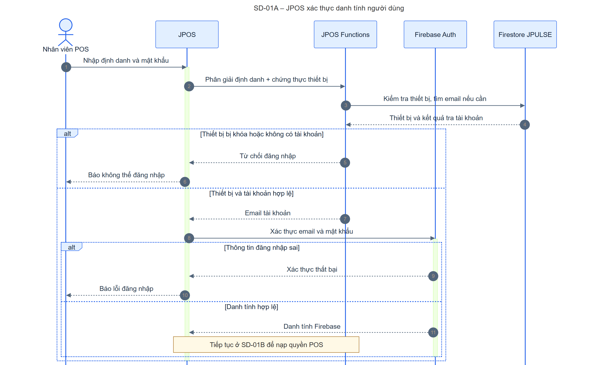

[Mermaid](./sequence/sd-01a-jpos-identity.mmd) · [SVG](./sequence/sd-01a-jpos-identity.svg) · [PNG](./sequence/sd-01a-jpos-identity.png)

JPOS Functions kiểm tra thiết bị và phân giải định danh; Firebase Authentication kiểm tra mật khẩu. Không tìm thấy tài khoản, thiết bị bị khóa hoặc Firebase từ chối đều chặn đăng nhập. Thành công chuyển sang SD-01B.

### SD-01B – JPOS nạp quyền từ dữ liệu JPULSE

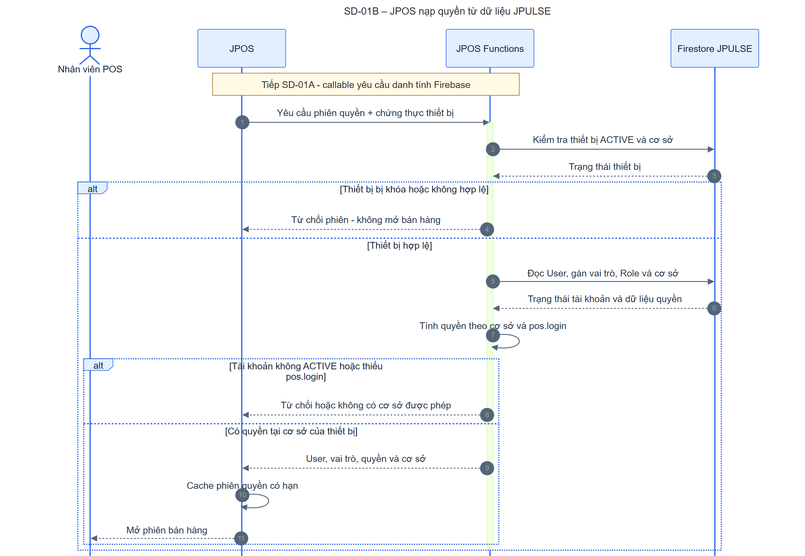

[Mermaid](./sequence/sd-01b-jpos-access.mmd) · [SVG](./sequence/sd-01b-jpos-access.svg) · [PNG](./sequence/sd-01b-jpos-access.png)

Sau khi Firebase đã xác thực, JPOS Functions kiểm tra lại thiết bị và đọc User, gán vai trò, Role, cơ sở từ Firestore JPULSE. Functions tính quyền `pos.login` theo cơ sở; JPOS chỉ mở phiên nếu có cơ sở được phép. Dữ liệu quyền bắt nguồn từ JPULSE, nhưng mã hiện tại đọc trực tiếp Firestore qua JPOS Functions.

### SD-01C – JPOS khôi phục phiên quyền khi mất mạng

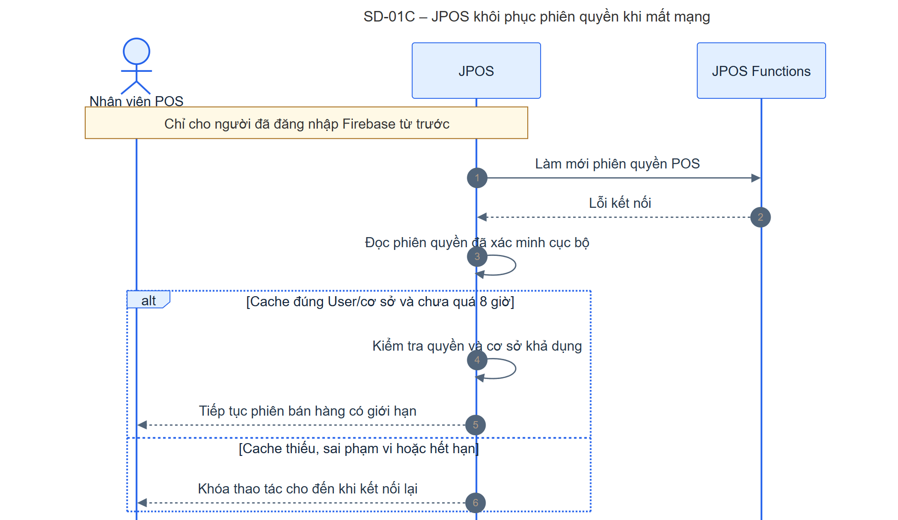

[Mermaid](./sequence/sd-01c-jpos-offline.mmd) · [SVG](./sequence/sd-01c-jpos-offline.svg) · [PNG](./sequence/sd-01c-jpos-offline.png)

Luồng này chỉ áp dụng khi người dùng **đã đăng nhập Firebase** và JPOS không tải lại được phiên quyền vì lỗi mạng. Cache cục bộ phải khớp User/cơ sở và chưa quá 8 giờ; cache không hợp lệ làm JPOS khóa thao tác. Đây không phải đường đăng nhập mới khi hoàn toàn mất mạng.

## 3. SD-02 — Người dùng đăng nhập Web JPULSE

### SD-02A – JPULSE phân giải và xác thực danh tính

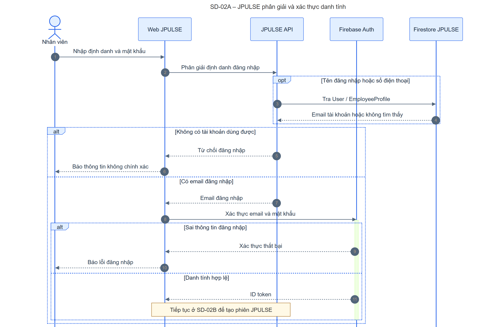

[Mermaid](./sequence/sd-02a-jpulse-identity.mmd) · [SVG](./sequence/sd-02a-jpulse-identity.svg) · [PNG](./sequence/sd-02a-jpulse-identity.png)

Web nhờ JPULSE API phân giải tên đăng nhập/số điện thoại nếu cần, rồi gọi Firebase Authentication để xác thực mật khẩu. Sai định danh hoặc credential dừng tại đây; ID token hợp lệ chuyển sang SD-02B.

### SD-02B – JPULSE tạo phiên và nạp quyền

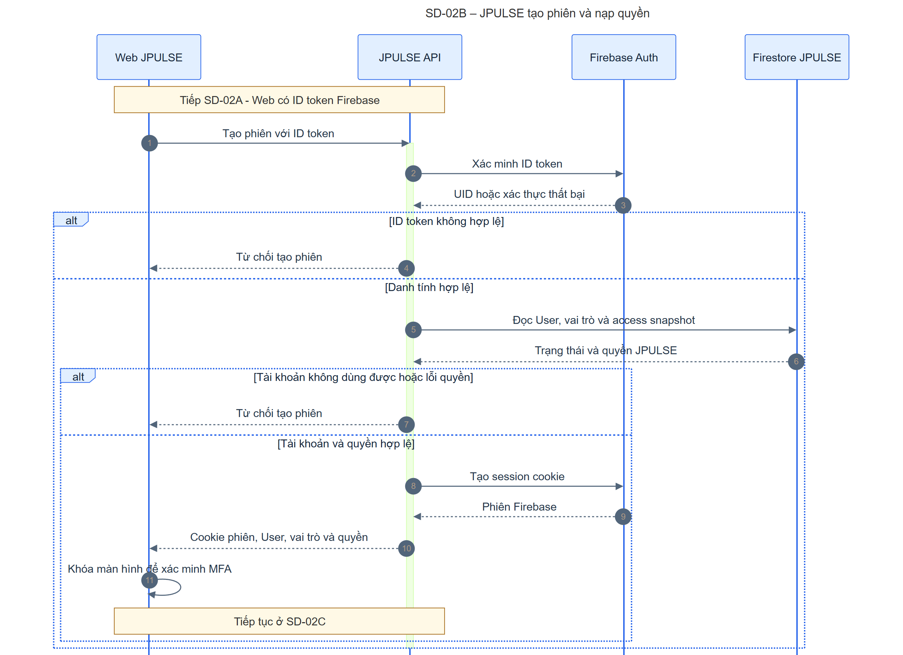

[Mermaid](./sequence/sd-02b-jpulse-session.mmd) · [SVG](./sequence/sd-02b-jpulse-session.svg) · [PNG](./sequence/sd-02b-jpulse-session.png)

API xác minh ID token với Firebase, đọc User, vai trò và access snapshot do JPULSE quản lý trong Firestore; chỉ sau các kiểm tra đó mới tạo session cookie. Web nhận quyền và khóa màn hình để chờ SD-02C. Firebase không quyết định quyền nghiệp vụ.

### SD-02C – Xác minh MFA sau đăng nhập

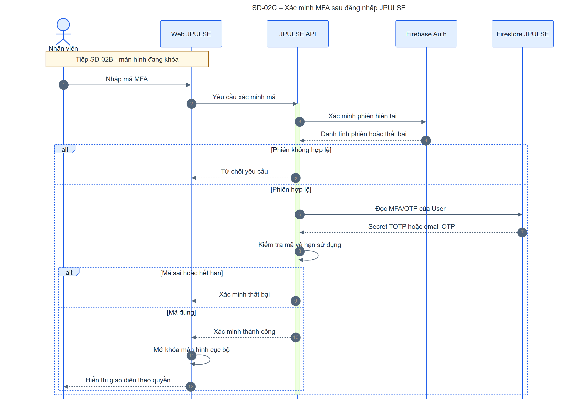

[Mermaid](./sequence/sd-02c-jpulse-mfa.mmd) · [SVG](./sequence/sd-02c-jpulse-mfa.svg) · [PNG](./sequence/sd-02c-jpulse-mfa.png)

API xác minh phiên, đọc dữ liệu TOTP/email OTP của User từ Firestore và kiểm tra mã. Mã sai hoặc hết hạn giữ giao diện khóa; mã đúng làm Web mở khóa **trạng thái cục bộ**. Mã OTP email được xóa sau khi dùng thành công trong triển khai hiện tại.

## 4. SD-03 — Tạo phiếu nhập kho

### SD-03A – Web tải chứng từ trực tiếp lên Storage

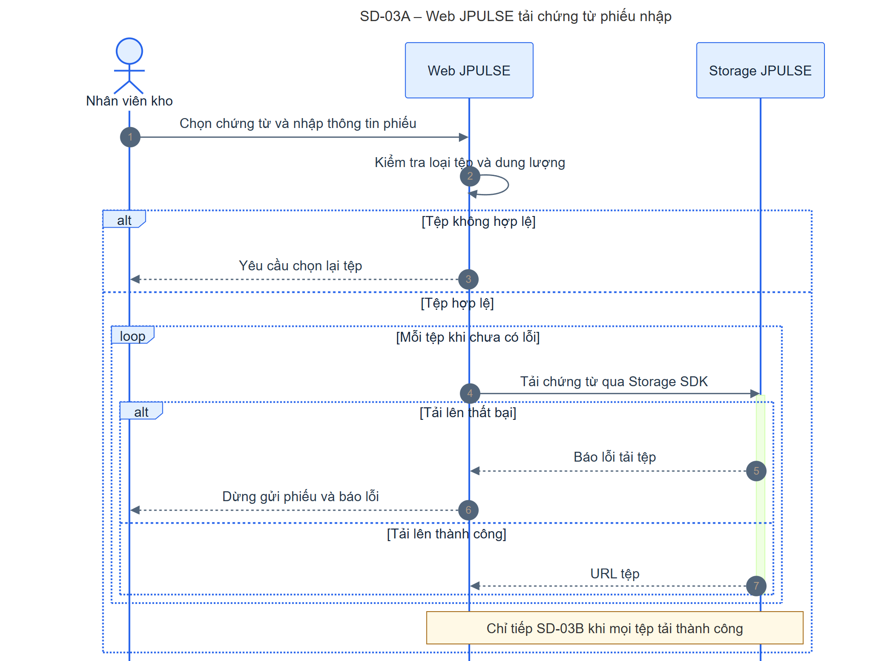

[Mermaid](./sequence/sd-03a-import-upload.mmd) · [SVG](./sequence/sd-03a-import-upload.svg) · [PNG](./sequence/sd-03a-import-upload.png)

Web kiểm tra loại/dung lượng rồi tải từng tệp bằng Firebase Storage SDK, nhận URL để gửi cùng phiếu. API không làm trung gian cho tệp ở đường này. Quy tắc Storage của môi trường production chưa có trong repository và cần xác minh.

### SD-03B – JPULSE kiểm tra yêu cầu tạo phiếu

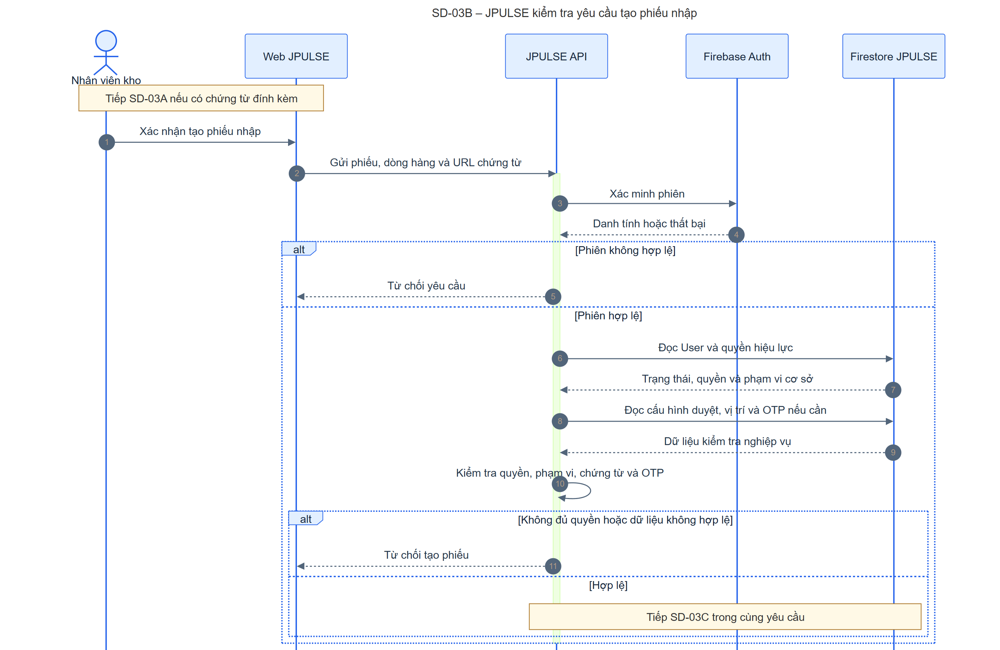

[Mermaid](./sequence/sd-03b-import-validate.mmd) · [SVG](./sequence/sd-03b-import-validate.svg) · [PNG](./sequence/sd-03b-import-validate.png)

Web gửi dữ liệu phiếu và URL tệp đến API. API xác minh phiên, nạp quyền và phạm vi cơ sở, đọc cấu hình quy trình/vị trí, xác minh chứng từ và OTP nếu cấu hình yêu cầu. Thiếu quyền hoặc đầu vào không hợp lệ dừng trước khi ghi.

### SD-03C – JPULSE ghi phiếu nhập và audit

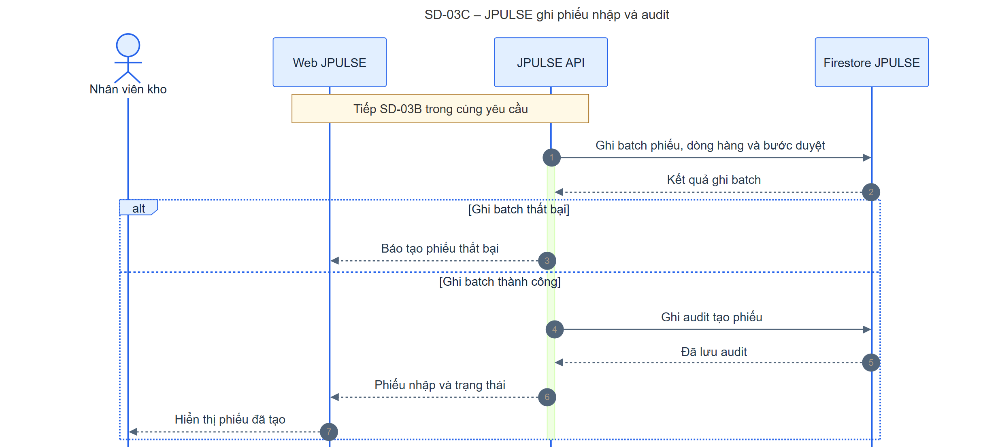

[Mermaid](./sequence/sd-03c-import-persist.mmd) · [SVG](./sequence/sd-03c-import-persist.svg) · [PNG](./sequence/sd-03c-import-persist.png)

API ghi batch phiếu, dòng hàng và bản ghi duyệt vào Firestore, sau đó ghi audit và trả trạng thái. Batch thất bại không tạo phiếu. Audit được ghi sau batch, nên lỗi audit sau khi batch thành công là tình huống cần quan sát riêng, không được coi là rollback tự động.

## 5. SD-04 — Phát hành hóa đơn điện tử bất đồng bộ

**Điều kiện áp dụng:** mã cho các SD dưới đây đã có, nhưng `MEINVOICE_ISSUE_ENABLED` mặc định `false`; Cloud Tasks chỉ được dùng khi cấu hình queue/worker đầy đủ. Đây là luồng khi phát hành thật và hàng đợi đã được bật, không khẳng định production đang phát hành.

### SD-04A – JPULSE xếp hàng phát hành hóa đơn

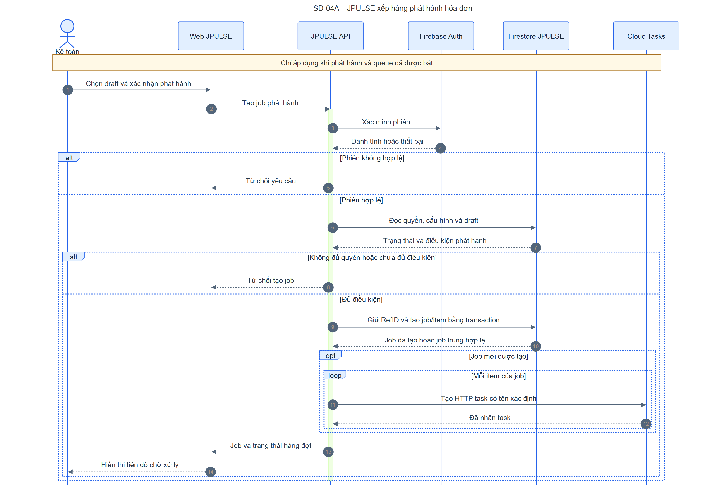

[Mermaid](./sequence/sd-04a-invoice-queue.mmd) · [SVG](./sequence/sd-04a-invoice-queue.svg) · [PNG](./sequence/sd-04a-invoice-queue.png)

API kiểm tra phiên/quyền, cấu hình và draft. Transaction trong Firestore giữ `RefID`, tạo job và item; với job mới, API tạo Cloud Task có tên xác định cho từng item. Web nhận trạng thái hàng đợi, không chờ MISA phát hành.

### SD-04B – Worker nhận task và gọi MISA

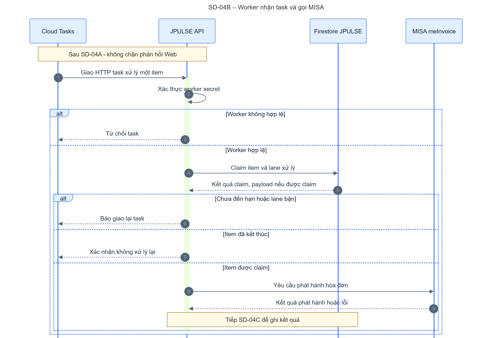

[Mermaid](./sequence/sd-04b-invoice-worker.mmd) · [SVG](./sequence/sd-04b-invoice-worker.svg) · [PNG](./sequence/sd-04b-invoice-worker.png)

Cloud Tasks giao một HTTP task đến API worker. API kiểm tra worker secret, claim item/lane trong Firestore và chỉ gửi yêu cầu phát hành tới MISA khi claim thành công. Task đến sớm hoặc lane bận được yêu cầu giao lại; item đã kết thúc không được phát hành lần nữa.

### SD-04C – JPULSE ghi kết quả phát hành

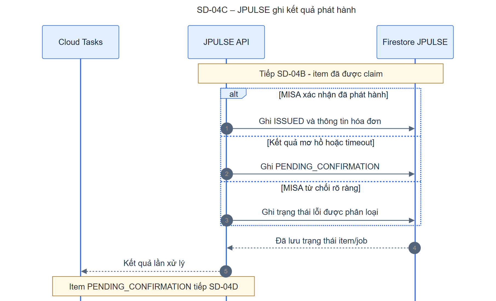

[Mermaid](./sequence/sd-04c-invoice-outcome.mmd) · [SVG](./sequence/sd-04c-invoice-outcome.svg) · [PNG](./sequence/sd-04c-invoice-outcome.png)

Kết quả MISA được ghi `ISSUED`, `PENDING_CONFIRMATION` hoặc lỗi được phân loại. Timeout hay phản hồi mơ hồ không kích hoạt phát hành lại ngay; chúng chuyển sang SD-04D để đối chiếu.

### SD-04D – JPULSE xác nhận kết quả chưa rõ

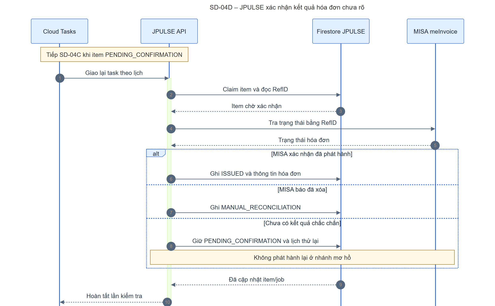

[Mermaid](./sequence/sd-04d-invoice-confirm.mmd) · [SVG](./sequence/sd-04d-invoice-confirm.svg) · [PNG](./sequence/sd-04d-invoice-confirm.png)

Lần task sau claim item đang chờ và tra MISA bằng `RefID`. MISA xác nhận thì ghi `ISSUED`; hóa đơn đã xóa chuyển `MANUAL_RECONCILIATION`; chưa chắc chắn thì giữ `PENDING_CONFIRMATION` và hẹn tra lại. Không gọi publish ở nhánh kết quả mơ hồ.

## 6. SD-05 — Web đọc và cập nhật thông báo trực tiếp

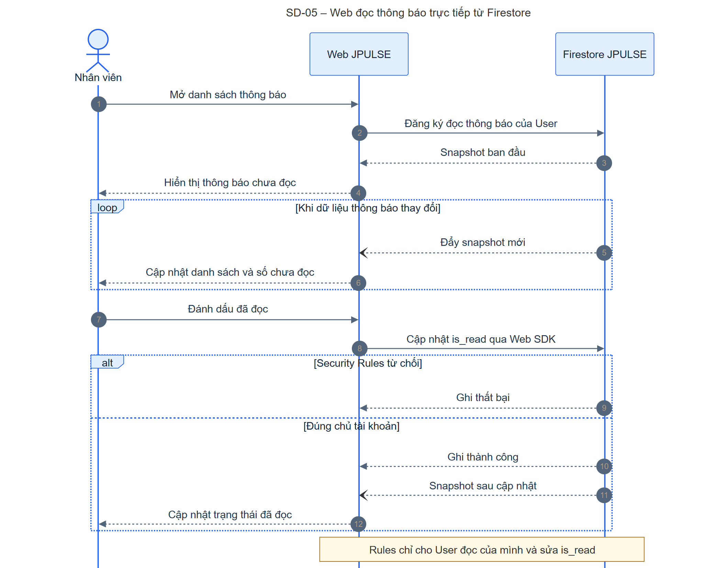

[Mermaid](./sequence/sd-05-notification-realtime.mmd) · [SVG](./sequence/sd-05-notification-realtime.svg) · [PNG](./sequence/sd-05-notification-realtime.png)

Web dùng Firestore Web SDK để lắng nghe thông báo của User và cập nhật `is_read` trực tiếp; JPULSE API không tham gia luồng này. Firestore Security Rules chỉ cho đọc thông báo của chính User và chỉ cho client sửa trường `is_read`. Lỗi subscription hoặc rule từ chối được báo tại Web.

## 7. Các điểm khác biệt và cần xác minh

| Vấn đề | Căn cứ hiện có | Tác động / quyết định cần chốt |
| --- | --- | --- |
| **JPOS xác thực không đi qua JPULSE API ở mã hiện tại.** | [JPOS AuthContext](../../../POS/src/lib/contexts/AuthContext.tsx), [authService](../../../POS/src/lib/services/authService.ts), [Functions](../../../POS/functions/src/auth/functions.ts). | Container Diagram và mô tả SRS nói JPOS gọi JPULSE xác thực. Cần chốt hiện trạng được chấp nhận hay kế hoạch chuyển sang JPULSE API; sau đó cập nhật Container Diagram. |
| **JPOS Functions đọc trực tiếp Firestore JPULSE dùng chung.** | [posAuthService](../../../POS/functions/src/services/posAuthService.ts), [kế hoạch voucher JPOS](../jpos-voucher-redemption-plan.md). | SRS nêu hệ thống ngoài không mặc định truy cập DB nội bộ. Cần chốt ranh giới tin cậy và quyền service account; sơ đồ SD-01 mô tả hiện trạng, không tự che đường truy cập này. |
| **Hai cách dựng quyền có thể lệch nhau.** | JPOS Functions tính quyền từ `user_warehouse_roles`/`roles`; JPULSE API nạp `user_access` materialized trong [authMiddleware](../../apps/be-wms/src/api/middlewares/authMiddleware.ts). | Cần xác nhận hai nguồn luôn đồng bộ và cách xử lý khi quyền vừa thay đổi hoặc cache offline còn hiệu lực. |
| **MFA mở khóa trạng thái Web cục bộ.** | [useAuth](../../apps/fe-wms/src/hooks/useAuth.ts), [MFALockScreen](../../apps/fe-wms/src/components/auth/MFALockScreen.tsx), [authMiddleware](../../apps/be-wms/src/api/middlewares/authMiddleware.ts). | Chưa thấy mọi API nghiệp vụ kiểm tra chứng cứ MFA sau login; nếu MFA phải là điều kiện server-side, cần bổ sung thiết kế và cập nhật SD-02. |
| **Chính sách Storage production chưa có trong repository.** | [uploadFile](../../apps/fe-wms/src/lib/uploadFile.ts); [firebase.json](../../firebase.json) chỉ khai báo Firestore rules. | Cần xác minh Storage Security Rules/bucket policy cho `temp-uploads` và vòng đời tệp khi tạo phiếu thất bại. |
| **Phát hành MISA phụ thuộc cấu hình go-live.** | [phase-4-issue-jobs](../integrations/meinvoice/phase-4-issue-jobs.md), [invoiceTaskDispatcher](../../apps/be-wms/src/services/invoiceTaskDispatcher.ts). | Xác nhận flag, queue, worker URL, OIDC/IAM và UAT trước khi coi SD-04 là luồng production đang chạy. Khi không có Cloud Tasks, code dùng Scheduler/sweep fallback; fallback không được vẽ như queue. |
| **Ghi phiếu và audit không cùng batch.** | [importVoucherCreationService](../../apps/be-wms/src/services/importVoucherCreationService.ts). | Cần quyết định cách phát hiện/khôi phục nếu batch đã commit nhưng audit hoặc bước hoàn tất duyệt thất bại. |

## 8. Đối chiếu với Container Diagram

| Nhóm SD | Participant và chiều gọi | Kết quả đối chiếu |
| --- | --- | --- |
| SD-01 | JPOS → Firebase Authentication; JPOS → JPOS Functions → Firestore JPULSE. | **Khác Container đã duyệt ở luồng JPOS:** không có JPULSE API trong đường đăng nhập hiện tại; JPOS Functions là phần của hệ thống JPOS ở ngoài ranh giới JPULSE. |
| SD-02 | Nhân viên → Web → JPULSE API/Firebase Authentication; API → Firestore/Firebase Authentication. | Khớp trách nhiệm: Firebase xác thực danh tính; JPULSE quyết định quyền từ Firestore. |
| SD-03 | Web → Storage trực tiếp; Web → API → Firestore. | Khớp hai đường truy cập khác nhau; không gộp tải tệp vào API. |
| SD-04 | Web → API → Firestore/Cloud Tasks; Cloud Tasks → API → Firestore/MISA. | Khớp hình tích hợp bổ trợ, với điều kiện cấu hình phát hành và queue. |
| SD-05 | Web ↔ Firestore trực tiếp qua Web SDK; Rules giới hạn đọc/ghi. | Khớp đường truy cập trực tiếp trong Container Diagram. |

Các SD mô tả một lần tương tác hoặc một bước được nối rõ ràng. Chúng không mở rộng controller, service hay repository thành container riêng; các xử lý nội bộ của API/JPOS Functions chỉ xuất hiện dưới dạng thông điệp tự gọi khi cần làm rõ quyết định nghiệp vụ.
