# Business flow charts của hệ thống BDuck

Tài liệu được tổng hợp từ giao diện `apps/fe-wms`, các route và controller trong `apps/be-wms`, cùng kiểu dữ liệu trong `packages/shared-types`.

Quy ước chung:

- API nội bộ xác thực bằng session cookie, kiểm tra RBAC và phạm vi cơ sở trước khi xử lý.
- API tích hợp ngoài xác thực bằng API key và danh sách kho được cấp quyền.
- Phần lớn API trả envelope `{ success, data, messages }`. Khi lỗi, `data` thường là `null` và `messages` chứa thông báo tiếng Việt, tiếng Trung.
- Các thao tác ghi quan trọng đều kiểm tra dữ liệu đầu vào, cập nhật Firestore theo transaction khi cần và ghi audit log.
- Ký hiệu `id` trong endpoint là định danh bản ghi tương ứng.

## 1. Xác thực, phiên đăng nhập và MFA

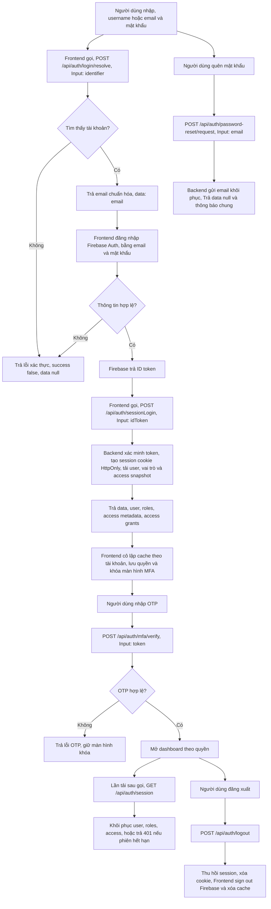

## 2. Dashboard tổng hợp tồn kho và chi phí

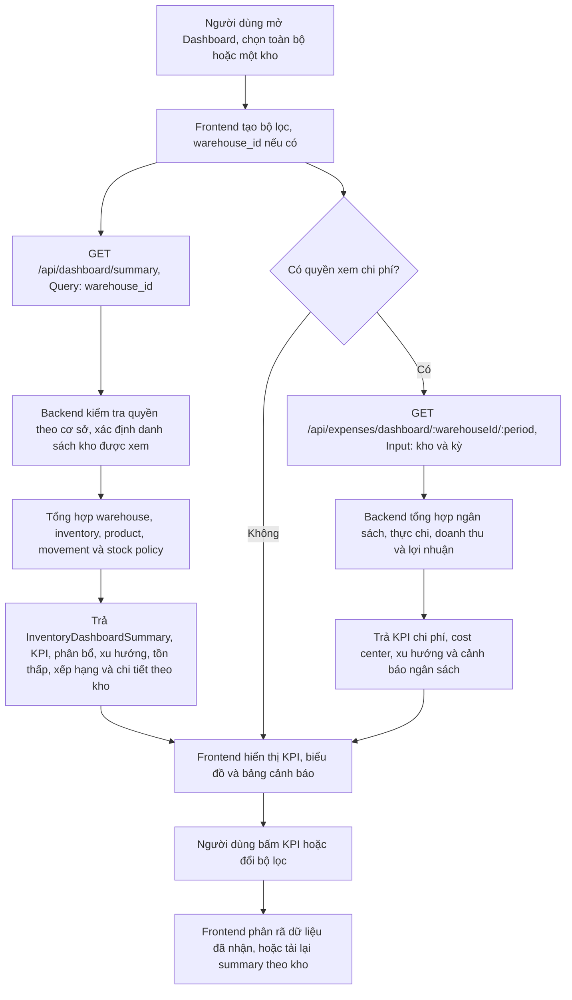

## 3. Tổ chức, kho, vị trí và ô kệ

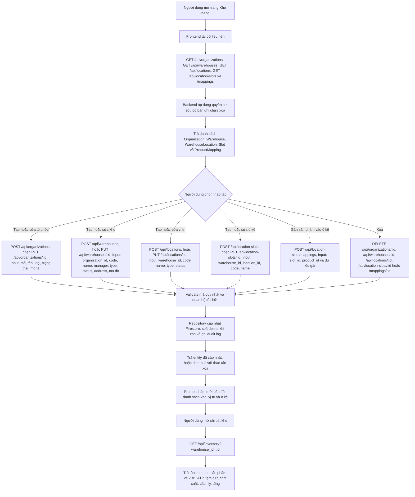

## 4. Sản phẩm, danh mục, BOM và chính sách tồn

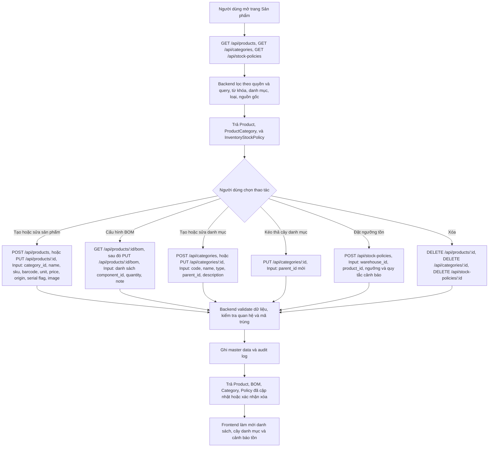

## 5. Phiếu nhập, phiếu xuất và điều chuyển kho

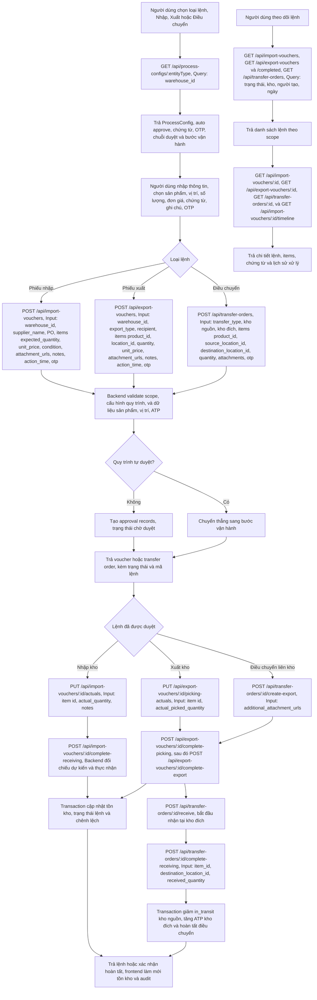

## 6. Phê duyệt, cấu hình quy trình và xử lý không phù hợp

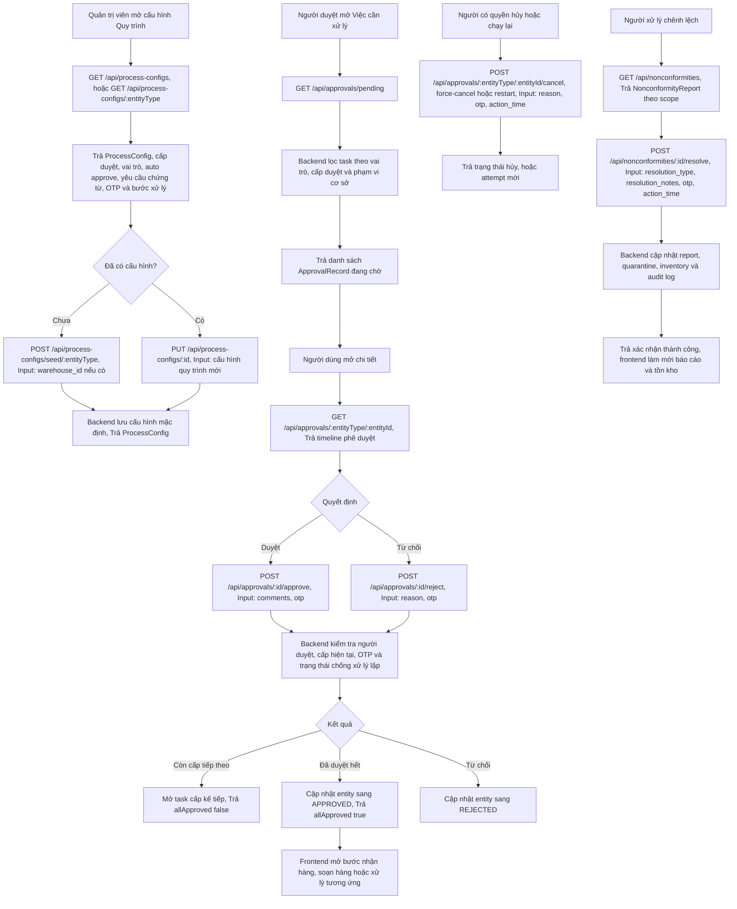

## 7. Kiểm kê nội bộ

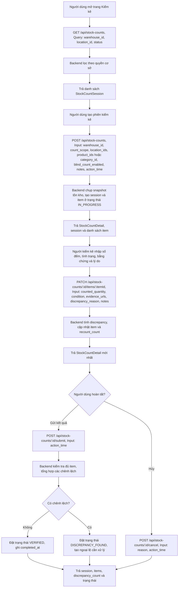

## 8. Kiểm kê ngoài, quét hàng và hàng chờ phê duyệt

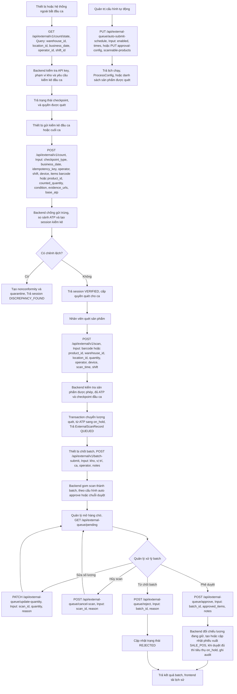

## 9. Nhập liệu và báo cáo chi phí

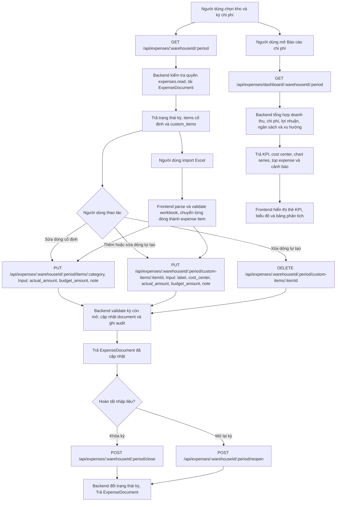

## 10. Doanh thu và mẫu báo cáo Excel

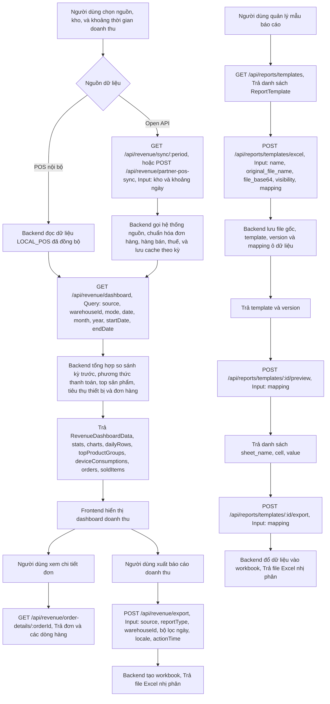

## 11. Hóa đơn điện tử MISA meInvoice

```mermaid
flowchart TD
    A["Quản trị viên cấu hình cửa hàng"] --> B["GET /api/meinvoice/store-configs/:warehouseId/account-options, Trả tài khoản MISA khả dụng"]
    B --> C["PUT /api/meinvoice/store-configs/:warehouseId, Input: account_id, inv_series, sign_type, seller shop, VAT mapping, SKU mapping, payment mapping, go_live_at, enabled"]
    C --> D["POST /api/meinvoice/store-configs/:warehouseId/validate"]
    D --> E["Backend gọi MISA kiểm tra mẫu hóa đơn, Trả template và validated_at"]
    F["Nhân viên chọn kho và ngày bán"] --> G["POST /api/invoices/source-orders/sync, Input: warehouse_id, business_date, purpose"]
    G --> H["Backend lấy đơn nguồn, upsert theo source identity, tạo hoặc rebase draft, và chạy đối soát ngày"]
    H --> I["Trả InvoiceSyncResult, order_count, inserted, updated, unchanged, draft counts và reconciliation summary"]
    I --> J["GET /api/invoices/source-orders, Query: warehouse_id, business_date"]
    J --> K["Trả InvoiceSourceOrderView"]
    K --> L["Người dùng chọn đơn để chuẩn bị hóa đơn"]
    L --> M["POST /api/invoices/source-orders/:id/prepare, Input: warehouse_id"]
    M --> N["Backend dựng InvoiceDocument, áp mapping, tính tiền và VAT, tạo revision"]
    N --> O["Trả InvoiceDocumentView"]
    O --> P["Người dùng sửa người mua, phương thức thanh toán hoặc dòng hàng"]
    P --> Q["PUT /api/invoices/documents/:id, Input: warehouse_id, expected_revision, expected_source_payload_hash, buyer, payment_method_name, items"]
    Q --> R["Backend kiểm tra optimistic lock, tính lại tổng và lưu revision mới"]
    R --> S["POST /api/invoices/documents/:id/preview, Input: warehouse_id"]
    S --> T["Backend preflight và gọi MISA preview, Trả url, expires_at, ref_id, prepared_payload_hash, source_payload_hash"]
    T --> U{"Người dùng xác nhận phát hành"}
    U -- "Một hoặc nhiều hóa đơn" --> V["POST /api/invoices/issues, hoặc POST /api/invoices/bulk-issues, Input: warehouse_id, business_date, document hoặc source_order ids"]
    V --> W["Backend khóa chống phát hành trùng, tạo issue job và các job item"]
    W --> X["Worker gọi MISA phát hành, retry lỗi tạm thời, lưu transaction_id, invoice_number và invoice_code"]
    X --> Y{"Kết quả MISA"}
    Y -- "Thành công" --> Z["Ghi InvoiceLedgerEntry, đặt trạng thái ISSUED"]
    Y -- "Không chắc chắn hoặc lệch dữ liệu" --> AA["Tạo reconciliation case, không tự phát hành lại"]
    Y -- "Lỗi có thể thử lại" --> AB["Đặt retry candidate, POST /api/invoices/issues/retry khi người dùng yêu cầu"]
    Z --> AC["GET /api/invoices/ledger, Trả sổ hóa đơn theo ngày"]
    AC --> AD["GET /api/invoices/ledger/:id/view, hoặc /download, Trả URL xem hoặc dữ liệu PDF, XML"]
    AA --> AE["GET /api/invoices/reconciliation-cases, Trả danh sách case và details"]
    AE --> AF["POST /api/invoices/reconciliation-cases/:id/resolve, Input: warehouse_id, note"]
    AF --> AG["Backend đóng case, Trả case đã cập nhật"]
    AH["Khách mở link yêu cầu hóa đơn"] --> AI["GET /api/public/invoice-requests/:token, Trả thông tin đơn được phép khai báo"]
    AI --> AJ["POST /api/public/invoice-requests/:token/submissions, Input: idempotency_key, action_time, buyer gồm tên, mã số thuế, địa chỉ, email"]
    AJ --> AK["Backend validate token và dữ liệu người mua, Trả public view và cờ duplicate"]
```

## 12. Hồ sơ nhân viên, vòng đời làm việc và hợp đồng

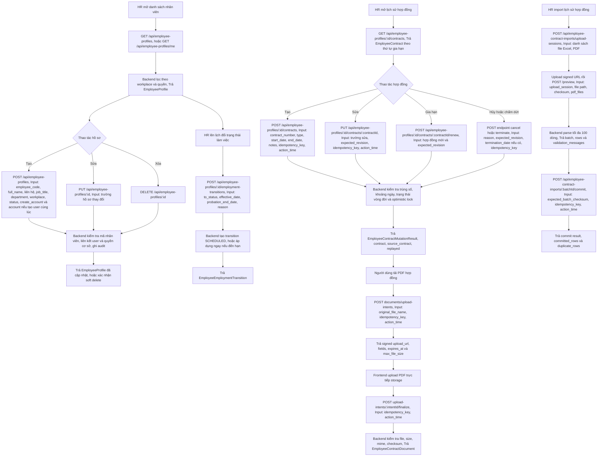

## 13. Chấm công, đơn nghỉ và quản trị phép

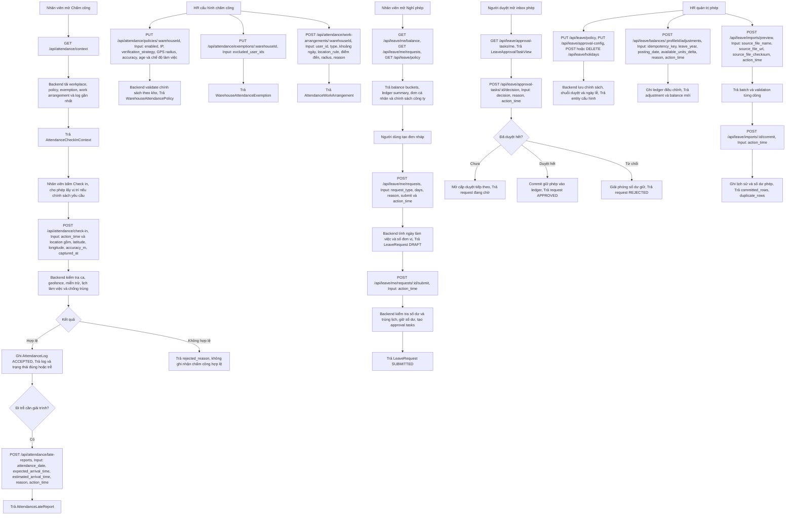

## 14. Thư viện tệp, tài liệu quy trình và thông báo

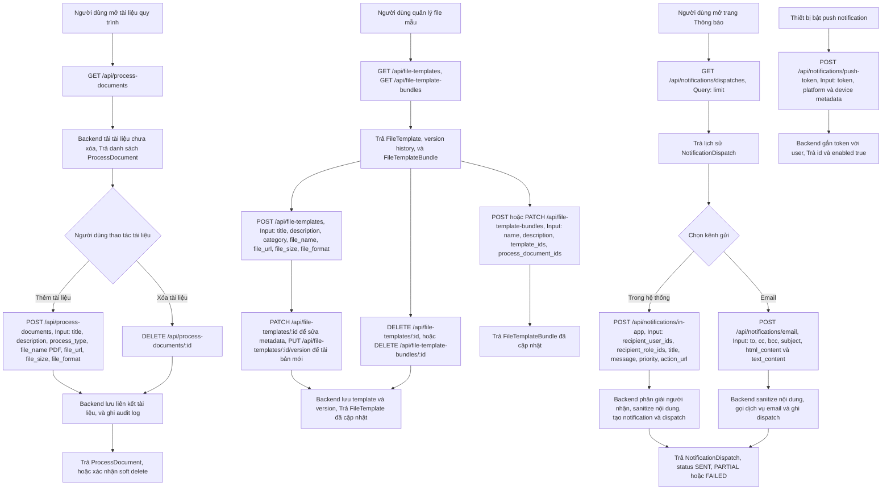

## 15. Người dùng, vai trò, phạm vi cơ sở, cấu hình hệ thống và audit

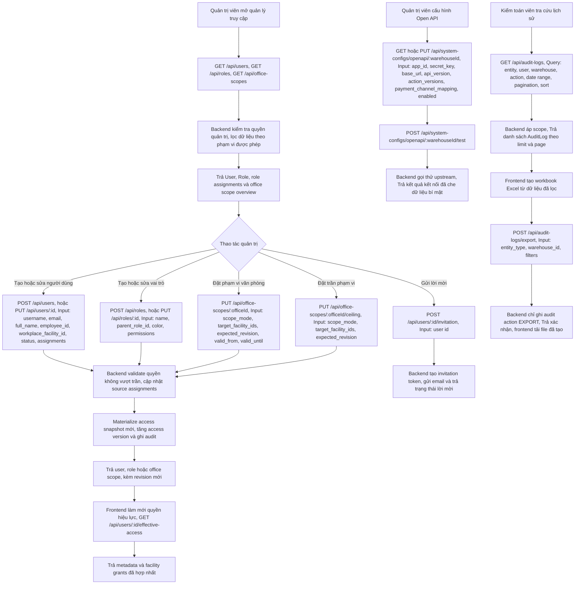

## 16. Quản lý thiết bị và cấu hình POS

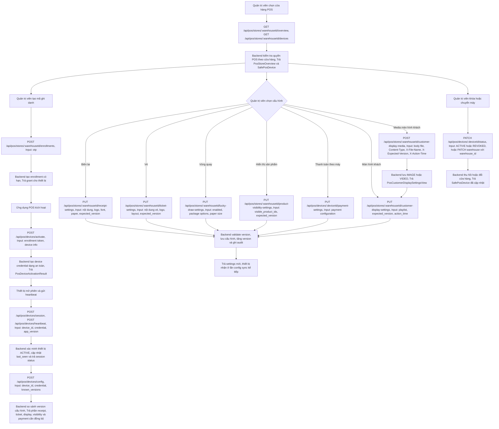

## 17. Chiến dịch voucher marketing

Luồng backend đã có đầy đủ API và feature gate. Tại thời điểm rà soát, menu có đường dẫn `/admin/vouchers` nhưng chưa tìm thấy page route tương ứng trong frontend; vì vậy sơ đồ dưới đây mô tả contract nghiệp vụ mà giao diện quản trị cần gọi.

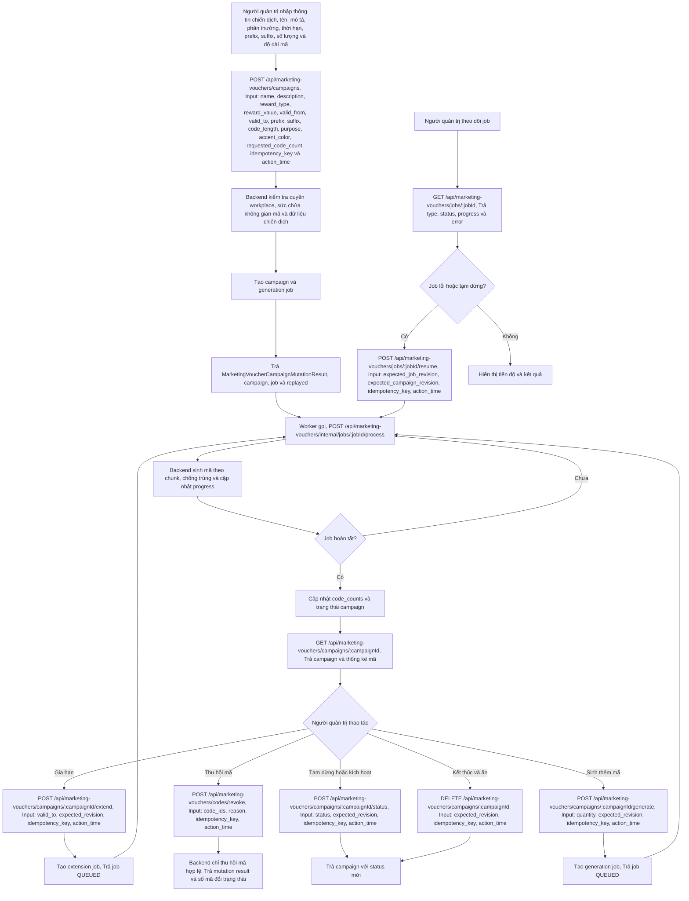
