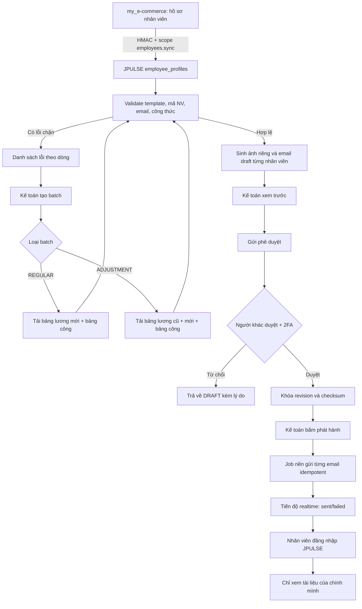
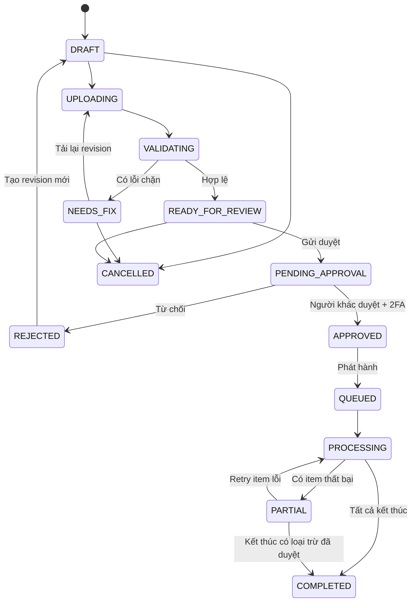

# Thiết kế nghiệp vụ gửi bảng lương an toàn trên JPULSE

- Trạng thái: Đề xuất chi tiết để review trước khi triển khai
- Ngày lập: 18-09-2026
- Phạm vi: JPULSE (`bduck-system`) và đồng bộ hồ sơ nhân viên từ `my_e-commerce`
- Đối tượng: Kế toán, người phê duyệt, nhân viên, quản trị hệ thống
- Nguyên tắc: xem trước trước khi gửi, tách dữ liệu tuyệt đối theo nhân viên, không xóa cứng, audit đầy đủ, cập nhật realtime, Việt/Trung

## 1. Kết luận kiến trúc

Giải pháp được đề xuất là một domain mới trong JPULSE tên **Phát hành bảng
lương** (`payroll-delivery`), không ghép trực tiếp vào chức năng thông báo chung.

- `my_e-commerce` tiếp tục là nguồn hồ sơ nhân viên gốc: mã nhân viên, tài
  khoản, email, nơi làm việc và trạng thái làm việc.
- JPULSE giữ một projection tối thiểu trong `employee_profiles` và là nơi quản
  lý file lương, kiểm tra, render ảnh, phê duyệt, phát hành email, theo dõi lỗi
  và cho nhân viên xem tài liệu của chính mình.
- Email chỉ thông báo và chứa nút mở cổng bảo mật. Ảnh bảng lương/bảng công
  được hiển thị **sau khi đăng nhập**, không đính kèm trực tiếp vào email ở chế
  độ mặc định.
- Không dùng CCCD làm mật khẩu file. CCCD là dữ liệu nhận dạng có thể biết
  được, không phải bí mật xác thực; đồng thời dữ liệu hiện tại còn thiếu CCCD ở
  một số nhân viên.
- Mỗi lần phát hành là một batch bất biến sau phê duyệt. Mọi thay đổi nguồn,
  người nhận hoặc nội dung đều làm hết hiệu lực phê duyệt và yêu cầu duyệt lại.

### Hai chế độ batch

| Chế độ | Dùng khi | Tài liệu của mỗi nhân viên | Nội dung email |
| --- | --- | --- | --- |
| `REGULAR` | Quy trình hằng tháng thông thường | Bảng lương hiện tại + bảng công | Thông báo bảng lương tháng đã sẵn sàng |
| `ADJUSTMENT` | Có tính thiếu/thừa hoặc cần đối chiếu | Bảng lương cũ + bảng lương mới + bảng công | Nội dung đối chiếu; thêm đoạn truy lĩnh nếu `arrears_amount > 0` |

Như vậy sự cố tháng 08/2026 là một batch `ADJUSTMENT`. Các tháng bình thường
sau đó chỉ dùng `REGULAR`, không phải tải và gửi hai bảng lương.

## 2. Phạm vi và điều kiện đầu vào

### 2.1 Trong phạm vi

- Đồng bộ hồ sơ nhân viên từ `my_e-commerce` sang JPULSE bằng mã nhân viên ổn
  định.
- Quản lý template Excel có version.
- Import một hoặc nhiều file nguồn, validation toàn batch và ánh xạ từng dòng
  với đúng nhân viên.
- Sinh riêng ảnh bảng lương/bảng công cho từng nhân viên.
- Xem trước danh sách người nhận, email, nội dung và toàn bộ ảnh trước khi gửi.
- Phê duyệt hai người, chặn người tạo tự duyệt.
- Gửi email theo job nền, idempotent, retry từng người nhận.
- Nhân viên xem tài liệu của chính mình trong JPULSE.
- Audit toàn bộ vòng đời và theo dõi realtime.

### 2.2 Ngoài phạm vi MVP

- Tính lương từ dữ liệu chấm công thô.
- Tự chuyển tiền ngân hàng.
- Gửi bảng lương qua Zalo/ứng dụng chat.
- Cho phép sửa số tiền trực tiếp trong JPULSE sau import.
- Gửi file lương không mã hóa dưới dạng attachment email.
- OCR bảng lương hoặc suy đoán nhân viên theo tên gần giống.

### 2.3 Kết quả khảo sát bộ file hiện tại

Các điểm này phải được xử lý ở bước tiền kiểm, không được bỏ qua khi triển khai:

- File nhân viên hiện có 26 dòng, email ở cột D, CCCD ở cột G nhưng không có
  mã nhân viên ổn định.
- Có hai địa chỉ có dấu hiệu gõ sai tên miền `gmail.con`; hệ thống phải báo lỗi
  để kế toán sửa nguồn, không tự sửa âm thầm.
- Hai trong ba nhân viên xuất hiện ở file lương hiện tại chưa có CCCD, vì vậy
  phương án dùng CCCD làm mật khẩu không khả thi ngay cả về dữ liệu.
- Bộ file đính kèm là **Fulltime**, trong khi mô tả ban đầu nhắc **Parttime**.
  Người tạo batch phải xác nhận loại nhân viên; không suy đoán.
- Sheet thực tế là `Bang luong`, `T08`, `Phieu luong`, không trùng tên nghiệp
  vụ được mô tả trước đó.
- Cột/ô `Truy lĩnh` hiện là kết quả động theo nhân viên đang chọn trong
  `Phieu luong`, chưa phải bảng dữ liệu một dòng/một nhân viên.
- Workbook có công thức `#REF!` và liên kết tới workbook ngoài. Batch phải bị
  chặn nếu còn lỗi công thức hoặc nguồn ngoài chưa được materialize thành giá
  trị ổn định.
- Ghép theo tên chỉ có thể dùng để hỗ trợ migration có người xác nhận; bản
  production bắt buộc ghép theo `employee_code`.

## 3. Quyết định nghiệp vụ cốt lõi

### 3.1 Khóa định danh

`employee_code` là khóa duy nhất dùng để ghép file lương với hồ sơ nhân viên.
Không ghép tự động theo họ tên, email, số điện thoại hoặc CCCD.

`my_e-commerce` cần bổ sung `employeeCode` bất biến và duy nhất cho `UserDoc`.
JPULSE lưu cùng giá trị vào `EmployeeProfile.employee_code`. Đổi tên hoặc email
không làm mất liên kết lịch sử.

### 3.2 Snapshot người nhận

Khi kế toán gửi batch đi duyệt, hệ thống chụp snapshot:

- `employee_profile_id`, `employee_user_id`, `employee_code`, họ tên;
- email nhận tại thời điểm duyệt;
- nơi làm việc và phạm vi quyền;
- nội dung email đã render;
- danh sách artifact và checksum;
- số truy lĩnh, ngày thanh toán và nội dung chuyển khoản nếu có.

Email thay đổi sau khi duyệt không tự động thay người nhận trong batch cũ. Kế
toán phải tạo revision, xem trước và xin duyệt lại.

### 3.3 Quy tắc batch điều chỉnh tháng 08/2026

- `payroll_period`: `2026-08`.
- `batch_type`: `ADJUSTMENT`.
- `payment_date`: `2026-09-22`.
- `transfer_memo`: `TẠM ỨNG LƯƠNG THÁNG 09/2026`.
- Tất cả người trong batch được xem bảng lương cũ, bảng lương mới và bảng công
  của chính họ để đối chiếu.
- Chỉ người có `arrears_amount > 0` nhận đoạn giải thích truy lĩnh.
- `arrears_amount = 0` không hiển thị nội dung thanh toán bổ sung.
- `arrears_amount < 0` bị đưa vào `NEEDS_REVIEW`, không được tự động gửi vì có
  thể là truy thu/thừa lương và cần nội dung, phê duyệt riêng.
- Nội dung chuyển khoản chỉ mô tả giao dịch bổ sung của kế toán, không tạo hoặc
  trừ khoản lương tháng 09/2026 trong hệ thống.
- Ngày và nội dung trên là dữ liệu của batch này, không hard-code vào template
  hay source code.

### 3.4 Bất biến chống gửi nhầm

Một email chỉ được enqueue khi tất cả điều kiện sau đúng:

1. Row resolve chính xác một `employee_profile_id` bằng `employee_code`.
2. Email hợp lệ, không trùng với row khác ngoài trường hợp đã được phê duyệt
   ngoại lệ.
3. Mỗi artifact có cùng `employee_profile_id` với row.
4. Artifact render không chứa mã nhân viên khác.
5. Batch checksum và row checksum trùng bản đã phê duyệt.
6. Người tạo khác người duyệt và người duyệt đã xác thực 2FA gần đây.
7. Batch chưa từng gửi cùng `idempotency_key`.

Nếu một row lỗi, chỉ row đó bị chặn. Batch có thể duyệt khi mọi row lỗi đã bị
loại có lý do hoặc được sửa và preview lại; hệ thống không âm thầm bỏ qua.

## 4. Vai trò và phân quyền

Đề xuất thêm các permission vào `PERMISSION_REGISTRY`, nhóm `employees` hoặc
một nhóm mới `payroll_delivery` nếu muốn hiển thị tách biệt trong màn hình vai
trò.

| Permission | Ý nghĩa | Vai trò gợi ý |
| --- | --- | --- |
| `payroll_delivery.read` | Xem danh sách batch trong phạm vi cơ sở | Kế toán, HR, quản lý tài chính |
| `payroll_delivery.import` | Tạo batch, tải file, chạy preview | Kế toán |
| `payroll_delivery.review` | Xem dữ liệu chi tiết và đánh dấu ngoại lệ | Kế toán trưởng/HR được ủy quyền |
| `payroll_delivery.approve` | Duyệt hoặc từ chối batch | Quản lý tài chính |
| `payroll_delivery.send` | Phát hành batch đã duyệt | Kế toán được phân quyền |
| `payroll_delivery.retry` | Retry các email thất bại, không đổi payload | Kế toán vận hành |
| `payroll_delivery.audit.read` | Xem lịch sử thao tác và truy cập | Kiểm soát nội bộ |
| `payroll_delivery.config.manage` | Quản lý template, nhà cung cấp email, retention | Quản trị hệ thống |
| `payroll_delivery.self.read` | Xem tài liệu lương của chính mình | Nhân viên |

Quy tắc bắt buộc:

- Permission được kiểm tra ở cả frontend và backend.
- Quyền quản trị bị giới hạn theo `workplace_warehouse_id` như các domain nhân
  sự hiện hữu.
- Có `approve` không đồng nghĩa có `send`.
- `creator_id === approver_id` luôn trả lỗi nghiệp vụ.
- Duyệt và gửi yêu cầu step-up 2FA; phiên xác thực tăng cường nên có hiệu lực
  tối đa 10 phút.
- Quyền `self.read` chỉ trả dữ liệu có `employee_user_id === req.user.id`; client
  không được truyền `employee_profile_id` để chọn người khác.

## 5. Luồng nghiệp vụ tổng thể



### 5.1 Luồng chi tiết của kế toán

1. Mở **Nhân sự → Phát hành bảng lương**.
2. Chọn **Tạo đợt phát hành**.
3. Nhập kỳ lương, loại `REGULAR`/`ADJUSTMENT`, nhóm nhân sự, cơ sở và thông tin
   thanh toán bổ sung nếu có.
4. Tải template từ JPULSE hoặc tải các file nguồn đúng phiên bản.
5. Hệ thống upload vào vùng tạm private, quét định dạng, checksum và validation.
6. Hệ thống resolve `employee_code` với snapshot nhân viên.
7. Kế toán xử lý các lỗi chặn/cảnh báo. Không có nút bỏ qua hàng loạt lỗi.
8. Hệ thống sinh ảnh và email draft cho từng người.
9. Kế toán mở lần lượt hoặc dùng bộ lọc để xem người có truy lĩnh, không truy
   lĩnh, thiếu email, khác cơ sở.
10. Kế toán xác nhận checklist và gửi phê duyệt.
11. Người duyệt khác đăng nhập, xác thực 2FA, xem mẫu và duyệt/từ chối.
12. Kế toán có quyền `send` phát hành batch đã duyệt.
13. Job nền gửi từng email; màn hình tự cập nhật tiến độ bằng listener.
14. Chỉ email thất bại mới được retry, giữ nguyên snapshot/checksum đã duyệt.

### 5.2 Luồng của nhân viên

1. Nhân viên nhận email không chứa số lương hoặc ảnh lương trực tiếp.
2. Nhấn **Xem bảng lương trên JPULSE**.
3. Nếu chưa đăng nhập, chuyển tới đăng nhập; nếu chính sách yêu cầu thì nhập
   TOTP.
4. Backend resolve hồ sơ từ user hiện tại, không nhận ID nhân viên từ URL làm
   căn cứ phân quyền.
5. Nhân viên thấy danh sách kỳ lương của mình.
6. Khi mở một kỳ, hệ thống phát signed URL một lần/thời hạn ngắn cho đúng
   artifact của nhân viên đó.
7. Lần xem đầu tiên và mọi lần tải xuống được ghi audit/access event.

## 6. Vòng đời trạng thái

### 6.1 Batch



Không cho cancel sau khi đã có email `SENT`. Khi cần sửa sau phát hành, tạo
batch correction mới có liên kết `supersedes_batch_id`.

### 6.2 Row nhân viên

`PENDING_VALIDATION → BLOCKED | NEEDS_REVIEW | READY → QUEUED → SENDING → SENT |
FAILED → VIEWED`.

- `BLOCKED`: thiếu/sai mã nhân viên, email lỗi, artifact lẫn dữ liệu, công thức
  lỗi hoặc thiếu tài liệu bắt buộc.
- `NEEDS_REVIEW`: chênh lệch âm, email trùng, mapping migration theo tên hoặc
  cảnh báo bất thường.
- `READY`: đã đủ dữ liệu và có preview.
- `FAILED`: lỗi gửi có mã lỗi đã sanitize; retry không tạo nội dung mới.
- `VIEWED`: đã có access event đầu tiên, nhưng không thay `SENT` trong job; đây
  là read model hiển thị.

## 7. Hợp đồng template Excel v1

Nên thay workbook động hiện tại bằng file dữ liệu phẳng do JPULSE phát hành.
Template có các sheet sau:

### 7.1 `_meta`

| Key | Ví dụ | Quy tắc |
| --- | --- | --- |
| `template_name` | `JPULSE_PAYROLL_DELIVERY` | Bắt buộc |
| `template_version` | `1.0` | Backend chỉ nhận version được hỗ trợ |
| `payroll_period` | `2026-08` | `YYYY-MM` |
| `batch_type` | `REGULAR` hoặc `ADJUSTMENT` | Bắt buộc |
| `timezone` | `Asia/Ho_Chi_Minh` | Cố định ở v1 |
| `source_system` | `ACCOUNTING` | Audit |

### 7.2 `PAYROLL_CURRENT`

Một dòng/một nhân viên, tối thiểu có:

- `employee_code`;
- `full_name_reference` chỉ để đối chiếu hiển thị;
- các cột thu nhập/khấu trừ theo template đã version hóa;
- `net_salary`;
- `arrears_amount` với batch `ADJUSTMENT`;
- `source_reference` duy nhất.

### 7.3 `PAYROLL_PREVIOUS`

Chỉ có với `ADJUSTMENT`, cùng cấu trúc chính với `PAYROLL_CURRENT`. Không có
sheet này trong `REGULAR` để giảm nhầm lẫn.

### 7.4 `TIMESHEET`

Một hoặc nhiều dòng của một nhân viên, luôn có `employee_code`, ngày, ca/giờ
công, giờ vào/ra, loại công và ghi chú. Hệ thống gom theo `employee_code` rồi
render duy nhất phần của nhân viên đó.

### 7.5 Validation file

- Chỉ nhận `.xlsx`, tối đa 10MB/file; không nhận `.xlsm`, macro, executable,
  SVG hoặc file đổi đuôi.
- Kiểm tra MIME, magic bytes, phần mở rộng và SHA-256.
- Không chấp nhận external workbook links.
- Không chấp nhận công thức lỗi `#REF!`, `#VALUE!`, `#NAME?`, `#N/A` ở trường
  bắt buộc.
- Chỉ dùng cached formula value khi workbook được exporter tin cậy tạo; lựa
  chọn an toàn hơn là template chỉ chứa giá trị.
- Header, sheet và version phải đúng tuyệt đối.
- `employee_code` phải duy nhất trong mỗi bảng lương.
- Không cho phép formula/cell chứa URL, DDE hoặc nội dung có thể gây formula
  injection khi xuất lại.
- Batch tối đa được cấu hình; đề xuất MVP 500 nhân viên.

Trong giai đoạn chuyển đổi, có thể xây một adapter riêng cho file kế toán cũ.
Adapter chỉ dùng để tạo preview và yêu cầu kế toán xác nhận từng mapping. Sau
UAT phải chuyển sang template v1, không duy trì suy đoán tên sheet vô hạn.

## 8. Sinh ảnh và cô lập tài liệu

Mỗi row sinh tối đa ba artifact:

| Artifact | `REGULAR` | `ADJUSTMENT` |
| --- | --- | --- |
| `PAYSLIP_CURRENT` | Bắt buộc | Bắt buộc |
| `PAYSLIP_PREVIOUS` | Không có | Bắt buộc |
| `TIMESHEET` | Bắt buộc | Bắt buộc |

Quy trình render:

1. Normalize dữ liệu row thành model server-side.
2. Render HTML/SVG nội bộ từ model, không chụp nguyên sheet có vùng của người
   khác.
3. Chuyển thành PNG độ phân giải cao và PDF tùy chọn để tải xuống.
4. Đóng watermark mờ: họ tên, mã nhân viên, kỳ lương và mã batch.
5. Chạy kiểm tra manifest: artifact phải chỉ chứa đúng một `employee_code`.
6. Lưu private storage path có ID ngẫu nhiên; không dùng tên/email trong path.
7. Lưu SHA-256, kích thước, MIME, render version và source row checksum.

Không crop trực tiếp một workbook tổng rồi gửi nếu vùng crop có khả năng chứa
header/footer của người khác. Render từ model theo row giúp giảm rủi ro lộ dữ
liệu và tạo giao diện nhất quán.

## 9. Nội dung email linh hoạt

### 9.1 Email thường

**Tiêu đề:** `[JPULSE] Bảng lương tháng {{payroll_period_display}} của bạn đã sẵn sàng`

```text
Xin chào {{employee_name}},

Bảng lương và bảng công tháng {{payroll_period_display}} của bạn đã được phát
hành trên JPULSE. Vui lòng đăng nhập để xem tài liệu cá nhân.

[Xem bảng lương trên JPULSE]

Nếu thông tin chưa chính xác, vui lòng phản hồi theo kênh hỗ trợ nội bộ trước
{{support_deadline}}.
```

### 9.2 Email điều chỉnh có truy lĩnh

**Tiêu đề:** `[JPULSE] Bảng lương điều chỉnh tháng 08/2026`

```text
Xin chào {{employee_name}},

JPULSE đã phát hành bảng lương ngày 15, bảng lương điều chỉnh và bảng công của
bạn để đối chiếu.

Phần truy lĩnh sẽ được thanh toán vào Thứ Ba, ngày 22/09/2026. Nội dung chuyển
khoản là “TẠM ỨNG LƯƠNG THÁNG 09/2026”. Đây là nội dung nghiệp vụ để bộ phận
kế toán chi bổ sung phần lương còn thiếu và không ảnh hưởng đến lương tháng
09/2026 của bạn.

[Xem tài liệu của tôi trên JPULSE]
```

### 9.3 Email điều chỉnh không có truy lĩnh

Giữ đoạn đối chiếu nhưng bỏ toàn bộ đoạn ngày thanh toán và nội dung chuyển
khoản. Không hiển thị “truy lĩnh 0 đồng”.

Template email dùng structured variables và rule engine đơn giản, không cho kế
toán chèn HTML tùy ý. Preview hiển thị đúng bản render cuối cùng. Mọi text có
bản `vi` và `zh`; batch chọn ngôn ngữ theo hồ sơ nhân viên, mặc định `vi`.

## 10. Mô hình dữ liệu đề xuất

Tạo `packages/shared-types/src/payrollDelivery.ts` và export từ package dùng
chung. Mọi entity có `action_time`, `sync_time`, timestamps, actor và
`is_deleted` nếu có vòng đời quản trị.

### 10.1 `payroll_delivery_batches`

Các trường chính:

```typescript
interface PayrollDeliveryBatch {
  id: string;
  payroll_period: string;
  batch_type: "REGULAR" | "ADJUSTMENT";
  employee_type: "FT" | "PT" | "MIXED";
  workplace_warehouse_ids: string[];
  status: PayrollDeliveryBatchStatus;
  template_version: string;
  revision: number;
  source_checksums: string[];
  payment_date: string | null;
  transfer_memo: string | null;
  support_deadline: string | null;
  created_by: string;
  submitted_by: string | null;
  approved_by: string | null;
  approved_at: Date | null;
  approval_checksum: string | null;
  supersedes_batch_id: string | null;
  action_time: Date;
  sync_time: Date;
  is_deleted: boolean;
}
```

### 10.2 `payroll_delivery_rows`

Mỗi document là một snapshot nhân viên trong batch:

- `batch_id`, `employee_profile_id`, `employee_user_id`, `employee_code`;
- `employee_name_snapshot`, `recipient_email_snapshot`, `locale`;
- `workplace_warehouse_id`, `status`, `validation_issues`;
- `previous_net_salary`, `current_net_salary`, `arrears_amount`;
- `email_subject`, `email_body_text`, `email_template_version`;
- `artifact_ids`, `source_row_references`, `row_checksum`;
- `excluded_at`, `excluded_by`, `exclusion_reason` nếu loại khỏi batch.

Không lưu toàn bộ cell thô vào audit log. Dữ liệu số chi tiết được lưu ở vùng
quyền hạn chế và mã hóa trường nhạy cảm nếu backend cần truy vấn.

### 10.3 `payroll_delivery_artifacts`

- liên kết batch/row/employee;
- `artifact_type`, private `storage_path`;
- `mime_type`, `file_size`, `sha256`, `render_version`;
- `source_row_checksum`, `watermark_version`;
- `created_by`, `action_time`, `sync_time`, `is_deleted`.

### 10.4 Approval và job

- `payroll_delivery_approvals`: request, decision, reason, creator/approver,
  revision/checksum và thời gian 2FA.
- `payroll_delivery_jobs`: tổng số, queued, sent, failed, excluded, timestamps,
  provider, idempotency key.
- `payroll_delivery_job_items`: một row/một người nhận, attempt count, provider
  message ID, lỗi đã sanitize và `next_retry_at`.
- `payroll_access_events`: view/download/expired-link/denied, user, artifact,
  IP/user-agent đã rút gọn theo chính sách retention.
- `audit_logs`: old/new values cho mọi mutation nghiệp vụ; không ghi ảnh, token,
  signed URL hoặc nội dung lương đầy đủ.

## 11. API và kiến trúc backend

Tuân thủ `Route → JWT/RBAC/Zod middleware → Controller → Service → Repository`.
Các mutation nhận `idempotency_key` và `expected_revision`.

| Method | Endpoint | Permission | Chức năng |
| --- | --- | --- | --- |
| `GET` | `/api/payroll-delivery` | `read` | Danh sách batch theo phạm vi |
| `POST` | `/api/payroll-delivery` | `import` | Tạo draft |
| `POST` | `/api/payroll-delivery/:id/upload-sessions` | `import` | URL upload private ngắn hạn |
| `POST` | `/api/payroll-delivery/:id/preview` | `import` | Parse, validate, render preview |
| `GET` | `/api/payroll-delivery/:id` | `read` | Chi tiết batch |
| `GET` | `/api/payroll-delivery/:id/rows` | `read` | Row có filter/pagination |
| `POST` | `/api/payroll-delivery/:id/submit-approval` | `review` | Gửi duyệt |
| `POST` | `/api/payroll-delivery/:id/approve` | `approve` | Duyệt sau 2FA |
| `POST` | `/api/payroll-delivery/:id/reject` | `approve` | Từ chối có lý do |
| `POST` | `/api/payroll-delivery/:id/send` | `send` | Tạo job phát hành |
| `POST` | `/api/payroll-delivery/:id/retry` | `retry` | Retry item lỗi |
| `POST` | `/api/payroll-delivery/:id/cancel` | `import` | Cancel/soft-delete khi hợp lệ |
| `GET` | `/api/payroll-delivery/self` | `self.read` | Danh sách kỳ của user hiện tại |
| `POST` | `/api/payroll-delivery/self/:artifactId/access` | `self.read` | Signed URL ngắn hạn sau ownership check |

Đồng bộ hồ sơ sử dụng tuyến tích hợp hiện hữu:

| Method | Endpoint | Xác thực | Chức năng |
| --- | --- | --- | --- |
| `PUT` | `/api/external/v1/employees/:employeeCode` | HMAC + `employees.sync` | Upsert projection nhân viên |
| `POST` | `/api/external/v1/employees/sync-batch` | HMAC + `employees.sync` | Backfill/đồng bộ theo batch |

Request HMAC giữ hợp đồng hiện tại
`method|path|timestamp|body`, chống replay và giới hạn scope. Payload sync không
chứa CCCD đầy đủ, ảnh CCCD hay số tài khoản ngân hàng vì JPULSE chỉ cần định
danh, email, user link, nơi làm việc và trạng thái.

Mọi response có `messages.vi` và `messages.zh`. Rate limit riêng cho upload,
preview, approve, send và signed URL. `helmet`, sanitize input, Zod và kiểm tra
quyền được thực thi trước service.

## 12. Màn hình và thành phần UI

### 12.1 Màn hình A — Danh sách đợt phát hành

**Route:** `/payroll-delivery`

**Desktop**

```text
┌ Phát hành bảng lương                         [Tạo đợt phát hành] ┐
│ [Kỳ lương] [Loại] [Trạng thái] [Cơ sở] [Tìm mã batch]          │
├─────────────────────────────────────────────────────────────────┤
│ Batch       Kỳ       Loại        Tiến độ      Trạng thái        │
│ PR-...      08/2026  Điều chỉnh  3/3          Hoàn tất          │
│ PR-...      09/2026  Thường      24/26        Gửi một phần      │
└─────────────────────────────────────────────────────────────────┘
```

Thành phần:

- `PayrollDeliveryHeader`: tiêu đề, mô tả, CTA theo quyền.
- `PayrollBatchFilters`: filter kỳ, loại, trạng thái, cơ sở; đồng bộ query URL.
- `PayrollBatchSummary`: số draft/chờ duyệt/đang gửi/lỗi, không hiển thị tổng
  tiền cho người chỉ có quyền `read`.
- `PayrollBatchTable` desktop và `PayrollBatchCardList` mobile.
- `PayrollBatchStatusBadge`, `PayrollDeliveryProgress`.
- `PayrollBatchListSkeleton`, empty state và error state.

Không có nút refresh. Danh sách và tiến độ cập nhật bằng `onSnapshot`.

**Mobile:** header gọn, CTA dạng floating action hoặc sticky bottom; filter mở
bottom sheet; mỗi batch là card chạm toàn vùng, tiến độ dạng thanh ngắn. Không
ép bảng desktop thành bảng ngang có scroll.

### 12.2 Màn hình B — Wizard tạo batch

**Route:** `/payroll-delivery/new` hoặc sheet toàn màn hình trên mobile.

| Bước | Thành phần | Kết quả |
| --- | --- | --- |
| 1. Thông tin | `PayrollBatchMetadataStep` | Kỳ, loại batch, FT/PT, cơ sở, deadline |
| 2. Tải file | `PayrollFileUploadStep` | Upload nguồn và kiểm tra checksum |
| 3. Kiểm tra | `PayrollValidationStep` | Lỗi/chặn/cảnh báo theo row |
| 4. Xem trước | `PayrollEmployeePreviewStep` | Ảnh và email từng nhân viên |
| 5. Xác nhận | `PayrollSubmitStep` | Checklist và gửi phê duyệt |

Chi tiết bước 1:

- `SegmentedControl`: `Thường` / `Điều chỉnh`.
- Chọn kỳ lương, loại nhân viên và cơ sở trong phạm vi quyền.
- Khi chọn `ADJUSTMENT`, hiện ngày thanh toán, nội dung chuyển khoản và lý do.
- Trường ngày thanh toán/nội dung chuyển khoản bắt buộc nếu có bất kỳ truy lĩnh
  dương; kiểm tra lại sau parse.

Chi tiết bước 2:

- `PayrollTemplateDownloadCard` để tải đúng template/version.
- `PayrollFileDropzone` riêng cho từng loại artifact.
- Hiển thị file name, size, SHA-256 rút gọn, trạng thái scan.
- Nút Tiếp tục disabled khi đang upload/validate.
- Lỗi dùng `gooeyToast.promise` có action **Thử lại**.

Chi tiết bước 3:

- Các card tổng: hợp lệ, cảnh báo, bị chặn, có truy lĩnh.
- `PayrollValidationFilters` và `PayrollValidationIssueList`.
- Mỗi lỗi nêu sheet, dòng, mã nhân viên, mã lỗi và cách sửa bằng vi/zh.
- Không cho chỉnh số liệu lương trực tiếp; có thể sửa email hồ sơ qua workflow
  hồ sơ nhân viên, sau đó tạo revision preview mới.

Chi tiết bước 4:

```text
┌ Danh sách nhân viên ───────┬ Xem trước: NV001 ────────────────┐
│ [Tất cả][Truy lĩnh][Cảnh báo]│ Email / Bảng cũ / Bảng mới / Công│
│ ✓ NV001  Có truy lĩnh       │                                  │
│ ✓ NV002  Không truy lĩnh    │ [ảnh đúng của NV001]             │
│ ! NV003  Email lỗi          │                                  │
└─────────────────────────────┴──────────────────────────────────┘
```

- `PayrollEmployeePreviewList`: danh sách ảo hóa, không đưa dữ liệu lương vào
  label.
- `PayrollEmployeePreviewPanel`: tab Email/Bảng cũ/Bảng mới/Bảng công.
- `PayrollRecipientSnapshot`: mã, tên, email, cơ sở.
- `PayrollArrearsBadge`: chỉ hiển thị cho người có quyền review số tiền.
- `PayrollPreviewChecklist`: xác nhận đã kiểm tra người nhận, ảnh, nội dung.

Mobile dùng danh sách trước; chạm một người mở full-screen sheet có swipe giữa
các artifact. Không hiển thị list và preview cạnh nhau trên màn hình nhỏ.

### 12.3 Màn hình C — Chi tiết và phê duyệt batch

**Route:** `/payroll-delivery/[batchId]`

- `PayrollBatchStatusBanner`: trạng thái, revision, người tạo, người duyệt.
- `PayrollBatchMetrics`: tổng row/hợp lệ/truy lĩnh/lỗi.
- `PayrollBatchSourceFiles`: metadata file và checksum, không cho public link.
- `PayrollEmployeeReviewTable/CardList`.
- `PayrollApprovalTimeline`: submit/approve/reject và lý do.
- `PayrollApprovalActionBar`: Duyệt/Từ chối, sticky bottom trên mobile.
- `PayrollTwoFactorDialog`: step-up 2FA trước duyệt.
- `PayrollRejectSheet`: lý do bắt buộc.

Người duyệt xem ít nhất một mẫu có truy lĩnh và một mẫu không truy lĩnh trước
khi nút duyệt được bật. Với batch nhỏ, cấu hình có thể yêu cầu mở toàn bộ row.

### 12.4 Màn hình D — Theo dõi phát hành

Nằm trong detail batch sau khi gửi:

- thanh tiến độ realtime;
- số queued/sending/sent/failed/viewed;
- danh sách item với email được che một phần;
- filter chỉ lỗi;
- nút `Retry lỗi` theo quyền, giữ payload cũ;
- provider message ID chỉ cho admin/audit;
- thông báo nếu tỷ lệ lỗi vượt ngưỡng.

Không cho sửa email trong job. Nếu email sai, tạo revision/batch bổ sung sau khi
cập nhật hồ sơ và phê duyệt lại.

### 12.5 Màn hình E — Bảng lương của tôi

Tích hợp một tab mới `payroll` vào `/employee-admin`, bên cạnh `time` và
`admin`, tận dụng `EmployeeAdminTabs` hiện có.

Thành phần:

- `MyPayrollPeriodList`: card theo tháng, loại thường/điều chỉnh, trạng thái.
- `MyPayrollAdjustmentNotice`: thông báo truy lĩnh có điều kiện.
- `PayrollDocumentViewer`: tab Bảng lương hiện tại/Bảng cũ/Bảng công.
- viewer ảnh có zoom, pan và fit-width; mobile ưu tiên toàn màn hình.
- `SecureDownloadButton`: xin signed URL mới khi bấm, không preload URL.
- `PayrollAccessNotice`: nhắc tài liệu cá nhân, không chia sẻ.
- `MyPayrollSkeleton`, empty state và expired-access state.

Tab chỉ hiện khi có `payroll_delivery.self.read`. Menu `employeeAdmin` thêm
permission này vào `permissionsAny` để nhân viên chỉ có quyền xem lương vẫn
truy cập được.

### 12.6 Màn hình F — Audit và cấu hình

**Audit drawer/page**

- timeline action với actor, `action_time`, `sync_time`;
- revision, old/new value đã redact;
- filter theo batch, nhân viên, action và thời gian;
- access denied events và download events;
- export audit chỉ dành cho quyền audit.

**Cấu hình**

- template đang active và version history;
- email sender/domain/provider health;
- retention policy;
- ngưỡng batch và retry;
- feature flag rollout;
- không hiển thị secret/API key.

## 13. Cấu trúc frontend đề xuất

```text
apps/fe-wms/src/
├─ app/payroll-delivery/
│  ├─ page.tsx
│  ├─ new/page.tsx
│  └─ [batchId]/page.tsx
├─ components/payroll-delivery/
│  ├─ batch-list/
│  ├─ batch-wizard/
│  ├─ preview/
│  ├─ approval/
│  ├─ delivery-monitor/
│  ├─ self-service/
│  └─ skeletons/
├─ hooks/
│  ├─ usePayrollBatches.ts
│  ├─ usePayrollBatch.ts
│  ├─ usePayrollDeliveryJob.ts
│  └─ useMyPayrollDocuments.ts
├─ lib/payrollDeliveryApi.ts
├─ utils/
│  ├─ payrollDeliveryUiPolicy.ts
│  ├─ payrollDeliveryFormat.ts
│  └─ payrollDeliveryValidationMessages.ts
└─ lib/payrollDeliveryFeatureFlag.ts
```

- Server Components chỉ làm shell/initial auth phù hợp; listener và wizard là
  Client Components ở boundary nhỏ.
- Toàn bộ styling dùng Tailwind, light-only, không render theo system dark mode.
- Skeleton mô phỏng đúng card/table/viewer sắp xuất hiện.
- Mọi mutation dùng `gooeyToast.promise`, có title/description/retry và disable
  nút để chống click đúp.
- Text qua i18n `vi`/`zh`.
- Draft metadata có thể lưu Zustand + IndexedDB; ảnh lương và số tiền không
  cache lâu dài trên client.

## 14. Cấu trúc backend đề xuất

```text
apps/be-wms/src/
├─ api/routes/payrollDeliveryRoutes.ts
├─ api/controllers/payrollDeliveryController.ts
├─ api/validators/payrollDeliverySchemas.ts
├─ services/payroll-delivery/
│  ├─ payrollDeliveryAccessPolicy.ts
│  ├─ payrollDeliveryImportService.ts
│  ├─ payrollDeliveryValidationService.ts
│  ├─ payrollDeliveryRenderService.ts
│  ├─ payrollDeliveryApprovalService.ts
│  ├─ payrollDeliveryDispatchService.ts
│  └─ payrollDeliverySelfService.ts
├─ repositories/payroll-delivery/
├─ workers/payrollDeliveryWorker.ts
└─ utils/payrollDeliveryChecksum.ts
```

Các file phải được chia nhỏ khi gần 200–300 dòng. Parser, policy, render và
dispatch không đặt chung trong controller.

Tận dụng pattern sẵn có:

- upload session/private storage từ import hợp đồng;
- preview/commit có checksum từ import hợp đồng;
- job item, retry và idempotency từ marketing voucher email;
- Brevo provider wrapper cho email;
- `onSnapshot`/facility scope từ các hook leave;
- central `PERMISSION_REGISTRY`, `menuConfig` và `employee-admin` tabs.

## 15. Realtime, local-first và đồng thời

- `payroll_delivery_batches`, approvals và job progress có listener realtime.
- UI không có nút “Tải lại”, “Đồng bộ” hoặc hướng dẫn F5.
- Draft metadata và lựa chọn filter có thể hoạt động local-first.
- Upload file, preview nhạy cảm, approve và send yêu cầu online; không queue
  offline thao tác gửi lương vì rủi ro phát hành trễ/nhầm.
- Mọi mutation ghi `action_time` từ client và `sync_time` từ server.
- `revision` + `expected_revision` chống hai kế toán ghi đè nhau.
- Sau submit approval, transaction khóa revision và source checksum.
- Job dùng deterministic key `payroll-delivery:{batchId}:{revision}:{rowId}`;
  retry không thể gửi trùng item đã `SENT`.

Đây là local-first có giới hạn theo phân loại dữ liệu: UX draft vẫn chịu được
mất mạng, nhưng tài liệu lương không được lưu offline bừa bãi.

## 16. Bảo mật và riêng tư

### 16.1 Không dùng CCCD làm mật khẩu

CCCD không đủ tính bí mật, có thể xuất hiện trong hồ sơ/ảnh chụp và khó thay
đổi sau lộ lọt. Ngoài ra không nên truyền/lưu thêm CCCD chỉ để mở file.

Baseline an toàn:

- đăng nhập tài khoản nhân viên;
- session cookie `HttpOnly`, `Secure`, `SameSite=Strict` nếu dùng cookie;
- 2FA/TOTP cho admin và hành động approve/send;
- có thể yêu cầu step-up 2FA cho nhân viên khi mở bảng lương tùy chính sách;
- signed URL TTL 5 phút, phát sau ownership check, không gửi qua email;
- private bucket, `Cache-Control: private, no-store`;
- mã hóa at-rest theo hạ tầng và field-level encryption cho dữ liệu số nhạy cảm;
- không ghi salary, CCCD, token, signed URL vào log;
- email recipient và lỗi provider được redact trên UI/log không có quyền;
- rate limit các endpoint login/access/download/preview/send;
- audit mọi lượt xem, tải, từ chối và truy cập sai quyền.

### 16.2 Phòng chống lộ chéo nhân viên

- Backend luôn derive `employee_user_id` từ JWT cho self-service.
- Repository query theo cả `artifact_id` và `employee_user_id`, không query theo
  artifact rồi mới lọc ở frontend.
- Storage path không đoán được và không mang email/tên.
- Signed URL không được tái sử dụng sau TTL; cân nhắc one-time token cho tải.
- Test tự động cố mở artifact của nhân viên B bằng token nhân viên A.
- Worker kiểm tra lại invariant artifact-owner ngay trước send.
- Preview và send cùng dùng một immutable manifest, tránh render lại khác bản
  đã duyệt.

### 16.3 Retention đề xuất

- File upload tạm: xóa tự động sau 24 giờ nếu chưa finalize; đây là dữ liệu tạm
  chưa trở thành hồ sơ nghiệp vụ.
- Artifact phát hành: giữ theo chính sách HR/pháp lý được phê duyệt; mặc định đề
  xuất 5 năm nhưng phải xác nhận trước production.
- Audit log: không xóa cứng, archive theo chính sách.
- Provider delivery log: giữ metadata tối thiểu, không giữ body lương đầy đủ.

## 17. Đồng bộ `my_e-commerce` → JPULSE

### 17.1 Payload tối thiểu

```typescript
interface EmployeeMasterProjection {
  employee_code: string;
  source_user_id: string;
  full_name: string;
  email: string | null;
  employee_type: "FT" | "PT";
  workplace_key: string;
  employment_status: "ACTIVE" | "SUSPENDED" | "ENDED";
  source_updated_at: string;
  source_version: number;
}
```

Không sync `idCard`, ảnh CCCD, tài khoản ngân hàng hoặc secret 2FA.

### 17.2 Cơ chế

1. Backfill tạo `employeeCode` cho user hiện hữu có người duyệt mapping.
2. `my_e-commerce` gọi endpoint JPULSE qua helper HMAC hiện có.
3. JPULSE kiểm tra scope `employees.sync`, timestamp, signature, Zod và version.
4. Upsert trong transaction; version thấp hơn bị bỏ qua có audit.
5. Ghi `source_system`, `source_user_id`, `action_time`, `sync_time`.
6. Thay đổi email/trạng thái phát sự kiện để UI JPULSE cập nhật realtime.
7. Batch payroll đã duyệt không thay snapshot; draft hiển thị cảnh báo dữ liệu
   master vừa đổi và yêu cầu preview lại.

Nếu cần đồng bộ ngược, phải tạo ADR riêng; MVP không để hai hệ thống cùng sửa
email/mã nhân viên để tránh xung đột nguồn sự thật.

## 18. Quan sát vận hành

Dashboard kỹ thuật không chứa số lương, chỉ có:

- số batch theo trạng thái;
- thời gian parse/render trung vị và p95;
- tỷ lệ email sent/failed/bounce;
- số lần retry;
- số access denied;
- số batch bị invalidated sau thay đổi nguồn;
- cảnh báo job đứng quá ngưỡng.

Alert gợi ý:

- bất kỳ invariant ownership nào thất bại: dừng toàn batch, mức nghiêm trọng;
- tỷ lệ gửi lỗi > 10% trong 10 phút;
- provider email unavailable;
- job không tiến triển trong 5 phút;
- download/access denied tăng bất thường;
- checksum nguồn thay đổi sau approval.

## 19. Kế hoạch triển khai

### Giai đoạn 0 — Chốt hợp đồng nghiệp vụ và dữ liệu

- [ ] Xác nhận cổng nhân viên đặt trong JPULSE.
- [ ] Xác nhận người duyệt và người có quyền bấm gửi.
- [ ] Xác nhận retention pháp lý.
- [ ] Xác nhận bộ file tháng 08 là Fulltime hay Parttime.
- [ ] Xác nhận “bảng lương cũ ngày 15” là ngày phát hành 15/09/2026.
- [ ] Chốt template Excel v1 và mapping các cột thu nhập/khấu trừ.
- [ ] Tạo danh sách `employee_code` và sửa email nguồn bị lỗi.
- [ ] Chốt việc mọi nhân viên trong batch điều chỉnh đều nhận hai bảng để đối
  chiếu, còn đoạn truy lĩnh chỉ cho người có chênh lệch dương.

**Đầu ra:** ADR, template v1, data dictionary, RBAC matrix, UAT dataset đã che
dữ liệu.

### Giai đoạn 1 — Nền tảng domain và đồng bộ nhân viên

- [ ] Thêm shared types, Zod schema và permission registry.
- [ ] Bổ sung `employeeCode` duy nhất trong `my_e-commerce`.
- [ ] Thêm integration scope/endpoint `employees.sync`.
- [ ] Backfill projection và báo cáo record chưa resolve.
- [ ] Tạo collections, indexes, Firestore rules và audit action types.
- [ ] Thêm feature flag `payrollDelivery` mặc định tắt.

**Đầu ra:** hồ sơ nhân viên có khóa ổn định, chưa có chức năng gửi.

### Giai đoạn 2 — Import, validation và preview

- [ ] Upload session private có TTL và file validation.
- [ ] Parser template v1 và adapter tạm cho workbook tháng 08.
- [ ] Validation engine, error code vi/zh, facility scope.
- [ ] Render service tạo ảnh riêng từng nhân viên, watermark/checksum.
- [ ] Wizard 5 bước, skeleton, toast và mobile flow.
- [ ] Preview email/artifact từng nhân viên.

**Đầu ra:** kế toán import và xem trước được, chưa thể gửi.

### Giai đoạn 3 — Phê duyệt và khóa revision

- [ ] Submit/reject/approve service bằng transaction.
- [ ] Chặn self-approval và yêu cầu step-up 2FA.
- [ ] Approval timeline realtime.
- [ ] Invalidate approval khi source/recipient/template đổi.
- [ ] Audit old/new values và action/sync time.

**Đầu ra:** batch được duyệt có immutable manifest.

### Giai đoạn 4 — Email job và theo dõi realtime

- [ ] Email template regular/adjustment có conditional block.
- [ ] Worker idempotent, retry/backoff, bounce handling.
- [ ] Delivery monitor realtime và retry item lỗi.
- [ ] Rate limit, circuit breaker và alert provider.
- [ ] Không gửi attachment/signed URL qua email.

**Đầu ra:** phát hành có kiểm soát tới hộp thư test.

### Giai đoạn 5 — Self-service bảo mật

- [ ] Thêm tab `payroll` vào `employee-admin`.
- [ ] Ownership query server-side và signed URL 5 phút.
- [ ] Image viewer mobile-native, download có audit.
- [ ] Cache headers/private storage/retention job.
- [ ] Security test truy cập chéo tài khoản.

**Đầu ra:** nhân viên xem đúng tài liệu của mình sau đăng nhập.

### Giai đoạn 6 — UAT batch điều chỉnh tháng 08/2026

- [ ] Chạy bộ dữ liệu đã mask trước.
- [ ] Chạy production data ở chế độ preview-only.
- [ ] Kế toán xác nhận từng người nhận và ba artifact.
- [ ] Gửi thử vào mailbox nội bộ thay thế, không gửi nhân viên thật.
- [ ] Đối chiếu nội dung có/không truy lĩnh.
- [ ] Người duyệt ký UAT checklist.
- [ ] Canary với nhóm rất nhỏ sau phê duyệt vận hành.
- [ ] Mở dần cho toàn batch và theo dõi bounce/failure.

### Giai đoạn 7 — Ổn định quy trình thường kỳ

- [ ] Đặt `REGULAR` làm lựa chọn mặc định.
- [ ] Loại adapter workbook cũ sau thời gian chuyển tiếp.
- [ ] Chuẩn hóa SOP kế toán và tài liệu xử lý lỗi.
- [ ] Review quyền định kỳ và access log.
- [ ] Diễn tập provider outage/retry và incident lộ dữ liệu.

Ước lượng sơ bộ cho một nhóm có FE, BE và QA: 4–6 tuần để đạt production an
toàn, phụ thuộc chủ yếu vào việc chuẩn hóa file, backfill mã nhân viên, hạ tầng
render và cơ chế 2FA hiện có. Không nên rút ngắn bằng cách bỏ preview, phê duyệt
hoặc ownership test.

## 20. Chiến lược kiểm thử

### Unit test

- parser template/version/header/cell types;
- công thức lỗi và external link;
- regular/adjustment artifact rules;
- conditional email có/không truy lĩnh;
- checksum/idempotency;
- policy creator ≠ approver;
- ownership predicate;
- normalize `employee_code` và email.

### Integration test

- upload → preview → submit → approve → send;
- đổi file/email sau approval làm invalidated;
- hai request approve/send đồng thời;
- worker crash giữa chừng và retry không gửi trùng;
- Brevo timeout/bounce/rate limit;
- HMAC employee sync, replay và sai scope;
- signed URL hết hạn và storage private.

### E2E

- kế toán tạo batch trên desktop và mobile;
- người duyệt khác duyệt với 2FA;
- nhân viên A không mở được URL của nhân viên B;
- batch điều chỉnh render đúng ba tab;
- batch thường không xuất hiện bảng cũ;
- tiến độ tự cập nhật, không refresh;
- i18n vi/zh, skeleton, toast retry, submit disabled.

### UAT bắt buộc trước lần gửi thật đầu tiên

- 100% row đã xem recipient snapshot;
- 100% artifact manifest chỉ có một employee code;
- không còn email lỗi hoặc thiếu mã nhân viên;
- tổng người được duyệt = tổng người queued + số loại trừ có lý do;
- sample ảnh được kế toán và người duyệt đối chiếu với nguồn;
- email thử không chứa ảnh lương hoặc signed URL dài hạn;
- có phương án dừng job và incident response.

## 21. Điều kiện nghiệm thu

- Không thể tạo batch production nếu thiếu `employee_code` hoặc dùng mapping
  tên chưa xác nhận.
- `REGULAR` chỉ tạo bảng lương hiện tại + bảng công.
- `ADJUSTMENT` tạo đúng bảng cũ + bảng mới + bảng công.
- Đoạn truy lĩnh chỉ xuất hiện khi `arrears_amount > 0`.
- Ngày 22/09/2026 và memo tháng 09 chỉ thuộc batch điều chỉnh hiện tại.
- Kế toán xem được email và toàn bộ artifact trước submit.
- Người tạo không thể tự duyệt; approve/send có 2FA.
- Nhân viên chỉ truy cập tài liệu của chính mình kể cả khi sửa URL/API request.
- Mọi tài liệu private, signed URL ngắn hạn, không dùng CCCD làm mật khẩu.
- Gửi/retry idempotent, không gửi lại item đã thành công.
- Trạng thái batch/job cập nhật realtime, không có nút refresh.
- Không có hard delete; audit đủ actor/action/action_time/sync_time/old/new.
- Mọi API validate Zod, JWT/RBAC, vi/zh; UI Tailwind light-only, skeleton và
  `gooeyToast.promise`.
- Luồng desktop và mobile vượt qua E2E/UAT.

## 22. Các quyết định cần chủ nghiệp vụ xác nhận

1. Người duyệt chính thức là Kế toán trưởng, HR Manager hay cấp khác?
2. Sau khi duyệt, người duyệt có được bấm gửi không, hay bắt buộc trả lại cho
   kế toán có quyền `send`?
3. Cổng xem của nhân viên đặt hoàn toàn trong JPULSE như baseline, hay cần thêm
   deep-link từ `my_e-commerce`?
4. Thời hạn lưu bảng lương/artifact chính thức là bao nhiêu năm?
5. “Bảng lương cũ của ngày 15” có đúng là bản đã phát hành ngày 15/09/2026?
6. Batch hiện tại là Fulltime theo tên file hay Parttime theo mô tả ban đầu?
7. Nhân viên không có truy lĩnh trong batch điều chỉnh có nhận cả hai bảng để
   đối chiếu hay chỉ bảng mới + bảng công? Baseline tài liệu này chọn cả hai.
8. Có bắt buộc nhân viên dùng 2FA khi mở bảng lương hay chỉ đăng nhập + kiểm tra
   ownership? Baseline đề xuất 2FA bắt buộc cho admin, tùy chính sách cho nhân
   viên.

Các mục trên không cản trở việc xây nền tảng domain/import, nhưng phải được
chốt trước UAT và trước khi bật tính năng gửi thật.
