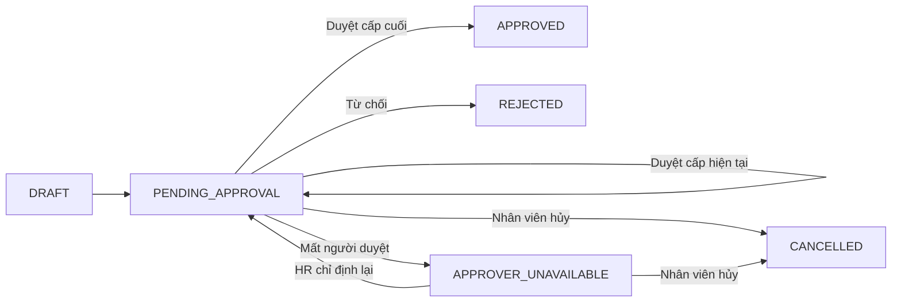

# Giai đoạn 4 — Duyệt nghỉ phép tuần tự

## Phạm vi đã triển khai

- Cấu hình toàn công ty từ 1 đến 3 cấp duyệt.
- Mỗi cấp có thể bật/tắt và được gán theo `ROLE` hoặc `USER`.
- Role được chọn phải cấp quyền `leave.approve`; người duyệt vẫn được kiểm tra lại quyền và hiệu lực tại nơi làm việc của nhân viên.
- Các cấp chạy tuần tự theo số cấp đang bật. Chỉ cấp hiện tại có trạng thái `PENDING`; cấp sau ở `WAITING`.
- Cấm tự duyệt đơn của mình.
- Gửi đơn tạo toàn bộ approval task và giữ số dư phép trong cùng một Firestore transaction.
- Duyệt cuối chuyển số dư từ `held_units` sang `used_units`.
- Từ chối hoàn số dư về `available_units`, giải phóng ngày đã đặt và hủy các cấp chưa mở.
- Khi cấp hiện tại không còn người duyệt hợp lệ, task và đơn chuyển sang `APPROVER_UNAVAILABLE`; số dư tiếp tục được giữ.
- Người có quyền `leave.approver.reassign` có thể chỉ định lại role/người duyệt, bắt buộc nhập lý do và tạo lịch sử/audit. Hệ thống không tự động rơi về role.

## Collections

- `leave_approval_configs/company`: cấu hình 1–3 cấp toàn công ty.
- `leave_approval_tasks`: snapshot cấu hình theo từng lần gửi đơn và từng cấp.
- `leave_approval_reassignments`: lịch sử chỉ định lại bất biến.
- `leave_requests`: trạng thái tổng của đơn.
- `leave_balance_buckets`, `leave_ledger_entries`: bút toán giữ, sử dụng hoặc hoàn phép.

Mã task có dạng `{request_id}_{approval_attempt}_{level}` để chống tạo trùng khi gửi đơn.

## API

- `GET /api/leave/approval-config`
- `GET /api/leave/approval-config/options`
- `PUT /api/leave/approval-config`
- `GET /api/leave/approval-tasks/me`
- `GET /api/leave/approval-tasks/unavailable`
- `POST /api/leave/approval-tasks/:id/decision`
- `POST /api/leave/approval-tasks/:id/reassign`

Mọi endpoint đều xác thực ở middleware và kiểm tra lại quyền theo cơ sở trong service.

## Trạng thái

## Phân quyền và realtime

- `leave.approve`: đọc hộp việc và quyết định tại đúng cơ sở.
- `leave.config.manage`: xem/sửa cấu hình toàn công ty.
- `leave.approver.reassign`: xem danh sách thiếu người duyệt và chỉ định lại.
- Firestore client chỉ đọc; mọi ghi dữ liệu đi qua backend.
- Listener task luôn có điều kiện `workplace_warehouse_id` theo phạm vi đã materialize; system admin có thể nghe toàn bộ.

## Kiểm thử

- `pnpm test:hr-phase4`
- `pnpm --filter @bduck/shared-types build`
- `pnpm --filter @bduck/be-wms typecheck`
- `pnpm --filter @bduck/fe-wms typecheck`
- `pnpm test:firestore-rules`
