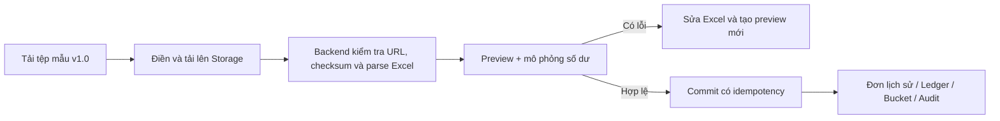

# Giai đoạn 6 — Nhập lịch sử nghỉ phép

## Phạm vi

- Chỉ người có quyền `leave.history.import` mới thấy và sử dụng chức năng.
- Dòng `ADJUSTMENT` yêu cầu thêm quyền `leave.balance.adjust` tại đúng cơ sở của nhân viên.
- Tệp mẫu ExcelJS có phiên bản `1.0`, tối đa 100 dòng và 10MB.
- Backend tải lại chính tệp từ thư mục `leave-imports/` trên Firebase Storage, kiểm tra SHA-256 rồi mới parse. Dữ liệu đã parse ở client không được tin cậy.
- Bắt buộc preview toàn bộ tệp trước. Batch có bất kỳ dòng lỗi nào không thể commit.
- Không sửa hoặc xóa lịch sử cũ. Mọi thay đổi số dư tạo `leave_ledger_entries`, cập nhật bucket và ghi audit cũ/mới.

## Các loại dữ liệu

| `record_type`        | Ý nghĩa                                         | Tác động số dư                                          |
| -------------------- | ----------------------------------------------- | ------------------------------------------------------- |
| `HISTORICAL_REQUEST` | Tạo đơn nghỉ lịch sử đã hoàn tất                | Chỉ `PAID_ANNUAL + APPROVED` chuyển available sang used |
| `ACCRUAL`            | Cộng phép lịch sử                               | Tăng available                                          |
| `USED`               | Ghi nhận phép đã dùng khi không có chi tiết đơn | Giảm available, tăng used                               |
| `ADJUSTMENT`         | Điều chỉnh có lý do                             | Tăng/giảm available                                     |
| `EXPIRED`            | Ghi nhận phép hết hạn                           | Giảm available, tăng expired                            |

Mỗi dòng dùng một `source_reference` duy nhất theo nhân viên. Cùng mã tham chiếu được chuyển thành document ID ổn định; retry không tạo bản ghi trùng và dữ liệu khác nội dung sẽ bị báo xung đột.

## Cột Excel

- `record_type`
- `source_reference`
- `employee_code`
- `posting_date` (`YYYY-MM-DD`)
- `leave_year`
- `units` (bước 0,5; để trống với `HISTORICAL_REQUEST`)
- `request_type`
- `request_status` (`APPROVED`, `REJECTED`, `CANCELLED`)
- `day_portion`
- `reason`

Các dòng được mô phỏng theo thứ tự từ trên xuống. Nếu cần dựng lại số dư cũ, dòng `ACCRUAL` phải đứng trước `USED`, đơn hưởng lương hoặc `EXPIRED`.

## Luồng xử lý

Commit xử lý từng dòng bằng Firestore transaction. Nếu bị gián đoạn, batch chuyển `FAILED`; thao tác thử lại bỏ qua các dòng đã commit.

## Collections và API

- `leave_import_batches`
- `leave_import_rows`
- `leave_requests`
- `leave_ledger_entries`
- `leave_balance_buckets`
- `audit_logs`

API:

- `GET /api/leave/imports`
- `POST /api/leave/imports/preview`
- `GET /api/leave/imports/:id`
- `POST /api/leave/imports/:id/commit`

## Kiểm thử

- `pnpm test:hr-phase6`
- `pnpm --filter @bduck/shared-types build`
- `pnpm --filter @bduck/be-wms typecheck`
- `pnpm --filter @bduck/fe-wms typecheck`
- `pnpm test:firestore-rules`
