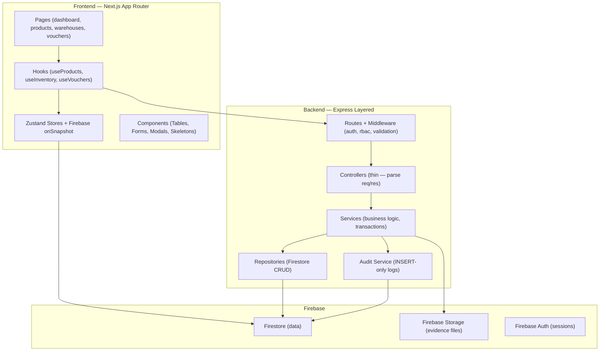
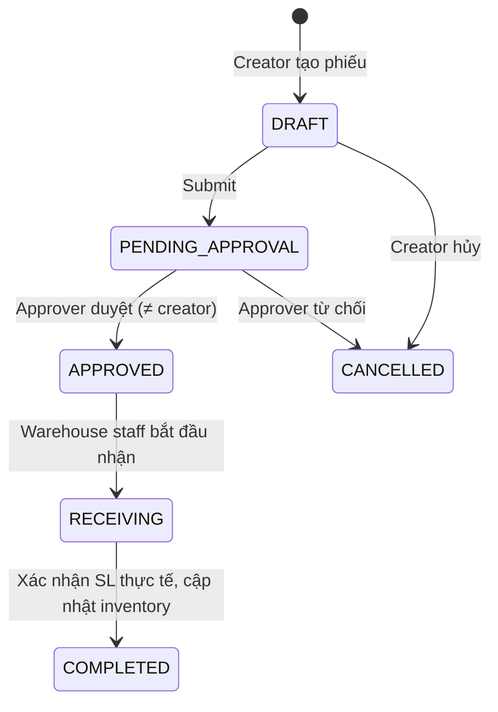
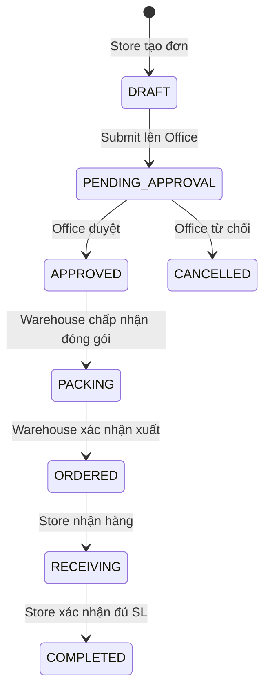

# WMS Feature Roadmap — Kế hoạch Triển khai Tổng thể

## Tổng quan

Triển khai toàn bộ chức năng WMS dựa trên 5 quy trình nghiệp vụ từ flowchart + 11 bảng types trong [shared-types](file:///d:/Github/bduck-system/packages/shared-types/src).

> [!IMPORTANT]
> Kế hoạch này là **ROADMAP** — chưa code ngay. Mỗi Phase sẽ được triển khai khi bạn approve.

## Open Questions

> [!WARNING]
> **Enum PurchaseOrderStatus**: Cần thêm `PACKING` giữa `APPROVED` và `ORDERED` theo flowchart. Sẽ update file [enums.ts](file:///d:/Github/bduck-system/packages/shared-types/src/enums.ts) khi bắt đầu Phase 2.

> [!IMPORTANT]
> **Voucher Number Generator**: Các voucher (IMP-{YYYYMMDD}-{SEQ}, EXP-..., TRF-...) cần counter auto-increment. Dùng Firestore document `counters/{type}` với `FieldValue.increment(1)` trong transaction?

---

## Architecture Overview



---

## Phase 0 — Backend Foundation (Hạ tầng chung)

> Tạo các utility dùng chung cho MỌI module sau này.

### Backend (`apps/be-wms`)

#### [NEW] `src/services/auditService.ts`
- Hàm `logAudit()` — INSERT record vào collection `audit_logs`
- Params: `entity_type, entity_id, action, user_id, old_value, new_value, action_time`
- `sync_time` = `new Date()` (server time)
- **IMMUTABLE**: chỉ INSERT, không UPDATE/DELETE

#### [NEW] `src/repositories/baseRepository.ts`
- Generic CRUD trên Firestore: `findById()`, `findAll()`, `create()`, `update()`, `softDelete()`
- Tự động set `is_deleted: false` khi create, `updated_at: new Date()` khi update
- `softDelete()` = update `is_deleted: true` (KHÔNG BAO GIỜ xóa vĩnh viễn)

#### [NEW] `src/utils/voucherNumberGenerator.ts`
- Tạo mã chứng từ: `IMP-20260522-0001`, `EXP-20260522-0001`...
- Dùng Firestore counter document + `runTransaction`

#### [NEW] `src/utils/zodSchemas.ts`
- Zod schemas cho validation: `createProductSchema`, `createWarehouseSchema`, `importVoucherSchema`...
- Tách riêng file, import vào controllers

#### [NEW] `src/utils/responseHelper.ts`
- Helper format response chuẩn: `{ success, data, messages: { vi, zh } }`
- `sendSuccess(res, data, messages)`, `sendError(res, statusCode, messages)`

#### [MODIFY] `src/api/middlewares/auditMiddleware.ts`
- Implement thực tế (hiện đang commented out)
- Inject `req.auditContext` cho services dùng

---

## Phase 1 — Master Data CRUD (Dữ liệu nền tảng)

> CRUD cho Products, Categories, Warehouses, Locations. Đây là nền tảng để mọi module khác hoạt động.

### 1.1 Product Categories

| Layer | File | Endpoints / Logic |
|-------|------|-------------------|
| Route | `src/api/routes/categoryRoutes.ts` | `GET /`, `POST /`, `PUT /:id`, `DELETE /:id` (soft) |
| Controller | `src/api/controllers/categoryController.ts` | Parse req → validate → call service |
| Service | `src/services/categoryService.ts` | CRUD + audit log + kiểm tra parent_id hợp lệ |
| Repository | `src/repositories/categoryRepository.ts` | Firestore `product_categories` collection |

**Business Rules:**
- Hierarchical (parent_id tự tham chiếu)
- Soft delete — CHECK không còn product nào dùng category trước khi xóa
- `code` phải UNIQUE

### 1.2 Products

| Layer | File | Endpoints |
|-------|------|-----------|
| Route | `src/api/routes/productRoutes.ts` | `GET /`, `GET /:id`, `POST /`, `PUT /:id`, `DELETE /:id` (soft) |
| Controller | `src/api/controllers/productController.ts` | Validate Zod schema |
| Service | `src/services/productService.ts` | CRUD + audit + validate category_id tồn tại |
| Repository | `src/repositories/productRepository.ts` | Firestore `products` collection |

**Business Rules:**
- `code` (SKU) phải UNIQUE
- `barcode` phải UNIQUE nếu có
- Upload `product_image_url[]` lên Firebase Storage
- Khi soft delete: CHECK không còn inventory record nào > 0

### 1.3 Warehouses & Locations

| Layer | File | Endpoints |
|-------|------|-----------|
| Route | `src/api/routes/warehouseRoutes.ts` | `GET /`, `POST /`, `PUT /:id`, `DELETE /:id` (soft) |
| Route | `src/api/routes/locationRoutes.ts` | `GET /?warehouse_id=`, `POST /`, `PUT /:id`, `DELETE /:id` |
| Controller | 2 controllers tương ứng | — |
| Service | `warehouseService.ts`, `locationService.ts` | — |
| Repository | `warehouseRepository.ts`, `locationRepository.ts` | Firestore `warehouses`, `warehouse_locations` |

**Business Rules:**
- Warehouse `code` UNIQUE
- Location `code` UNIQUE within same warehouse
- Khi soft delete warehouse: CHECK không còn location ACTIVE + không có inventory > 0
- Location QUARANTINE → chỉ ADMIN/WAREHOUSE_MANAGER mới set được

### Frontend (`apps/fe-wms`)

| File | Mô tả |
|------|--------|
| `src/app/(dashboard)/products/page.tsx` | Tab layout: Products / Categories |
| `src/app/(dashboard)/products/categories/page.tsx` | Table + modal CRUD categories |
| `src/app/(dashboard)/warehouses/page.tsx` | Table + modal CRUD warehouses |
| `src/app/(dashboard)/warehouses/[id]/page.tsx` | Chi tiết warehouse + danh sách locations |
| `src/components/products/ProductTable.tsx` | Bảng sản phẩm + search/filter |
| `src/components/products/ProductFormModal.tsx` | Modal tạo/sửa sản phẩm |
| `src/components/products/CategoryTable.tsx` | Bảng danh mục + tree view |
| `src/components/warehouses/WarehouseTable.tsx` | Bảng kho |
| `src/components/warehouses/LocationTable.tsx` | Bảng vị trí trong kho |
| `src/hooks/useProducts.ts` | Firestore onSnapshot listener |
| `src/hooks/useWarehouses.ts` | Firestore onSnapshot listener |

---

## Phase 2 — Inventory Core (Nhập kho & Tồn kho)

> Import vouchers + Inventory records + PurchaseOrder flow

### 2.0 Enum Update

#### [MODIFY] [enums.ts](file:///d:/Github/bduck-system/packages/shared-types/src/enums.ts)
```diff
 export enum PurchaseOrderStatus {
     DRAFT = 'DRAFT',
     PENDING_APPROVAL = 'PENDING_APPROVAL',
     APPROVED = 'APPROVED',
+    PACKING = 'PACKING',
     ORDERED = 'ORDERED',
     RECEIVING = 'RECEIVING',
     COMPLETED = 'COMPLETED',
     CANCELLED = 'CANCELLED',
 }
```

### 2.1 Inventory Records

| File | Mô tả |
|------|--------|
| `src/repositories/inventoryRepository.ts` | CRUD cho `inventory` collection |
| `src/services/inventoryService.ts` | ATP logic, stock queries, location-product unique check |

**ATP Formula:**
```
total_quantity = atp_quantity + on_hold_quantity + in_transit_quantity + quarantine_quantity
```

### 2.2 Import Vouchers (Quy trình nhập kho)

| Layer | File | Endpoints |
|-------|------|-----------|
| Route | `importVoucherRoutes.ts` | `GET /`, `POST /`, `PUT /:id`, `POST /:id/approve`, `POST /:id/receive`, `POST /:id/complete` |
| Controller | `importVoucherController.ts` | — |
| Service | `importVoucherService.ts` | Status machine: DRAFT→PENDING→APPROVED→RECEIVING→COMPLETED |
| Repository | `importVoucherRepository.ts` | `import_vouchers` + `import_voucher_items` |

**Status Flow (từ flowchart "Quy trình nhập kho"):**


**Business Rules:**
- `creator_id ≠ approver_id` (SOD)
- Khi COMPLETED: `runTransaction` — tạo/update inventory records, tăng `atp_quantity` hoặc `quarantine_quantity` tùy `condition`
- Nếu `actual_quantity ≠ expected_quantity` → auto tạo NonconformityReport
- Audit log mỗi bước chuyển status

### 2.3 Purchase Orders (Quy trình đặt hàng)

| Layer | File | Endpoints |
|-------|------|-----------|
| Route | `purchaseOrderRoutes.ts` | `GET /`, `POST /`, `PUT /:id`, `POST /:id/approve`, `POST /:id/pack`, `POST /:id/order` |
| Controller | `purchaseOrderController.ts` | — |
| Service | `purchaseOrderService.ts` | DRAFT→PENDING→APPROVED→**PACKING**→ORDERED→RECEIVING→COMPLETED |

**Status Flow (từ flowchart "Quy trình đặt hàng"):**


### Frontend

| File | Mô tả |
|------|--------|
| `src/app/(dashboard)/inventory/page.tsx` | Overview: tồn kho toàn hệ thống (aggregated) |
| `src/app/(dashboard)/inventory/import/page.tsx` | Danh sách phiếu nhập + tạo mới |
| `src/app/(dashboard)/inventory/import/[id]/page.tsx` | Chi tiết phiếu nhập + nhận hàng |
| `src/app/(dashboard)/orders/page.tsx` | PO listing theo role |
| `src/components/inventory/InventoryOverview.tsx` | Dashboard tồn kho |
| `src/components/inventory/ImportVoucherForm.tsx` | Form tạo phiếu nhập |
| `src/components/inventory/ReceivingForm.tsx` | Form nhận hàng (scan/nhập SL) |

---

## Phase 3 — Transfer & Export (Điều chuyển & Xuất kho)

### 3.1 Transfer Orders (Quy trình xuất kho — Điều chuyển)

| Layer | File | Endpoints |
|-------|------|-----------|
| Route | `transferOrderRoutes.ts` | `GET /`, `POST /`, `POST /:id/approve`, `POST /:id/dispatch`, `POST /:id/receive`, `POST /:id/complete` |
| Service | `transferOrderService.ts` | DRAFT→PENDING→APPROVED→IN_TRANSIT→RECEIVED→COMPLETED |

**Status Flow (từ flowchart "Quy trình xuất kho"):**
```mermaid
stateDiagram-v2
    [*] --> DRAFT: Tạo lệnh chuyển
    DRAFT --> PENDING_APPROVAL: Submit
    PENDING_APPROVAL --> APPROVED: Manager duyệt
    APPROVED --> IN_TRANSIT: Dispatch (trừ ATP source, tăng in_transit)
    IN_TRANSIT --> RECEIVED: Kho đích nhận hàng
    RECEIVED --> COMPLETED: Xác nhận SL, cập nhật inventory đích
    note right of IN_TRANSIT: runTransaction:\n1. source.atp -= qty\n2. source.in_transit += qty\n3. status = IN_TRANSIT\n4. Fail → ROLLBACK ALL
```

**Critical Transaction Logic:**
```typescript
// PHẢI nằm trong 1 runTransaction
await db.runTransaction(async (txn) => {
  // 1. Trừ atp_quantity tại source
  // 2. Tăng in_transit_quantity tại source
  // 3. Update transfer_order.status = IN_TRANSIT
  // 4. Tạo receiving record tại destination
  // Nếu bất kỳ bước nào fail → auto rollback
});
```

### 3.2 Export Vouchers (Xuất kho trực tiếp)

| Layer | File | Endpoints |
|-------|------|-----------|
| Route | `exportVoucherRoutes.ts` | `GET /`, `POST /`, `POST /:id/approve`, `POST /:id/process`, `POST /:id/complete` |
| Service | `exportVoucherService.ts` | DRAFT→PENDING→APPROVED→PROCESSING→COMPLETED |

**Business Rules:**
- `export_type` quyết định flow: `SALE_POS`, `GIFT_MANUAL`, `TRANSFER`, `ADJUSTMENT`, `INTERNAL`
- Khi PROCESSING: CHECK `atp_quantity >= requested_quantity` trước khi trừ
- Khi `export_type = TRANSFER`: auto-link với `transfer_orders` qua `reference_id`

### Frontend

| File | Mô tả |
|------|--------|
| `src/app/(dashboard)/transfers/page.tsx` | Danh sách lệnh chuyển |
| `src/app/(dashboard)/transfers/[id]/page.tsx` | Chi tiết + dispatch/receive |
| `src/app/(dashboard)/exports/page.tsx` | Danh sách phiếu xuất |
| `src/components/transfers/TransferForm.tsx` | Form tạo lệnh chuyển |
| `src/components/transfers/DispatchConfirm.tsx` | Xác nhận xuất (nhập SL thực tế) |
| `src/components/transfers/ReceiveConfirm.tsx` | Xác nhận nhận hàng |

---

## Phase 4 — Quality Control (Xử lý hàng lỗi / chênh lệch)

> Flowchart: "Quy trình xử lý hàng lỗi / chênh lệch"

### 4.1 Nonconformity Reports

| Layer | File | Endpoints |
|-------|------|-----------|
| Route | `nonconformityRoutes.ts` | `GET /`, `POST /`, `POST /:id/quarantine`, `POST /:id/resolve` |
| Service | `nonconformityService.ts` | OPEN→QUARANTINED→UNDER_REVIEW→RESOLVED→CLOSED |

**Business Rules:**
- Khi `issue_type = DAMAGED | SEAL_BROKEN`: Auto `inventory.quarantine_quantity += qty`, `atp_quantity -= qty`
- **ENFORCED EVIDENCE**: API reject nếu không có attachment ảnh (`requires_evidence = true`)
- Tự động tạo `QuarantineRecord`

### 4.2 Quarantine Records

| File | Mô tả |
|------|--------|
| `quarantineRepository.ts` | CRUD `quarantine_records` |
| `quarantineService.ts` | Release chỉ khi có biên bản xử lý từ MANAGER+ |

### 4.3 Adjustment Vouchers

| File | Mô tả |
|------|--------|
| `adjustmentVoucherRoutes.ts` | `POST /`, `POST /:id/approve` |
| `adjustmentVoucherService.ts` | Snapshot qty_before/after, `creator_id ≠ approver_id` |

### 4.4 Stock Count Sessions

| File | Mô tả |
|------|--------|
| `stockCountRoutes.ts` | `POST /`, `POST /:id/complete`, `GET /:id/items` |
| `stockCountService.ts` | `counter_id ≠ supervisor_id`, auto tạo nonconformity nếu discrepancy |

### Frontend

| File | Mô tả |
|------|--------|
| `src/app/(dashboard)/quality/page.tsx` | Tab: NC Reports / Quarantine / Stock Count |
| `src/components/quality/NCReportForm.tsx` | Form báo cáo + upload ảnh bắt buộc |
| `src/components/quality/QuarantineTable.tsx` | Danh sách hàng cách ly |
| `src/components/quality/StockCountWizard.tsx` | Wizard kiểm kê nhiều bước |

---

## Phase 5 — Sales Operations (POS & Gift Export)

### 5.1 POS Integration

| File | Mô tả |
|------|--------|
| `posTransactionRoutes.ts` | `POST /sync` (nhận data từ POS), `GET /` |
| `posTransactionService.ts` | Auto tạo export_voucher khi COMPLETED, trừ ATP |

### 5.2 Gift Export Sessions

| File | Mô tả |
|------|--------|
| `giftSessionRoutes.ts` | `POST /`, `POST /:id/submit`, `POST /:id/approve`, `GET /:id/items` |
| `giftSessionService.ts` | Offline scan → sync → approve → auto export_voucher |

**Business Rules:**
- `employee_id ≠ approver_id`
- Scan offline (`scanned_at` = action_time), sync lên server (`synced_at` = sync_time)
- Khi approved: auto tạo `ExportVoucher` type `GIFT_MANUAL`, trừ ATP

### Frontend

| File | Mô tả |
|------|--------|
| `src/app/(dashboard)/pos/page.tsx` | POS transaction history |
| `src/app/(dashboard)/gifts/page.tsx` | Gift export sessions |
| `src/components/gifts/GiftScannerView.tsx` | Mobile-optimized barcode scanner |

---

## Phase ∞ — Approval Workflows & Audit Viewer

### Approval Workflows (Cross-cutting)

| File | Mô tả |
|------|--------|
| `src/services/approvalService.ts` | Centralized approval engine cho mọi entity type |
| `src/components/approval/ApprovalPanel.tsx` | Reusable panel hiện trong chi tiết voucher |

### Audit Log Viewer

| File | Mô tả |
|------|--------|
| `src/app/(dashboard)/audit/page.tsx` | Search/filter audit logs |
| `src/components/audit/AuditTimeline.tsx` | Timeline view cho 1 entity |
| `src/hooks/useAuditLogs.ts` | Firestore realtime listener |

---

## Firestore Collections Map

| Collection | Type File | Phase |
|------------|-----------|-------|
| `organizations` | [master-data.ts](file:///d:/Github/bduck-system/packages/shared-types/src/master-data.ts) | 1 |
| `warehouses` | master-data.ts | 1 |
| `warehouse_locations` | master-data.ts | 1 |
| `product_categories` | master-data.ts | 1 |
| `products` | master-data.ts | 1 |
| `inventory` | [inventory.ts](file:///d:/Github/bduck-system/packages/shared-types/src/inventory.ts) | 2 |
| `import_vouchers` / `_items` | [vouchers.ts](file:///d:/Github/bduck-system/packages/shared-types/src/vouchers.ts) | 2 |
| `purchase_orders` / `_items` | vouchers.ts | 2 |
| `export_vouchers` / `_items` | vouchers.ts | 3 |
| `transfer_orders` / `_items` | vouchers.ts | 3 |
| `nonconformity_reports` | [quality-control.ts](file:///d:/Github/bduck-system/packages/shared-types/src/quality-control.ts) | 4 |
| `quarantine_records` | quality-control.ts | 4 |
| `adjustment_vouchers` | quality-control.ts | 4 |
| `stock_count_sessions` / `_items` | inventory.ts | 4 |
| `gift_export_sessions` / `_items` | [sales-operations.ts](file:///d:/Github/bduck-system/packages/shared-types/src/sales-operations.ts) | 5 |
| `pos_transactions` / `_items` | sales-operations.ts | 5 |
| `approval_workflows` | [system.ts](file:///d:/Github/bduck-system/packages/shared-types/src/system.ts) | ∞ |
| `audit_logs` | system.ts | 0 |
| `attachments` | system.ts | 0 |

---

## RBAC Permission Matrix

| Permission Key | ADMIN | DIRECTOR | WH_MANAGER | WH_STAFF | STORE_MGR |
|:---|:---:|:---:|:---:|:---:|:---:|
| `products.read` | ✅ | ✅ | ✅ | ✅ | ✅ |
| `products.write` | ✅ | ✅ | ❌ | ❌ | ❌ |
| `warehouses.read` | ✅ | ✅ | ✅ (own) | ✅ (own) | ❌ |
| `warehouses.write` | ✅ | ✅ | ❌ | ❌ | ❌ |
| `import.create` | ✅ | ❌ | ✅ | ✅ | ❌ |
| `import.approve` | ✅ | ✅ | ✅ | ❌ | ❌ |
| `transfer.create` | ✅ | ❌ | ✅ | ✅ | ❌ |
| `transfer.approve` | ✅ | ✅ | ✅ | ❌ | ❌ |
| `transfer.dispatch` | ✅ | ❌ | ✅ | ✅ | ❌ |
| `export.create` | ✅ | ❌ | ✅ | ✅ | ❌ |
| `export.approve` | ✅ | ✅ | ✅ | ❌ | ❌ |
| `quality.report` | ✅ | ❌ | ✅ | ✅ | ✅ |
| `quality.resolve` | ✅ | ✅ | ✅ | ❌ | ❌ |
| `stockcount.create` | ✅ | ❌ | ✅ | ✅ | ❌ |
| `orders.create` | ❌ | ❌ | ❌ | ❌ | ✅ |
| `orders.approve` | ✅ | ✅ | ❌ | ❌ | ❌ |
| `audit.read` | ✅ | ✅ | ✅ (own) | ❌ | ❌ |
| `pos.sync` | ✅ | ❌ | ❌ | ❌ | ✅ |
| `gift.scan` | ❌ | ❌ | ❌ | ✅ | ❌ |
| `gift.approve` | ✅ | ❌ | ✅ | ❌ | ✅ |

---

## Sidebar Menu Updates

[menuConfig.ts](file:///d:/Github/bduck-system/apps/fe-wms/src/config/menuConfig.ts) sẽ cần cập nhật thêm các mục sau khi triển khai từng Phase:

| Phase | Menu Items |
|-------|-----------|
| 1 | 📦 Sản phẩm (`/products`), 🏭 Kho hàng (`/warehouses`) |
| 2 | 📊 Tồn kho (`/inventory`), 📥 Nhập kho (`/inventory/import`), 🛒 Đặt hàng (`/orders`) |
| 3 | 🔄 Điều chuyển (`/transfers`), 📤 Xuất kho (`/exports`) |
| 4 | 🔍 Kiểm soát CL (`/quality`) |
| 5 | 💰 POS (`/pos`), 🎁 Quà tặng (`/gifts`) |
| ∞ | 📋 Audit Logs (`/audit`) |

---

## Verification Plan

### Automated Tests
- Mỗi Service file phải có unit test cho business rules (SOD, ATP check, status transitions)
- API integration tests bằng `supertest` cho critical flows

### Manual Verification
- Login với các role khác nhau → verify RBAC filter
- Tạo phiếu nhập → approve → nhận → check inventory tăng
- Tạo lệnh chuyển → dispatch → check ATP giảm + in_transit tăng
- Báo cáo hư hỏng không kèm ảnh → expect error
- `creator_id = approver_id` → expect block

---

## Estimated Scope

| Phase | Files (BE+FE) | Complexity | Dependencies |
|-------|:---:|:---:|:---|
| **0** | ~8 | 🟢 Low | None |
| **1** | ~25 | 🟡 Medium | Phase 0 |
| **2** | ~30 | 🔴 High | Phase 1 |
| **3** | ~25 | 🔴 High | Phase 2 |
| **4** | ~20 | 🟡 Medium | Phase 2 |
| **5** | ~15 | 🟡 Medium | Phase 3 |
| **∞** | ~10 | 🟢 Low | All phases |
