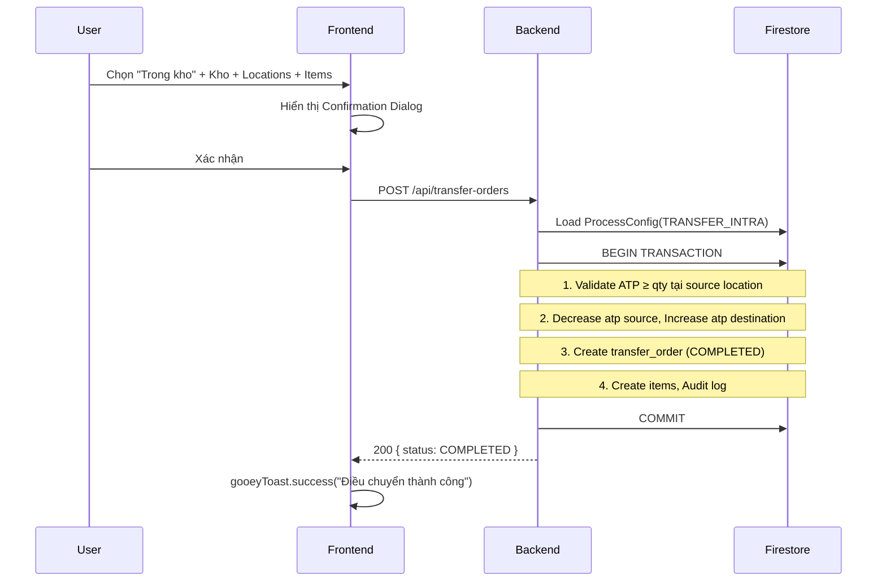
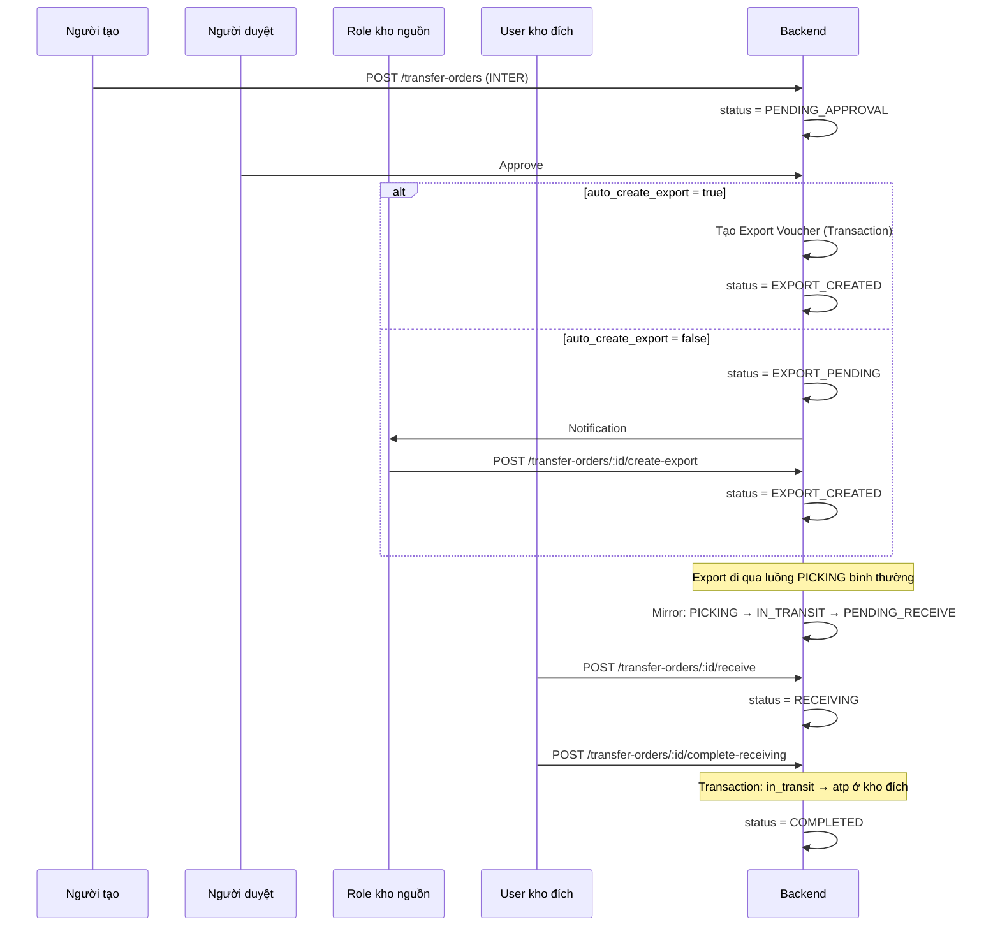

# Chức năng Điều chuyển (Transfer) — Implementation Plan v2

> Tất cả câu hỏi đã được trả lời. Plan đã finalize.

## Tổng quan

Xây dựng chức năng **Điều chuyển** hàng hóa với 2 loại:
1. **INTRA_WAREHOUSE** — Di chuyển hàng từ Location A → Location B trong **cùng 1 kho** (mã: `TRF-I-{SEQ}`)
2. **INTER_WAREHOUSE** — Chuyển hàng từ **Kho A → Kho B** liên kho (mã: `TRF-X-{SEQ}`)

**Bắt buộc**: Cả kho nguồn và kho đích đều PHẢI được chọn, không được để trống.

---

## Quyết định đã xác nhận

| # | Quyết định | Chi tiết |
|---|-----------|----------|
| Q1 | Quyền tạo điều chuyển | Dynamic RBAC — tạo permissions `transfers.read`, `transfers.write`, `transfers.receive` trong permissionRegistry |
| Q2 | Intra auto-complete | **Option A** — Tự động hoàn tất ngay + hiện confirmation dialog trước khi thực hiện |
| Q3 | Tạo export 1-click | **Option A** + config cho phép chuyển sang mode "gửi yêu cầu đến role" |
| Q4 | Role nhận export | Cấu hình trong ProcessConfig `step_options.create_export.assigned_role_id` |
| Q5 | Ai nhận hàng | Config: "tất cả tài khoản thuộc kho đích + có quyền `transfers.receive`" |
| Q6 | Kiểm đếm nhận | Giống ReceivingSession — so sánh qty, auto nonconformity, require evidence |
| Q7 | ATP logic | Trừ khi picking xong, cộng khi nhận hàng ✓ |
| Q8 | Config kiểm đếm intra | `step_options.receiving.enabled: false` (mặc định tắt) |
| Q9 | Route + UI | `/transfers` riêng + link từ warehouse detail với prefill + nút swap |
| Q10 | Mã phiếu | `TRF-I-{SEQ}` (intra) / `TRF-X-{SEQ}` (inter) |
| Q11 | Tệp đính kèm export | Auto-copy từ transfer + cho upload thêm, UI hiển thị nguồn gốc tệp |
| Q12 | Nút warehouse | Dẫn đến `/transfers?warehouseId={id}` |

---

## Proposed Changes

### Phase 1: Shared Types & Enums

#### [MODIFY] [enums.ts](file:///d:/Github/bduck-system/packages/shared-types/src/enums.ts)

```typescript
// [NEW] Transfer type
export enum TransferType {
  INTRA_WAREHOUSE = 'INTRA_WAREHOUSE',
  INTER_WAREHOUSE = 'INTER_WAREHOUSE',
}

// [EXPANDED] Transfer order status — thêm trạng thái cho luồng liên kho
export enum TransferOrderStatus {
  DRAFT = 'DRAFT',
  PENDING_APPROVAL = 'PENDING_APPROVAL',
  APPROVED = 'APPROVED',
  EXPORT_PENDING = 'EXPORT_PENDING',       // Chờ tạo lệnh xuất (khi config = manual)
  EXPORT_CREATED = 'EXPORT_CREATED',       // Đã tạo lệnh xuất
  PICKING = 'PICKING',                     // Mirror từ Export (đang soạn hàng)
  IN_TRANSIT = 'IN_TRANSIT',               // Đang vận chuyển
  PENDING_RECEIVE = 'PENDING_RECEIVE',     // Chờ nhận hàng
  RECEIVING = 'RECEIVING',                 // Đang kiểm đếm
  RECEIVED = 'RECEIVED',
  COMPLETED = 'COMPLETED',
  REJECTED = 'REJECTED',
  CANCELLED = 'CANCELLED',
}
```

> [!NOTE]
> `EXPORT_PENDING` vs `EXPORT_CREATED`: Khi config `auto_create_export = true` → skip EXPORT_PENDING, nhảy thẳng APPROVED → EXPORT_CREATED. Khi `auto_create_export = false` → APPROVED → EXPORT_PENDING (chờ role bấm tạo).

#### [MODIFY] [vouchers.ts](file:///d:/Github/bduck-system/packages/shared-types/src/vouchers.ts)

```typescript
export interface TransferOrder {
  id: string;
  order_number: string;               // TRF-I-{SEQ} hoặc TRF-X-{SEQ}
  transfer_type: TransferType;         // [NEW]
  source_warehouse_id: string;         // FK → warehouses — BẮT BUỘC
  destination_warehouse_id: string;    // FK → warehouses — BẮT BUỘC (cùng kho nếu INTRA)
  status: TransferOrderStatus;
  creator_id: string;
  approver_id: string | null;
  approved_at: Date | null;
  // ── Export link (INTER only) ──
  export_voucher_id: string | null;    // [NEW] FK → export_vouchers
  // ── Receiving (INTER only) ──
  received_by: string | null;          // [NEW] FK → users
  received_at: Date | null;
  dispatched_at: Date | null;
  // ── Attachments ──
  attachment_urls: string[];           // [NEW]
  // ── Config snapshot ──
  config_snapshot: {                   // [NEW] Frozen config at creation
    auto_approve: boolean;
    auto_create_export: boolean;
    require_receiving: boolean;
    require_evidence: boolean;
  } | null;
  // ── Standard fields ──
  requires_reauth: boolean;
  reauth_confirmed_by: string | null;
  reauth_confirmed_at: Date | null;
  action_time: Date;
  sync_time: Date;
  notes: string | null;
  is_deleted: boolean;
  created_at: Date;
  updated_at: Date;
}

export interface TransferOrderItem {
  id: string;
  transfer_order_id: string;
  product_id: string;
  source_location_id: string;          // FK → warehouse_locations
  destination_location_id: string | null; // FK → warehouse_locations (INTRA: required, INTER: set on receive)
  quantity: number;
  received_quantity: number | null;
  status: TransferItemStatus;
  is_deleted: boolean;
}
```

#### [MODIFY] [permissionRegistry.ts](file:///d:/Github/bduck-system/packages/shared-types/src/permissionRegistry.ts)

```typescript
// [NEW] Permission Group
{ id: "transfers", label: { vi: "Điều chuyển", zh: "调拨" }, icon: "ArrowLeftRight", order: 8 }

// [NEW] Permissions
{ key: "transfers.read",    group: "transfers", label: { vi: "Xem điều chuyển", zh: "查看调拨" }, ... }
{ key: "transfers.write",   group: "transfers", label: { vi: "Tạo & sửa điều chuyển", zh: "创建和编辑调拨" }, ... }
{ key: "transfers.receive", group: "transfers", label: { vi: "Nhận hàng điều chuyển", zh: "接收调拨货物" }, ... }
```

#### [MODIFY] [process.ts](file:///d:/Github/bduck-system/packages/shared-types/src/process.ts)
- Thêm `'TRANSFER_INTRA'` vào `ProcessEntityType`

---

### Phase 2: Backend — Service Layer

#### [NEW] `apps/be-wms/src/services/transferOrderService.ts` (~250 dòng)

| Function | Mô tả |
|----------|-------|
| `createTransferOrder()` | Validate → Snapshot config → Nếu INTRA + auto_approve: move inventory ngay (Transaction), status=COMPLETED. Nếu INTER: status=PENDING_APPROVAL, tạo approvals |
| `onApprovalCompleted()` | Callback khi duyệt xong. Nếu `auto_create_export=true`: tự tạo Export Voucher. Nếu false: status=EXPORT_PENDING, notify role |
| `createExportFromTransfer()` | Copy items sang ExportVoucher, copy attachment_urls (đánh dấu origin), cho upload thêm. Set `reference_type=TRANSFER_ORDER` |
| `syncExportStatus()` | Listener/callback: mirror Export status → Transfer status |
| `receiveTransfer()` | Validate user thuộc kho đích + có quyền `transfers.receive`. Status → RECEIVING |
| `completeReceiving()` | Nhận items + discrepancy check. Transaction: `in_transit → atp` ở kho đích. Status → COMPLETED |

**Intra-warehouse Transaction** (trong `createTransferOrder`):
```
BEGIN TRANSACTION
  1. Validate ATP ở source_location ≥ quantity
  2. Decrease atp_quantity at source_location
  3. Increase atp_quantity at destination_location (upsert nếu chưa có)
  4. Create transfer_order (status=COMPLETED)
  5. Create transfer_order_items
  6. Audit log
COMMIT
```

**Inter-warehouse — Export auto-create** (trong `onApprovalCompleted`):
```
BEGIN TRANSACTION
  1. Create export_voucher (warehouse_id=source, reference_type=TRANSFER_ORDER)
  2. Create export_voucher_items (copy from transfer items)
  3. Copy attachment_urls (tag origin="TRANSFER")
  4. Update transfer_order.export_voucher_id
  5. Update transfer_order.status = EXPORT_CREATED
  6. Create approval records cho export_voucher (nếu cần)
  7. Audit log
COMMIT
```

#### [NEW] `apps/be-wms/src/services/transferQueryService.ts` (~100 dòng)
- `listTransferOrders(filters)` — type, status, warehouse_id, pagination
- `getTransferOrderById(id)` — join items + export voucher info

#### [NEW] `apps/be-wms/src/repositories/transferOrderRepository.ts` (~80 dòng)
- CRUD cho Firestore collection `transfer_orders` + subcollection `items`

---

### Phase 3: Backend — API Layer

#### [NEW] `apps/be-wms/src/api/controllers/transferOrderController.ts` (~200 dòng)

| Endpoint | Method | Auth | Mô tả |
|----------|--------|------|-------|
| `/api/transfer-orders` | POST | `transfers.write` | Tạo phiếu điều chuyển |
| `/api/transfer-orders` | GET | `transfers.read` | Danh sách (filter, paginate) |
| `/api/transfer-orders/:id` | GET | `transfers.read` | Chi tiết |
| `/api/transfer-orders/:id/create-export` | POST | Config role | 1-click tạo Export Voucher |
| `/api/transfer-orders/:id/receive` | POST | `transfers.receive` | Bắt đầu nhận hàng |
| `/api/transfer-orders/:id/complete-receiving` | POST | `transfers.receive` | Hoàn tất kiểm đếm |

#### [NEW] `apps/be-wms/src/api/routes/transferOrderRoutes.ts`

#### [MODIFY] [index.ts](file:///d:/Github/bduck-system/apps/be-wms/src/index.ts)
- Import và mount `/api/transfer-orders` router

#### [MODIFY] [exportVoucherService.ts](file:///d:/Github/bduck-system/apps/be-wms/src/services/exportVoucherService.ts)
- Trong `completePicking()`: nếu `reference_type === TRANSFER_ORDER` → gọi `transferOrderService.syncExportStatus()`
- Tương tự khi Export chuyển sang SHIPPED

---

### Phase 4: Frontend — Pages & Components

#### [NEW] `apps/fe-wms/src/app/(dashboard)/transfers/page.tsx`
- Client page với 2 tabs: **Danh sách** | **Tạo mới**
- URL params: `?warehouseId=xxx` (prefill từ warehouse detail)

#### [NEW] `src/components/features/transfers/TransferListTab.tsx` (~200 dòng)
- Bảng danh sách với filter: Loại (Intra/Inter), Trạng thái, Kho
- Status badge màu sắc
- Actions: Xem chi tiết, Quick actions theo status
- Skeleton loading khi chờ data
- Realtime listener (`onSnapshot`)

#### [NEW] `src/components/features/transfers/CreateTransferTab.tsx` (~250 dòng)
- **4-step stepper** (giống pattern Import/Export):

| Step | Nội dung |
|------|----------|
| 0. Thông tin | Loại (Intra/Inter), Kho nguồn, Kho đích + **nút Swap ⇄**, Ghi chú |
| 1. Tải chứng từ | FileUploadField (tuỳ chọn) |
| 2. Sản phẩm | Product picker + Location nguồn + (Location đích nếu Intra) + Số lượng |
| 3. Xác nhận | Summary + Confirmation dialog trước khi submit |

- **Swap Button**: Đổi nhanh kho nguồn ↔ kho đích (reset items khi swap)
- **INTRA mode**: Kho nguồn = Kho đích (auto-set). Hiện cả location nguồn + location đích
- **INTER mode**: 2 warehouse pickers khác nhau. Location đích không cần chọn (chọn khi nhận hàng)
- **Validation**: Kho nguồn ≠ Kho đích (nếu INTER). Cả 2 bắt buộc. ATP check
- **Confirmation dialog** trước submit (Q2: luôn phản hồi thành công/thất bại)

#### [NEW] `src/components/features/transfers/TransferDetailView.tsx` (~200 dòng)
- Timeline trạng thái (giống Import/Export detail)
- Nút hành động context-aware:

| Status | Nút hiển thị | Điều kiện |
|--------|-------------|-----------|
| APPROVED | "Tạo lệnh xuất kho" | Config `auto_create_export=false` + user có role |
| EXPORT_PENDING | "Tạo lệnh xuất kho" | User thuộc config role |
| IN_TRANSIT / PENDING_RECEIVE | "Nhận hàng" | User thuộc kho đích + quyền `transfers.receive` |
| RECEIVING | "Hoàn tất kiểm đếm" | User đang kiểm đếm |

#### [NEW] `src/components/features/transfers/CreateExportFromTransferModal.tsx` (~150 dòng)
- Hiện thông tin transfer order
- Danh sách tệp đính kèm từ transfer (label: "📎 Từ phiếu điều chuyển TRF-X-001")
- Upload thêm tệp mới (label: "📎 Tệp bổ sung")
- Nút "Tạo lệnh xuất kho" → gooeyToast.promise

#### [NEW] `src/components/features/transfers/ReceiveTransferPanel.tsx` (~180 dòng)
- Reuse pattern từ ReceivingSession:
  - Danh sách items: `quantity` (gửi) vs `received_quantity` (nhận thực tế)
  - Input từng item
  - Discrepancy highlight
  - Evidence upload (nếu config require)
  - Nút "Hoàn tất kiểm đếm"

---

### Phase 5: Frontend — Hooks & API

#### [NEW] `src/hooks/useTransferOrders.ts`
- Realtime listener cho `transfer_orders` collection
- Filter by warehouse, type, status

#### [NEW] `src/hooks/useTransferOrderApi.ts`
- `createTransferOrder(data)` → POST
- `createExportFromTransfer(id, files)` → POST
- `receiveTransfer(id)` → POST
- `completeReceiving(id, items)` → POST

---

### Phase 6: Navigation & Integration

#### [MODIFY] Sidebar layout — thêm menu "Điều chuyển"
- Icon: `ArrowLeftRight`
- Label i18n: vi="Điều chuyển", zh="调拨"
- Route: `/transfers`
- Permission guard: `transfers.read`

#### [MODIFY] [warehouses/[id]/page.tsx](file:///d:/Github/bduck-system/apps/fe-wms/src/app/(dashboard)/warehouses/[id]/page.tsx)
- Nút "Điều chuyển" → `router.push('/transfers?warehouseId={id}')`

---

### Phase 7: ProcessConfig Seeds

#### Firestore seed: `TRANSFER_ORDER` (Inter-warehouse default)
```json
{
  "entity_type": "TRANSFER_ORDER",
  "warehouse_id": null,
  "auto_approve": false,
  "approval_chain": [
    {
      "level": 0,
      "role_id": "{configurable}",
      "label": { "vi": "Quản lý kho", "zh": "仓库经理" },
      "required": true,
      "enabled": true,
      "min_approvers": 1
    }
  ],
  "step_options": {
    "create_export": {
      "auto_create_export": true,
      "require_evidence": false,
      "require_barcode_scan": false,
      "assignment_mode": "ROLE",
      "assigned_role_id": null,
      "label": null
    },
    "receiving": {
      "require_evidence": true,
      "require_barcode_scan": false,
      "assignment_mode": "ROLE",
      "assigned_role_id": null,
      "label": null
    }
  }
}
```

#### Firestore seed: `TRANSFER_INTRA` (Intra-warehouse default)
```json
{
  "entity_type": "TRANSFER_INTRA",
  "warehouse_id": null,
  "auto_approve": true,
  "approval_chain": [],
  "step_options": {
    "approval": {
      "enabled": false,
      "require_evidence": false,
      "require_barcode_scan": false,
      "assignment_mode": "CREATOR",
      "assigned_role_id": null,
      "label": null
    },
    "receiving": {
      "enabled": false,
      "require_evidence": false,
      "require_barcode_scan": false,
      "assignment_mode": "CREATOR",
      "assigned_role_id": null,
      "label": null
    }
  }
}
```

> [!NOTE]
> `step_options.create_export.auto_create_export` là field mới trong StepOption, cần mở rộng interface.

---

## Luồng chi tiết (Final)

### Luồng A: Intra-warehouse



### Luồng B: Inter-warehouse



---

## Thứ tự triển khai

| Giai đoạn | Ước lượng | Dependencies |
|-----------|-----------|-------------|
| Phase 1: Shared Types | ~1h | Không |
| Phase 2: Backend Services | ~3h | Phase 1 |
| Phase 3: Backend API | ~1.5h | Phase 2 |
| Phase 4: Frontend Components | ~4h | Phase 3 |
| Phase 5: Frontend Hooks | ~1h | Phase 3 |
| Phase 6: Navigation | ~30m | Phase 4 |
| Phase 7: ProcessConfig | ~30m | Phase 2 |

---

## Verification Plan

### Automated
- TypeScript compile pass cho cả `shared-types`, `be-wms`, `fe-wms`
- Zod schema validation test

### Manual
- **Intra**: Tạo phiếu → confirm dialog → inventory di chuyển ngay → toast success
- **Inter full flow**: Tạo → Duyệt → Export auto-created → Picking → Ship → Nhận → Kiểm đếm → Hoàn tất
- **Inter manual export**: Config `auto_create_export=false` → status EXPORT_PENDING → role bấm tạo
- **Swap button**: Đổi kho nguồn ↔ đích, items reset
- **Permission**: User không có `transfers.write` → không thấy nút tạo
- **Permission**: User không có `transfers.receive` → không thấy nút nhận hàng
- **Realtime**: 2 tabs, tạo ở tab 1, tab 2 tự update
- **Mobile**: Touch-friendly, native feel
- **Tệp đính kèm**: Export tự kèm tệp transfer + upload thêm, hiển thị nguồn gốc
