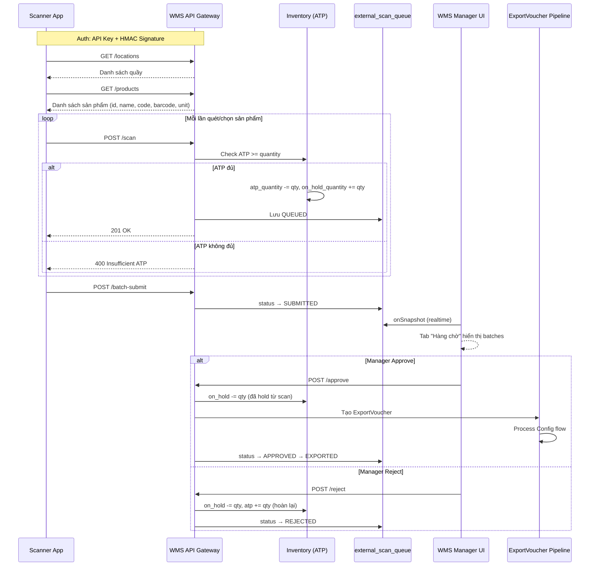

# Thiết kế API tích hợp hệ thống bên ngoài — Xuất kho qua quét barcode (v2)

## Bối cảnh

Một phần mềm bên ngoài (POS/Scanner App) cần kết nối với WMS để:
1. Nhân viên **quét mã sản phẩm** tại quầy (location) → lưu vào **hàng chờ (queue)**
2. Cuối ngày, **quản lý** review số lượng trên WMS UI → duyệt → tạo phiếu xuất kho
3. Phiếu xuất kho tuân theo `process_config` (có duyệt hoặc không cần duyệt)
4. Tài khoản bên ngoài **KHÔNG link** với user WMS → audit log phải lấy họ tên, locationId trực tiếp

### Ràng buộc đặc biệt

- Hệ thống bên ngoài không có tài khoản WMS → không thể dùng `user_id` cho audit
- Phải cung cấp API cho bên ngoài lấy danh sách location + danh sách sản phẩm
- **ATP phải được trừ (hold) ngay khi đưa vào queue** để đảm bảo không xuất âm
- Barcode phải tồn tại trong hệ thống, nếu không → reject scan
- Đảm bảo bảo mật + an toàn dữ liệu (LUẬT THÉP)

---

## Kiến trúc tổng quan



---

## 1. Xác thực & Bảo mật

### API Key + HMAC-SHA256 Signature

> [!IMPORTANT]
> Không dùng Firebase Auth (bên ngoài không có user). Dùng **Service-to-Service auth**.

#### Collection: `integration_clients`

| Field | Type | Description |
|-------|------|-------------|
| `id` | string | UUID, PK |
| `client_name` | string | Tên hệ thống (VD: "Joy World POS Scanner") |
| `api_key` | string | Public key gửi trong Header `X-API-Key` |
| `api_secret_hash` | string | bcrypt hash của secret (verify HMAC) |
| `scopes` | string[] | VD: `["scan", "locations.read", "products.read"]` |
| `allowed_warehouse_ids` | string[] | Giới hạn kho nào được truy cập |
| `ip_whitelist` | string[] | IP được phép (rỗng = tất cả) |
| `rate_limit_per_minute` | number | Mặc định: 120 |
| `is_active` | boolean | Bật/tắt |
| `created_by` | string | FK → users (admin tạo) |
| `created_at` | Date | |
| `last_used_at` | Date \| null | |

#### Flow xác thực

```
Headers:
  X-API-Key: <api_key>
  X-Timestamp: <unix_ms>
  X-Signature: HMAC-SHA256(secret, "{method}|{path}|{timestamp}|{body}")
```

**Middleware `requireApiKey`:**
1. Lookup `integration_clients` by `X-API-Key`
2. Check `is_active`, IP whitelist, rate limit
3. Verify `X-Timestamp` ±5 phút (chống replay attack)
4. Verify HMAC signature
5. Check scope cho endpoint hiện tại
6. Inject `req.integrationClient` cho các layer sau

---

## 2. ATP Reservation — Hold khi đưa vào queue

> [!IMPORTANT]
> **LUẬT THÉP**: Trước khi đưa sản phẩm vào queue, PHẢI check `atp_quantity >= requested_quantity`. Nếu đủ → giữ hàng bằng cách: `atp_quantity -= qty`, `on_hold_quantity += qty`. Khi reject → hoàn lại.

### Cơ chế Hold/Release

Sử dụng Firestore Transaction để đảm bảo tính nhất quán:

```
                ┌─────────────────────────────────────────────┐
                │             INVENTORY RECORD                │
                │                                             │
  POST /scan    │  atp_quantity -= qty                        │
  (hold)        │  on_hold_quantity += qty                    │
                │                                             │
  POST /approve │  on_hold_quantity -= qty                    │
  (release →    │  (ATP đã trừ sẵn, không cần trừ thêm)      │
   export)      │  → Tạo ExportVoucher → completePicking      │
                │    sẽ dùng qty từ on_hold                   │
                │                                             │
  POST /reject  │  on_hold_quantity -= qty                    │
  (rollback)    │  atp_quantity += qty (hoàn lại)             │
                │                                             │
  DELETE /scan  │  on_hold_quantity -= qty                    │
  (hủy scan)    │  atp_quantity += qty (hoàn lại)             │
                └─────────────────────────────────────────────┘
```

**Transaction cho POST /scan:**
```typescript
await db.runTransaction(async (tx) => {
    const invRef = db.collection("inventory")
        .where("warehouse_id", "==", warehouseId)
        .where("warehouse_location_id", "==", locationId)
        .where("product_id", "==", productId);
    
    const invSnap = await tx.get(invRef);
    const invDoc = invSnap.docs.find(d => d.data().is_deleted !== true);
    
    if (!invDoc || invDoc.data().atp_quantity < quantity) {
        throw new Error("ATP_INSUFFICIENT");
    }
    
    // Hold: trừ ATP, cộng on_hold
    tx.update(invDoc.ref, {
        atp_quantity: FieldValue.increment(-quantity),
        on_hold_quantity: FieldValue.increment(quantity),
        last_updated_at: now,
    });
    
    // Tạo queue record
    tx.set(queueRef, scanRecord);
});
```

---

## 3. Collection: `external_scan_queue`

| Field | Type | Description |
|-------|------|-------------|
| `id` | string | UUID, PK |
| `client_id` | string | FK → integration_clients |
| `warehouse_id` | string | FK → warehouses |
| `warehouse_location_id` | string | FK → warehouse_locations (quầy) |
| `product_id` | string | FK → products |
| `barcode_scanned` | string | Barcode gốc nhân viên quét |
| `quantity` | number | Số lượng (mặc định 1) |
| `unit_price` | number | Đơn giá sản phẩm (snapshot lúc quét) |
| `scan_time` | Date | Thời gian quét (action_time client) |
| `sync_time` | Date | Server receive time |
| `operator_name` | string | Họ tên nhân viên quét (bắt buộc) |
| `operator_id_external` | string \| null | Mã NV hệ thống ngoài |
| `device_id` | string \| null | ID thiết bị quét |
| `batch_id` | string \| null | Nhóm batch khi submit |
| `status` | enum | `QUEUED` \| `SUBMITTED` \| `APPROVED` \| `EXPORTED` \| `REJECTED` |
| `approved_by` | string \| null | FK → users (WMS manager) |
| `approved_at` | Date \| null | |
| `export_voucher_id` | string \| null | FK → export_vouchers |
| `rejection_reason` | string \| null | |
| `atp_held` | boolean | true nếu đã hold ATP cho record này |
| `notes` | string \| null | |
| `is_deleted` | boolean | |
| `created_at` | Date | |

### Status Flow:
```
QUEUED (ATP held) → SUBMITTED → APPROVED → EXPORTED (ATP released → ExportVoucher)
                              → REJECTED (ATP released → hoàn lại atp_quantity)
```

---

## 4. API Endpoints (External — `requireApiKey`)

### Base path: `/api/external/v1`

---

### 4.1 GET `/locations`
**Scope:** `locations.read`

Trả danh sách quầy thuộc `allowed_warehouse_ids` của client. Chỉ trả `ACTIVE`, `is_deleted = false`.

```json
{
    "success": true,
    "data": [
        {
            "id": "loc-uuid",
            "warehouse_id": "wh-uuid",
            "warehouse_name": "Joy World Store A",
            "name": "Quầy 1",
            "code": "Q1",
            "type": "COUNTER",
            "status": "ACTIVE"
        }
    ]
}
```

---

### 4.2 GET `/products`
**Scope:** `products.read`

Trả danh sách sản phẩm đang hoạt động để nhân viên tìm thủ công khi không quét được barcode.

**Query params:**
- `?warehouse_id=xxx` (bắt buộc, phải thuộc `allowed_warehouse_ids`)
- `?search=gấu+bông` (tùy chọn, tìm theo name/code/barcode)
- `?limit=50&offset=0` (phân trang)

```json
{
    "success": true,
    "data": [
        {
            "id": "prod-uuid",
            "name": "Gấu bông vàng XL",
            "code": "GB-XL-001",
            "barcode": "8936082131003",
            "unit": "PCS",
            "product_type": "SOUVENIR_SALE",
            "unit_price": 150000,
            "image_url": "https://..."
        }
    ],
    "pagination": { "total": 128, "limit": 50, "offset": 0 }
}
```

**Bảo mật:** Chỉ trả sản phẩm `is_deleted = false`. Chỉ trả sản phẩm có inventory tại warehouse yêu cầu.

---

### 4.3 POST `/scan`
**Scope:** `scan`

Quét 1 sản phẩm → check ATP → hold → lưu queue.

**Request:**
```json
{
    "barcode": "8936082131003",
    "product_id": null,
    "warehouse_location_id": "loc-uuid",
    "quantity": 1,
    "operator_name": "Nguyễn Văn A",
    "operator_id_external": "NV-0042",
    "device_id": "SCANNER-01",
    "scan_time": "2026-06-07T14:30:00Z"
}
```

> [!TIP]
> Gửi `barcode` HOẶC `product_id`. Nếu gửi barcode → server resolve sang product_id. Nếu gửi product_id trực tiếp (từ manual search) → skip barcode lookup.

**Server logic:**
1. Validate `warehouse_location_id` ∈ `allowed_warehouse_ids`
2. Resolve product:
   - Nếu có `barcode` → query `products.barcode = ?` → `is_deleted = false`
   - Nếu có `product_id` → validate tồn tại
   - Không tìm thấy → **400** "Sản phẩm không tồn tại trong hệ thống"
3. **Firestore Transaction:**
   - Check `inventory.atp_quantity >= quantity` tại warehouse + location
   - Trừ ATP: `atp -= qty`, `on_hold += qty`
   - Tạo queue record `status = QUEUED, atp_held = true`
4. Ghi audit log
5. Return 201

**Error cases:**
- Barcode/product không tồn tại → 400
- ATP không đủ → 400 kèm thông tin ATP hiện tại
- Location không thuộc scope → 403

---

### 4.4 DELETE `/scan/:scanId`
**Scope:** `scan`

Hủy 1 scan (trước khi batch submit). Hoàn lại ATP.

**Server logic:**
1. Find queue record, verify `status = QUEUED`, `client_id` match
2. **Transaction:** `atp += qty`, `on_hold -= qty`
3. Soft delete record

---

### 4.5 POST `/batch-submit`
**Scope:** `scan`

Cuối ca → gom scans → submit batch cho quản lý review.

**Request:**
```json
{
    "warehouse_location_id": "loc-uuid",
    "shift_date": "2026-06-07",
    "operator_name": "Nguyễn Văn A",
    "operator_id_external": "NV-0042",
    "notes": "Ca sáng - quầy 1"
}
```

**Server logic:**
1. Query `external_scan_queue` where `location + QUEUED + shift_date + client_id`
2. Generate `batch_id`
3. Update all → `status = SUBMITTED, batch_id = xxx`
4. Return summary: số sản phẩm, tổng quantity, tổng giá trị

---

## 5. API Endpoints (WMS Internal — `requireAuth`)

### Base path: `/api/external-queue`

Dùng authentication WMS bình thường (Firebase session cookie).

---

### 5.1 GET `/api/external-queue/pending`
**Permission:** `external_scan.approve`

Trả danh sách batches đang chờ duyệt (SUBMITTED). Group by `batch_id`.

```json
{
    "success": true,
    "data": [
        {
            "batch_id": "batch-uuid",
            "warehouse_name": "Store A",
            "location_name": "Quầy 1",
            "operator_name": "Nguyễn Văn A",
            "shift_date": "2026-06-07",
            "submitted_at": "2026-06-07T17:30:00Z",
            "total_products": 5,
            "total_quantity": 23,
            "total_value": 1250000,
            "items": [
                {
                    "scan_id": "scan-uuid",
                    "product_name": "Gấu bông vàng XL",
                    "product_code": "GB-XL-001",
                    "barcode": "8936082131003",
                    "quantity": 3,
                    "unit_price": 150000,
                    "scan_time": "2026-06-07T10:15:00Z"
                }
            ]
        }
    ]
}
```

---

### 5.2 GET `/api/external-queue/history`
**Permission:** `external_scan.approve`

Trả lịch sử tất cả batches (APPROVED, EXPORTED, REJECTED). Có filter theo ngày, kho, trạng thái.

**Query params:** `?status=APPROVED&warehouse_id=xxx&from=2026-06-01&to=2026-06-07`

```json
{
    "data": [
        {
            "batch_id": "batch-uuid",
            "status": "EXPORTED",
            "operator_name": "Nguyễn Văn A",
            "location_name": "Quầy 1",
            "shift_date": "2026-06-06",
            "total_products": 8,
            "total_quantity": 31,
            "total_value": 2100000,
            "approved_by_name": "Trần Thị B",
            "approved_at": "2026-06-06T18:00:00Z",
            "export_voucher_number": "EXP-20260606-042"
        }
    ]
}
```

---

### 5.3 POST `/api/external-queue/approve`
**Permission:** `external_scan.approve`

Quản lý duyệt 1 batch → tạo ExportVoucher.

**Request:**
```json
{
    "batch_id": "batch-uuid",
    "approved_items": [
        { "scan_id": "scan-uuid-1", "quantity": 3 },
        { "scan_id": "scan-uuid-2", "quantity": 5 }
    ],
    "notes": "Đã kiểm tra, khớp số lượng"
}
```

> [!TIP]
> Manager có thể **điều chỉnh quantity** từng sản phẩm. Nếu giảm quantity so với queue, phần chênh lệch sẽ được hoàn lại ATP.

**Server logic:**
1. Validate batch `status = SUBMITTED`
2. So sánh quantity approved vs queue → tính delta cần release
3. **Transaction:**
   - Release `on_hold -= qty` cho mỗi item
   - Nếu approved qty < queue qty → `atp += (queue_qty - approved_qty)` (hoàn chênh lệch)
4. Tạo `ExportVoucher`:
   - `export_type = SALE_POS`
   - `creator_id = manager_user_id`
   - Items = approved_items (dùng approved quantity)
5. Trigger `process_config` flow (approval chain hoặc auto-approve)
6. Update queue → `APPROVED, approved_by, export_voucher_id`
7. Audit log đầy đủ

---

### 5.4 POST `/api/external-queue/reject`
**Permission:** `external_scan.approve`

Từ chối 1 batch → hoàn lại toàn bộ ATP.

**Request:**
```json
{
    "batch_id": "batch-uuid",
    "reason": "Số lượng không khớp với sổ bán hàng"
}
```

**Server logic:**
1. Validate batch `status = SUBMITTED`
2. **Transaction:** `on_hold -= qty`, `atp += qty` cho mỗi item
3. Update queue → `REJECTED, rejection_reason`
4. Audit log

---

## 6. WMS Manager UI — Trang "Hàng chờ xuất kho"

### Route: `/external-queue`
### Permission: `external_scan.approve`

```
┌─────────────────────────────────────────────────────────┐
│  Hàng chờ xuất kho                                      │
│  Quản lý và duyệt hàng chờ từ hệ thống bên ngoài       │
├─────────┬──────────┐                                    │
│ Hàng chờ│ Lịch sử  │  (2 tabs)                         │
├─────────┴──────────┘                                    │
│                                                         │
│  TAB 1: HÀNG CHỜ (Realtime - onSnapshot)               │
│  ┌─────────────────────────────────────────────────┐    │
│  │ 📦 Batch #B-20260607-001                        │    │
│  │ Quầy 1 — Store A   │   NV: Nguyễn Văn A        │    │
│  │ Ca: 07/06/2026      │   5 SP │ 23 cái │ 1.25M   │    │
│  │ Submitted: 17:30     │                           │    │
│  │                                                  │    │
│  │  SP           │ Barcode        │ SL  │ Đơn giá   │    │
│  │  Gấu bông XL  │ 893608213..   │  3  │ 150.000   │    │
│  │  Móc khóa A   │ 893608214..   │  5  │  35.000   │    │
│  │  ...                                             │    │
│  │                                                  │    │
│  │     [Từ chối]  [Duyệt & tạo phiếu xuất]         │    │
│  └─────────────────────────────────────────────────┘    │
│                                                         │
│  TAB 2: LỊCH SỬ                                        │
│  ┌─────────────────────────────────────────────────┐    │
│  │ Filter: [Kho ▼] [Trạng thái ▼] [Từ ngày - Đến] │    │
│  │                                                  │    │
│  │ Batch    │ Quầy  │ NV    │ SP │ SL │ Giá trị│ TT │    │
│  │ B-001    │ Q1    │ NV A  │  5 │ 23 │ 1.25M  │ ✅ │    │
│  │ B-002    │ Q2    │ NV B  │  3 │ 12 │ 450K   │ ❌ │    │
│  │ ...                                              │    │
│  └─────────────────────────────────────────────────┘    │
└─────────────────────────────────────────────────────────┘
```

### Components:

#### Trang chính: `ExternalQueuePage.tsx`
- Layout 2 tabs: "Hàng chờ" + "Lịch sử"
- Skeleton loading khi tải data

#### Tab 1 — `ExternalQueuePendingTab.tsx`
- **Realtime**: `onSnapshot` lên `external_scan_queue` where `status = SUBMITTED`
- Group by `batch_id` → render batch cards
- Mỗi batch card hiển thị:
  - Thông tin quầy, nhân viên quét, ngày ca
  - Tổng sản phẩm, tổng số lượng, tổng giá trị
  - Bảng chi tiết từng sản phẩm (name, barcode, quantity, unit_price)
  - **Manager có thể chỉnh quantity** trước khi duyệt
  - Nút **[Duyệt]** và **[Từ chối]**
- Empty state khi không có batch nào chờ duyệt

#### Tab 2 — `ExternalQueueHistoryTab.tsx`
- Fetch từ API `GET /api/external-queue/history`
- Filter: kho, trạng thái (APPROVED/REJECTED/EXPORTED), khoảng ngày
- Bảng tổng quan: batch_id, quầy, nhân viên, tổng SP, tổng SL, tổng giá trị, trạng thái, người duyệt, mã phiếu xuất
- Click batch → mở drawer chi tiết (danh sách sản phẩm + thông tin phiếu xuất nếu có)

---

## 7. Permission Registry

### Thêm vào `permissionRegistry.ts`:

| Key | Group | Label (vi) | Label (zh) |
|-----|-------|------------|------------|
| `external_scan.approve` | `external` | Duyệt hàng chờ từ hệ thống ngoài | 审批外部扫描队列 |
| `external_scan.view` | `external` | Xem hàng chờ từ hệ thống ngoài | 查看外部扫描队列 |

---

## 8. Audit Log — format cho external requests

```typescript
// Scan từ bên ngoài
await logAudit({
    entity_type: "EXTERNAL_SCAN",
    entity_id: scanQueueId,
    warehouse_id: warehouseId,
    action: AuditAction.CREATE,
    user_id: `EXT:${client_id}`,   // Format đặc biệt
    old_value: null,
    new_value: {
        barcode: "8936082131003",
        product_id: "prod-uuid",
        quantity: 1,
        operator_name: "Nguyễn Văn A",
        operator_id_external: "NV-0042",
        device_id: "SCANNER-01",
        warehouse_location_id: "loc-uuid",
        client_name: "Joy World POS Scanner",
        atp_before: 50,
        atp_after: 49,
        on_hold_before: 5,
        on_hold_after: 6,
    },
    ip_address: req.ip,
    device_id: deviceId,
});

// Manager duyệt batch
await logAudit({
    entity_type: "EXTERNAL_SCAN_BATCH",
    entity_id: batchId,
    warehouse_id: warehouseId,
    action: AuditAction.APPROVE,
    user_id: managerId,  // WMS user thật
    old_value: { status: "SUBMITTED", items: [...] },
    new_value: {
        status: "APPROVED",
        export_voucher_id: voucherId,
        export_voucher_number: "EXP-20260607-001",
        approved_items: [...],
        original_operator: "Nguyễn Văn A",
    },
});
```

---

## 9. Navigation

Thêm mục "Hàng chờ xuất kho" vào sidebar WMS:
- Icon: `ScanBarcode` (lucide)
- Route: `/external-queue`
- Permission guard: `external_scan.view`

---

## Tổng quan files cần tạo/sửa

### Backend (be-wms)
| Action | File | Mô tả |
|--------|------|--------|
| [NEW] | `middlewares/apiKeyMiddleware.ts` | Middleware xác thực API Key + HMAC |
| [NEW] | `services/externalScanService.ts` | Logic scan, ATP hold/release, batch |
| [NEW] | `controllers/externalScanController.ts` | Handlers cho external API |
| [NEW] | `controllers/externalQueueController.ts` | Handlers cho WMS internal API |
| [NEW] | `routes/externalRoutes.ts` | Routes `/api/external/v1/*` |
| [NEW] | `routes/externalQueueRoutes.ts` | Routes `/api/external-queue/*` |
| [MODIFY] | `config/app.ts` hoặc `index.ts` | Mount routes mới |

### Frontend (fe-wms)
| Action | File | Mô tả |
|--------|------|--------|
| [NEW] | `components/features/external-queue/ExternalQueuePage.tsx` | Trang chính |
| [NEW] | `components/features/external-queue/ExternalQueuePendingTab.tsx` | Tab hàng chờ |
| [NEW] | `components/features/external-queue/ExternalQueueHistoryTab.tsx` | Tab lịch sử |
| [NEW] | `components/features/external-queue/BatchDetailDrawer.tsx` | Drawer chi tiết batch |
| [MODIFY] | `lib/i18n/vi.ts` | Thêm keys i18n |
| [MODIFY] | `lib/i18n/zh.ts` | Thêm keys i18n |
| [MODIFY] | Sidebar/Navigation | Thêm menu item |

### Shared Types
| Action | File | Mô tả |
|--------|------|--------|
| [MODIFY] | `permissionRegistry.ts` | Thêm permissions mới |
| [NEW] | `externalScan.ts` | Types cho ExternalScanQueue |

---

## Open Questions

> [!IMPORTANT]
> **Q1: ATP hold khi scan trùng** — Nếu nhân viên quét cùng sản phẩm tại cùng quầy 2 lần, hệ thống nên: (A) Tạo 2 records riêng, mỗi cái hold 1 qty, hay (B) Cộng dồn vào record cũ? Phương án A đơn giản hơn và rõ ràng cho audit log. Tôi **đề xuất A**.

> [!IMPORTANT]
> **Q2: Admin UI quản lý Integration Client** — Cần trang admin trong WMS để tạo/quản lý API Key không? Hay chỉ cần seed trực tiếp vào Firestore ban đầu và làm trang admin sau?

---

## Verification Plan

### Automated Tests
- Unit test `requireApiKey` middleware (valid/invalid key, expired timestamp, IP block, scope)
- Unit test ATP hold/release transaction (concurrent scan, insufficient ATP)
- Integration test: scan → submit → approve → ExportVoucher created + ATP correctly deducted

### Manual Verification
- Tạo integration client → gọi `GET /locations` + `GET /products` → verify scope
- Quét barcode → verify ATP giảm, on_hold tăng
- Submit batch → WMS UI hiển thị realtime
- Manager approve → ExportVoucher tạo, inventory cập nhật
- Manager reject → ATP hoàn lại
- Verify audit log ghi đầy đủ operator info
